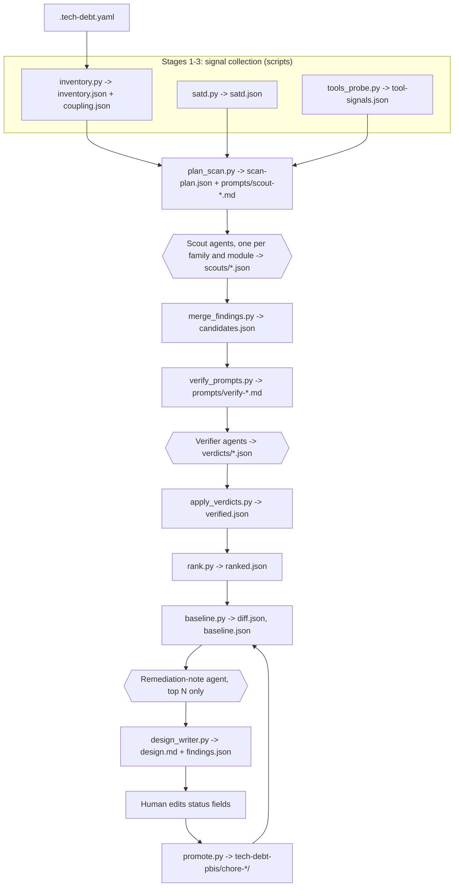

# Best-practice reference architecture for an LLM-driven, read-only tech-debt scan

Judge synthesis for tech-debt-scan v2. Inputs: the three survey reports in this directory (agent skills, commercial tools, research tools) and the current skill under `skills/tech-debt-scan/`. Written 2026-09-02.

Fixed constraints taken as given: SKILL.md orchestration; pure-Python scripts (3.11+, pyyaml only) run as `python scripts/<name>.py`; read-only Agent subagents for LLM work; language-agnostic with external tools used only when present; a human-reviewed `design.md` feeding ralph PBI bundles; no live LLM in tests; Windows-safe invocation.

## 1. Evidence weighing

### Where the surveys agree

All three surveys converge on one pipeline shape from different directions. The practitioner artefacts that measured anything (Anthropic Code Review, Qodo, HackenProof, CodeX-Verify, remove-dead-code) split detection into narrow parallel agents and pass candidates through an independent verification step before dedup and ranking. The research survey supplies the numbers: fan-out raises recall (82.7 versus 65.7 percent for a single agent, S21) but drops precision to 48.8 percent, and a separate evidence-backed judge recovers it (36 percent false-positive reduction, S22; 95.5 percent of false positives identified, S24; kappa 0.94 against experts, S6). The commercial survey shows the same two stages in CodeScene ACE's validation cascade and Sonar's re-analysis of every remediation.

They also agree that git-mined behavioural signals are the best-validated prioritiser: CodeScene's hotspot model in the commercial survey, the Code Red study in the research survey (39 codebases, 15 times more defects in low-health high-churn code, S42), and ksimback's churn cross-reference and fastruby's Skunk score among the agent skills. Change coupling (S35, S36) and ownership concentration (S37) have independent predictive validity, and Google's finding that no static metric predicted felt debt (Jaspan and Green) reinforces this from the negative side.

Finally, every survey lands on explicit negative space in the output (a "looks bad but is fine" section, open questions instead of guesses, a stated error bias), on baselines with NEW/RESOLVED diffing, on suppression with reasons, on a machine-readable companion to the prose, and on an evaluation corpus with planted decoys.

### Where they disagree, and how the disagreement is resolved

Duplication. Agent skills and commercial tools give it a category and a gate (Sonar's 3 percent, jscpd, CPD); the research survey found 71 percent of clones in two mature systems beneficial (S38). Resolution: report duplication only when change coupling between the copies or a tool corroborates it, and never score on copy count.

Lint and rule counts. Effort-accounting tools (Sonar, Qlty, NDepend, CAST) price every violation and sum. Only 25 of 202 SonarQube rules had measurable fault-proneness (S40), rule-count debt explained as little as 5 percent of lead-time variance (S44), and only complexity-reducing alert removals lowered bug tendency (S41). Resolution: linter output is evidence for a specific finding, never a score input.

Composite health scores. Practitioner skills and commercial dashboards emit 0 to 100 scores. In the Brightsquid case (S34) system-wide coupling metrics barely moved while localised flaw counts tracked a 72 percent improvement in issue closure time. Resolution: no composite score; report per-finding priority and per-scan deltas.

Self-reported confidence. Most agent skills, and the current skill, ask the model how sure it is and weight by the answer. Unaided LLM judgement agrees with ground truth at kappa 0.10 to 0.21 and a third of its false rejections cite statements absent from the code (S15); CodeScene attributes its 97 to 99 percent precision tier to validation steps passed, not prompting (S12, S13). Resolution: confidence is earned by checks the pipeline performs.

Recall first or precision first. Qodo argues recall first because missed issues cannot be recovered downstream; remove-dead-code says a false positive is unacceptable. Both hold once assigned to stages: scouts optimise recall, the verifier optimises precision, and the report is precision-biased because alert fatigue is the documented failure mode (S4's over-detection warning, BitsAI-CR's 26.7 percent ignored-comment rate, CR-Bench).

### What is trusted, in order

Measured results against multi-rater oracles at scale (S4, S42, S37, S39) and the CodeScene validation studies (S12, S13, vendor-authored) rank highest; deployment metrics from production reviewers (BitsAI-CR, Cihan et al., Anthropic's 16 to 54 percent substantive-comment jump after requiring proofs) come next. Vendor documentation is trusted for what a mechanism does, not whether it works; practitioner skills for design ideas (only brooks-lint ships evaluations); vendor case studies (CodeScene's 1.2 percent of code causing 45 percent of bugs, Qodo's F1 60.1) as illustration only.

### Design principles that survive scrutiny

1. Mine behaviour before reading code. Churn times complexity, change coupling and ownership concentration are computed first and drive where scouts look and how findings rank. Research: Code Red (S42, S43), Nayebi et al. architecture roots (S34). Commercial: CodeScene hotspots.
2. One narrow prompt per debt family, carrying the family's definition, literature-derived questions and known false-positive traps; output is verdict plus evidence only. Research: Souza et al. (S4), ZeroFalse category-specific prompts (S23), Jin and Chen on explanation demands raising misjudgement (S16). Agent skills: HackenProof, CodeX-Verify.
3. Detection and verification are separate agents with separate instructions; the verifier re-reads cited evidence and may reject. Research: S6, S22, S24, S17. Agent skills: Anthropic Code Review, Anthropic SDLC "write a proof".
4. Confidence tiers are earned from checks passed (quote matches the file, tool or second scout corroborates, verifier confirms), never self-reported. Research: ACE (S12, S13). Commercial: vulture's per-kind confidence, Renovate Merge Confidence.
5. Every finding cites file, line range and a verbatim quote; a script checks the quote exists before any LLM re-reads it. Research: hallucinated criticism in S15, evidence-attached claims in S6. Agent skills: ksimback's "doesn't count without file:line".
6. The verifier gets precise, bounded context: the span, its immediate neighbourhood, and the deterministic signals, nothing else. Research: LLM4FPM (S25), LocAgent (S27), Fattha et al. (S28).
7. Ranking is a stated deterministic formula over coarse LLM inputs and git-measured interest; the LLM never ranks the final list and never invents cost figures. Agent skills: Anthropic tech-debt plugin formula, wshobson's quantification demands as the anti-pattern. Commercial: NDepend's debt-and-interest split. Research: JSS review finding no validated prioritisation model (S45).
8. Do not score on lint counts, duplication counts, size, code age or global coupling metrics. Research: S40, S41, S44, S38, S34. Commercial: Jaspan and Green.
9. Persist a fingerprinted baseline; report NEW, UNCHANGED and RESOLVED; record human decisions with reason and expiry so they are not re-raised. Commercial: Qodana, ArchUnit FreezingArchRule, OSV-Scanner `ignoreUntil`. Agent skills: ksimback re-run tagging, brooks-lint history.
10. Use tools when present, read when absent, and mark the fallback as a lower tier. Commercial: knip, vulture, jscpd, OSV-Scanner. Agent skills: ksimback (note missing tools, never install). Research: hybrid LLM plus tools improved F1 on five of nine smells (S4).
11. Report first, act on approval, and record the decision. Commercial: Sonar's Open, Accepted, False Positive states; Stepsize's triage-layer insight. Agent skills: GitHub's tutorial, code-overhaul's gates.
12. Evaluate against a fixture corpus with planted debt and planted decoys, and report per-category precision. Agent skills: brooks-lint's frozen corpus with nine false-positive scenarios. Research: realistic class balance (S30), rater disagreement (S48), PRIMES 2.0 threats (S29).

## 2. Reference architecture

The pipeline has eleven stages. Scripts are deterministic and testable with fixtures; agents are read-only LLM calls whose responses the orchestrator writes to a pinned file. Every stage reads and writes JSON under `.tech-debt/` so any stage can be rerun alone.



### Stage 0: configuration

Purpose: let a repository state its own bars. Script: shared `config.py` loaded by every script. Input: `.tech-debt.yaml` at the repository root (committed, unlike the gitignored `.tech-debt/` directory). Contents: ignore globs; path classes (`tests`, `generated`, `vendored`) with per-class family disables; enabled families; ranking preset and weight overrides; churn window; per-scout cap; top N; permitted tools; families CI already enforces; suppressions with fingerprint, reason and expiry; and a traps list of previously rejected findings for the verifier. Evidence: brooks-lint's config file, Anthropic's REVIEW.md, OSV-Scanner's expiring suppressions, CodeScene's glob-scoped rules.

### Stage 1: inventory and behavioural signals

Purpose: compute every cheap deterministic signal before any judgement. Script: `inventory.py`, extended. Output: `.tech-debt/inventory.json` and `.tech-debt/coupling.json`. Per file: LOC, indentation complexity and max indent (kept, the proxy is language-agnostic), path class, churn, bug-fix commit share (message heuristic, recorded but not scored), distinct authors, top-owner share, last-touched date, and an approximate fan-in (files whose text references this file's stem, marked `approximate`). Change coupling from the same `git log` pass: pairs co-committing at least three times with a ratio of at least 30 percent, plus each file's coupling degree. Hotspots: churn times complexity normalised, as now. When git is absent every history field is null and the report says so. Evidence: S42, S34, S35, S37; CodeScene hotspots, change coupling and knowledge distribution.

### Stage 2: self-admitted debt mining

Purpose: find SATD markers deterministically, because a keyword matcher already reaches F1 0.58 with no training while zero-shot prompting trails fine-tuned models by 6 to 9 points (S1, S2, S3). Script: `satd.py`. Output: `.tech-debt/satd.json` with marker, file, line, quoted comment, and age from `git blame` when available (SATDBailiff's lifecycle idea). The half-finished scout receives this list as leads and classifies debt type and severity by reading around each marker; it does not search for markers itself.

### Stage 3: external tool probe

Purpose: use what is installed, never install anything. Script: `tools_probe.py`. Output: `.tech-debt/tool-signals.json` with `tools_run`, `tools_absent`, and normalised findings keyed by file and line (dead exports, cycles, clones, vulnerable or outdated packages, complexity warnings). Candidates by manifest: knip, madge, dependency-cruiser, jscpd, eslint for JavaScript and TypeScript; vulture, ruff, pip-audit for Python; deadcode and govulncheck for Go; `dotnet list package` for .NET; osv-scanner for any lockfile. Each call has a timeout, JSON output where offered, and short argv. Tools that execute project code (coverage, mutation testing) are out of scope for a read-only scan and reported as "not assessed". Evidence: ksimback's parallel tool step, commercial survey recommendation 6, fastruby's stale-coverage lesson.

### Stage 4: scan planning and prompt rendering

Purpose: decide who reads what, and render every prompt to a file so none is improvised. Script: `plan_scan.py`. Output: `.tech-debt/scan-plan.json` and `.tech-debt/prompts/scout-<family>[-<module>].md`. Scope: the hotspot band (top decile) plus every file a family's leads point at, then the remainder. Above a configurable file count the repository is split by top-level module, one scout per family per module (ksimback's pattern; hierarchical localisation, S26, S27). Each prompt is a shared prefix (repository summary from the inventory, read-only rule, do-not-invent rule, evidence contract, per-scout cap, and the three output channels `findings`, `open_questions`, `looks_bad_but_fine`), a family block from `categories.py` (definition, four to six literature-derived questions, known traps), and a leads block (hotspot files, coupled pairs, tool hits and SATD markers for that family).

### Stage 5: scout fan-out

Purpose: recall. Agents: one read-only scout per prompt file; the orchestrator writes each response verbatim to `.tech-debt/scouts/<family>[-<module>].json`. Finding shape: `title`, `family`, `debt_type`, `severity` on the fixed rubric, `effort` S/M/L, `signals_cited`, and `evidence` as a list of `{file, line_start, line_end, quote}` with a verbatim quote of at most six lines. No `suggested_fix` and no `confidence`: fix demands alongside the verdict raise false rejections (S16) and self-reports are not an input (S15). An empty list is a valid answer; a cap is a ceiling, not a target. Evidence: S4, S23, HackenProof's shared-prefix fan-out.

### Stage 6: merge and deduplicate

Purpose: a clean candidate set with the first earned check applied. Script: `merge_findings.py`. Output: `.tech-debt/candidates.json` plus a stats block. Steps: validate each scout file and drop malformed items with a logged reason; normalise paths; check every quote against the file on disk (whitespace-normalised) and set `quote_verified`; fingerprint from family, path and a hash of the normalised quote; cluster line ranges overlapping within ten lines (S10), recording `confirmed_by` and keeping the union of evidence; attach the primary file's inventory signals; apply suppressions and path-class disables, counting them. Candidates without a verified quote go straight to open questions and never reach the verifier. Evidence: HackenProof's location-keyed merge with confirmation counts, Qodo's judge, S15's hallucinated-evidence rate.

### Stage 7: verification

Purpose: precision. Script `verify_prompts.py` renders `.tech-debt/prompts/verify-<batch>.md`, five to eight candidates per batch grouped by file. For each candidate it extracts the cited span with thirty lines of context from disk, lists change-coupled files and approximate referrers, restates the deterministic signals, and appends the family's verification questions and the repository's traps. The verifier agent has fresh context and different instructions from the scouts: confirm, downgrade, reject or refer to a human, with a proof of at most 150 words citing line numbers, adjusted severity and effort, and no fix proposal. The orchestrator writes `.tech-debt/verdicts/verify-<batch>.json`; `apply_verdicts.py` merges verdicts into `.tech-debt/verified.json` and assigns the earned tier:

- Tier A: verifier confirmed, quote verified, and at least one independent corroboration (a tool hit at the location, two or more scouts, or a deterministic signal such as a hotspot-band file, a coupling pair or a SATD marker).
- Tier B: verifier confirmed and quote verified, no independent corroboration.
- Tier C: verifier downgraded or referred; listed for a human, excluded from the top N by default.
- Rejected: verifier rejected; kept with its reason in the "considered and rejected" section.

Expect a large share of candidates to fail: 63.1 percent of a static detector's hard-severity architectural smells were intentional on expert review (S6). No debate rounds between agents (S28). Evidence: S6, S17, S22, S24; S12 and S13 for tiering; Anthropic's proof requirement.

### Stage 8: deterministic ranking

Purpose: order verified findings without asking the model. Script: `rank.py`. Output: `.tech-debt/ranked.json`. Formula family: impact times interest times earned confidence times tractability, which is the Anthropic plugin's `(Impact + Risk) × (6 − Effort)` with risk replaced by git-measured interest and NDepend's debt-versus-interest split made explicit.

```
priority = severity × interest × tier_weight × tractability

severity      verifier-confirmed 1..5 on the fixed rubric
interest      1 + wH·H + wC·C + wF·F, each of H, C, F in [0, 1]
              H = primary file's hotspot score / repository max
              C = primary file's strong-coupling degree / repository max
              F = approximate fan-in / repository max (0 when unavailable)
tier_weight   A 1.0, B 0.7, C 0.35
tractability  S 1.0, M 0.75, L 0.5
```

Presets: `balanced` (wH 1.0, wC 0.5, wF 0.5), `hotspot-first` (wH 1.5, wC 0.5, wF 0.25), `architecture` (wH 0.75, wC 1.0, wF 1.0), `quick-wins` (balanced weights, tractability S 1.0, M 0.5, L 0.2). Ties break by fingerprint. A spread rule caps any family at half the top N. The hotspot amplifier lives here only; scouts no longer add a severity point for hotspot location, which the current design does on top of a 1.5 multiplier and so counts twice.

Not scored on: lines of code, lint counts, duplicate or TODO counts, code age (recent AI-authored code carries more debt, S50, S51), self-reported confidence, global coupling metrics, and any money or hours estimate (principles 7 and 8).

### Stage 9: baseline and re-scan diffing

Purpose: gate on direction, not level. Script: `baseline.py`. Inputs: the previous scan's `.tech-debt/baseline.json` (fingerprints, tiers, statuses, human decisions) and `ranked.json`. Output: `.tech-debt/diff.json` marking each finding NEW, UNCHANGED or RESOLVED, where RESOLVED means the fingerprint's quote no longer exists near the recorded location. Findings previously marked accepted (with reason and expiry) or false positive stay suppressed until expiry; expired acceptances return as UNCHANGED with a note. The baseline is rewritten after promotion. Evidence: Qodana's Unchanged/New/Absent, ArchUnit's shrinking freeze store, jscpd `--baseline`, Sonar's states, OSV-Scanner's `ignoreUntil`.

### Stage 10: remediation notes and reporting

Purpose: a reviewable document and a machine-readable twin. One small agent call, restricted to the top N, writes a remediation sketch and acceptance criteria per finding after verification so fix proposals cannot bias detection (S16). Script: `design_writer.py render`. Outputs: `.tech-debt/design.md` and `.tech-debt/findings.json` (every verified finding with signals, tier, proof and diff status; a SARIF projection is optional). The design document carries frontmatter with scan statistics, tools run and absent, and counts of candidates, verified, rejected, suppressed, new and resolved; the top N with yaml anchors (`status`, `slug`, `fingerprint`, `tier`, `priority`, `family`, `debt_type`, `severity`, `effort`, `diff`), the verifier's proof, quoted evidence, the interest signals and the remediation note; a compact "below the cut" table of remaining tier A and B findings; "considered and rejected" with reasons; "looks bad but is fine"; "open questions for the maintainer"; and "not assessed". Evidence: ksimback's negative-space sections, CodeScene's per-PR counts.

### Stage 11: promotion

Purpose: hand approved findings to the ralph queue and record every human decision. Script: `promote.py`, extended. The PBI carries fingerprint, tier, proof, evidence quotes and the acceptance criteria from the remediation note. Status vocabulary grows to distinguish `rejected` (false positive, added to the traps list) from `accepted` (deliberate deferral with reason and optional expiry), and both are written back to the baseline. Evidence: Sonar's issue lifecycle, GitHub's one-issue-per-item tutorial, code-overhaul's batch approval.

### Evaluation harness

Purpose: measure precision without a live model in CI. Assets: a fixture corpus of small repositories, each with a `planted.json` manifest of planted debt (family, path, lines) and decoys that must stay clean (intentional duplication in test fixtures, a public entry point with no in-repo caller, a documented feature flag, a long flat data table, a commented deliberate cycle). Fixtures need a synthetic git history so churn, coupling and ownership are exercised. Script `evaluate.py` scores any `verified.json` or `ranked.json` against the manifest and prints per-family precision, recall and decoy hits. Tests: golden scout and verdict files drive merge, tiering, ranking and diffing; a ranking test asserts byte-identical order for a fixed input; a quote-verification test asserts a fabricated citation is diverted. An opt-in `live` marker runs real scouts and verifiers over the corpus and appends to a dated evaluation log, with at least 80 percent tier A precision as the release bar. Evidence: brooks-lint's corpus, S30's replication warning, S48's rater disagreement (two people should build the manifest).

## 3. Detection strategy by debt family

The families below extend the current eight categories. For each: how it is detected, what happens when a tool is absent, and how much the verifier matters.

Size and complexity smells (god modules, long methods, deep nesting, complex conditionals). LLM reading is reliable: F1 0.87 to 0.89 on Long Method, Large Class and Data Class against a 76-developer oracle (S4); Cognitive Complexity is the one code-only metric with validated links to comprehension (S39). Inventory metrics supply leads; no tool needed. Verifier need is moderate: the main false positive is a large but cohesive file.

Architecture and structure (cycles, layering violations, hubs, shotgun surgery, unstable interfaces). LLM recall is high and precision low: 100 percent recall at 64 to 82 percent precision on hub-like dependencies (S5), and 63 percent of a static detector's findings were intentional (S6). Change coupling from stage 1 is the language-agnostic corroborator (a modularity violation is files co-changing without a structural dependency, S34); madge or dependency-cruiser supply cycles when present, and cycles reported by reading alone are tier B at best. This family needs the verifier most and its remediation is usually effort L.

Duplication. Token-level clones need jscpd or CPD; the LLM finds semantic near-duplicates that tools miss. Reported only when the copies are change-coupled or a tool corroborates (S38, S35). Without a tool, duplication is capped at tier B and excluded from `quick-wins`.

Dead code. Tools win: knip, vulture (with per-kind confidence), Go deadcode with `-whylive`. Reading cannot see dynamic dispatch, reflection, route conventions or external callers, remove-dead-code's protected classes. Without a tool, dead-code findings are tier C unless the file also has zero churn and zero approximate fan-in, and the verifier must list the dynamic-reference patterns it checked.

Test debt. Gaps: a script maps source files to test files by naming convention and reports hotspot files with no mapped test; the LLM confirms the gap covers behaviour that matters. Smells (assertion-free tests, conditional logic, sleeps, eager tests from tsDetect's catalogue): LLM-readable at 74 to 80 percent accuracy (S8). Coverage, flakiness and mutation score are "not assessed" without CI data, never guessed.

Self-admitted and half-finished work. Keyword matcher first (F1 0.58 baseline, S3), age from blame, LLM classification of type and severity by reading around the marker (S1). Stubs, never-enabled flags and partial migrations remain LLM-read with the count of old-side call sites as evidence. Verifier need is low for markers, moderate for migration claims.

Dependency debt. Structural facts are readable from manifests: missing lockfile, manifest-lock drift, duplicate-purpose packages, vendored copies. Staleness, end of life and vulnerabilities need a tool or registry lookup; without one the scout must not assert them and the report lists them as not assessed (Sonatype's "false confidence" warning; the current prompt's caveat becomes a hard rule).

Documentation drift. LLM-readable (README flags versus argument parsers, examples versus signatures) and cheap to verify because the verifier compares two artefacts. No measured F1 appears in the surveys; treat as tier B until the live evaluation says otherwise.

Build, configuration and infrastructure debt. Google ranks release-process debt last and migration debt first (Jaspan and Green); a read-only scan sees only the artefacts. Optional family, off by default.

## 4. Gap critique of the current skill

| Reference-architecture element | Current skill status | Evidence-backed impact of the gap | Priority |
|---|---|---|---|
| Configuration and suppression file | Absent. Only CLI knobs (`SKILL.md` Flexibility knobs, lines 58-71). | No ignore globs, path classes or suppressions, so tests, generated and vendored code get the same bar and rejected findings recur every scan (brooks-lint, Sonar states, OSV-Scanner). | Must |
| Behavioural signals: coupling, ownership, bug-fix share | Partial. Commit counts only in `inventory.py:122-160`; hotspot ranks churn times indentation in `_build_hotspots`. | Change coupling and ownership have independent defect validity (S35, S37) and are the language-agnostic corroborator for architecture findings; without them architecture and duplication cannot earn tier A. | Must |
| SATD keyword mining script | Absent. The half-finished prompt asks the LLM to find markers (`categories.py:129-141`). | A keyword matcher is a strong zero-cost baseline; zero-shot LLM trails fine-tuned by 6 to 9 F1 points (S1, S3), and blame age is unavailable to the scout. | Should |
| External tool probe | Absent. | Dead code, clones, cycles and CVEs are tool-solved problems (commercial survey); LLM-only detection is weak on all four, and unverifiable CVE claims are invited. | Should |
| Scout prompt contract: shared prefix, literature questions, quoted evidence, output channels, caps | Partial. `_OUTPUT_SCHEMA` in `categories.py:28-62` requires file and line with a free-text note, no verbatim quote, no open-questions or looks-fine channel, no cap, and asks for `suggested_fix` and self-reported `confidence`. | Free-text notes cannot be checked; fix demands raise misjudgement (S16); self-reported confidence is near-random (S15); without a cap and an empty-result rule the model fills the list. | Must |
| Hotspot handling | Present but double-counted: scouts add one severity point (`categories.py:35-37`) and `priority_score` multiplies by 1.5 (`build_synthesis_prompt.py:63,129-133`). | The same signal inflates rank twice and hides the intended weighting. | Must |
| Per-module chunking for large repositories | Absent. | ksimback documents degradation above 200k LOC; hierarchical localisation outperforms free exploration (S26, S27). | Should |
| Merge and dedup script with quote verification | Absent. Claude concatenates arrays into `raw-findings.json` (`SKILL.md` Step 3) and the synthesis prompt asks the LLM to merge duplicates (`build_synthesis_prompt.py:197-199`). | No fingerprint, no confirmation count, and no deterministic check that cited lines exist; hallucinated evidence (S15) passes straight to the report. | Must |
| Independent verifier stage | Absent. | The single highest-leverage gap: candidate false-positive rates of 50 to 63 percent are the documented prior (S6, S21), and an evidence-backed judge removes most of them (S22, S24, Anthropic Code Review). | Must |
| Earned confidence tiers | Absent. `CONFIDENCE_WEIGHT` in `build_synthesis_prompt.py:59` weights the scout's own guess. | Precision tiers come from validation steps passed (S12, S13); weighting a self-report rewards confident scouts, not correct ones. | Must |
| Fully deterministic ranking | Partial. `priority_score` (`build_synthesis_prompt.py:120-134`) pre-ranks, then a synthesis agent re-picks the top N and must return exactly N (`validate_synthesis_output`, line 239). | The LLM makes the final ordering non-reproducible, and "exactly N" forces invention when fewer findings survive; no coupling or fan-in weighting. | Must |
| Baseline and re-scan diff | Absent. | Every scan restarts from zero; RESOLVED and NEW cannot be shown and accepted debt is re-raised (Qodana, ksimback re-runs). | Should |
| Report sections: rejected, looks-fine, open questions, not assessed, counts | Partial. `design_writer.py:74-111` renders only findings with reasoning, evidence and fix. | The negative-space sections are the cheapest false-positive control found and make re-runs converge (ksimback, REVIEW.md). | Must |
| Machine-readable findings file | Partial. `top5.json` holds only the chosen N. | Downstream tooling and diffing need the full verified set (SARIF-shaped JSON is the common denominator across Qodana, jscpd, OSV). | Should |
| Promotion carrying proof, fingerprint, acceptance criteria; decisions written back | Partial. `bundle_writer.py:65-96` carries category, debt type and effort; `rejected` is not distinguished from deferred. | PBIs without acceptance criteria are weaker work items (GitHub tutorial); undistinguished rejection loses the trap signal for the verifier. | Should |
| Evaluation corpus with planted debt and decoys | Partial. Fixtures are trivial (`tests/fixtures/python-repo/main.py` is nine lines, no git history); goldens test parsing and rendering only. | Precision is unmeasured; brooks-lint and S30 show the corpus is what turns a prompt into a detector. | Must |
| Path-class bars for tests, generated, vendored | Absent. | Different bars per path class are universal in commercial tools (CodeScene, DeepSource, PMD). | Should |
| Documentation consistency | `docs/architecture.md` says six categories and severity-only sorting; `categories.py` has eight and the builder scores. | The skill's own doc drift; fix as part of the redesign. | Could |

Present and worth keeping unchanged: file-path passing for large payloads, LF-only output, atomic status edits, roll-forward promotion, and the `skill_check.py` lint of documented commands.

## 5. Anti-patterns to avoid

- Do not run one generic "audit this repository" prompt over whole files: 64 percent precision with a shallow prompt, and context clutter is a documented false-positive cause (S5, S25); the marketplace single-prompt agents produce generic best-practice lists.
- Do not let the model choose or order the final list. Ranking is a script over verified inputs; the current synthesis agent is the thing to remove, not to tune.
- Do not weight self-reported confidence (kappa 0.10 to 0.21, S15).
- Do not require exactly N findings. A fixed count invites invention; a cap is a ceiling.
- Do not ask the detection prompt for fixes or explanations alongside the verdict (S16). Fix sketches come after verification, for the top N only.
- Do not count lint violations, TODOs, duplicate copies or lines of code as debt (S40, S41, S44, S38, Jaspan and Green).
- Do not assert vulnerabilities, end of life or outdated versions without a tool or registry source (Sonatype).
- Do not emit a composite health score; per-finding deltas are what tracked real improvement (S34).
- Do not add debate or consultation rounds between agents: cost without benefit (S28).
- Do not trust stale inputs; record the source and timestamp of every signal and show "not assessed" rather than a guess (fastruby's coverage lesson).
- Do not treat an LLM's proposed refactoring as evidence of the debt or as the fix: 18 to 37 percent of raw refactorings preserved behaviour (S12), and the scan is read-only by design.
- Do not down-weight findings because the code is recent or AI-authored; those regions carry more debt (S50, S51).

## 6. Open questions for the design brainstorm

1. Taxonomy. Keep the eight scout families with the SATD-derived `debt_type` axis, adopt Google's ten categories as the reporting axis, or add Sonar's quality axis? The 01-debt-types notes in this directory hold the evidence.
2. Verification budget. Verify every candidate, or only those above a provisional pre-rank cut plus every severity 4 and 5? Batch size and the per-scan token ceiling need numbers.
3. Fingerprint stability. A hash of the normalised quote survives line shifts but not edits to the quoted lines; a symbol key needs language awareness. Decide the tolerance for RESOLVED.
4. Committed state. `.tech-debt/` is gitignored but configuration and baseline must be committed: root-level `.tech-debt.yaml` plus a gitignore exception, or a separate directory?
5. Status vocabulary. Make `rejected` mean false positive and add `accepted` with reason and expiry, or keep four statuses and record the reason elsewhere?
6. Fan-in. Is the textual stem-reference count an acceptable lead, or is fan-in weight zero unless a dependency tool ran?
7. Tool policy. Which tools ship in the first probe, how their outputs normalise, and whether any tool that executes project code is ever permitted.
8. Live evaluation. Who runs the `live` marker, where results go, and the precision threshold that gates a release.
9. Top N versus tier cut. Present the top N by priority, or all tier A and B with N as a display cap?
10. Chunking thresholds. The size at which module fan-out starts, and whether module scouts run every family or only those with leads in that module.
11. Feedback loop. Do rejected findings feed only the traps list, or also per-repository family weights, as Google's per-team slicing suggests?
