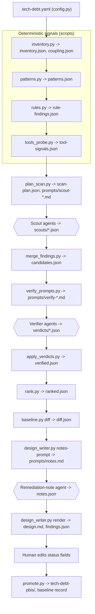

# tech-debt-scan v2: design brainstorm

Decision document for human review. Written 2026-09-02 from the consolidated taxonomy (`02-debt-types-consolidated.md`, cited as [T TD-xx]), the three gap analyses (`04-gap-analysis-code-design.md` [GC], `04-gap-analysis-arch-test-docs.md` [GA], `04-gap-analysis-infra-deps-process.md` [GI]), the judge's reference architecture (`05-architecture-best-practice.md` [J s1..s6]) and the current skill under `skills/tech-debt-scan/`. Nothing here is implemented; section 9 lists the choices that need an answer before a plan is written.

Fixed constraints, taken as given: Claude Code skill; SKILL.md orchestration with pinned commands, pinned output files and the exit-5 no-improvisation rule; pure Python 3.11+ with pyyaml as the only dependency, every script direct-path invocable; read-only Agent subagents for all LLM work; language-agnostic by default, external tools only when already installed; human review of `design.md` before `promote.py`; no live LLM in tests; Windows-safe argv; ruff, mypy strict, pytest and `skill_check.py` in CI.

## 1. Goal, non-goals, success criteria

**Goal.** Replace a recall-only scan whose final list an LLM picks with a detect, verify, rank pipeline whose output is reproducible, evidence-checked and diffable across runs, while widening coverage from the eight v1 categories to the taxonomy types the gap reports found absent or unverifiable.

**Success criteria, measurable.**

1. Every one of TD-01 to TD-35 has an explicit disposition (in scope, deferred, excluded) and every in-scope type has a named family, a lead source and a verifier posture (section 2). No type is invisible the way TD-13 is today [GC TD-13].
2. On the fixture corpus, tier A precision is at least 0.80 under the opt-in live run, and no planted decoy reaches tier A [J s2 evaluation harness].
3. `rank.py` produces a byte-identical `ranked.json` for a fixed `verified.json` and inventory [J s2 evaluation harness]. No LLM touches the final order [J s5].
4. Every reported finding cites a file, a line range and a verbatim quote that `merge_findings.py` found on disk; a fabricated citation is diverted to open questions, never reported [J principle 5].
5. A second scan over the same repository classifies each finding NEW, UNCHANGED or RESOLVED and honours accepted-with-expiry decisions [J principle 9].
6. `design.md` carries the negative-space sections (considered and rejected, looks bad but fine, open questions, not assessed) so re-runs converge and exclusions are visible [J s4 row "Report sections"].
7. Deterministic stages complete in under two minutes on a 5,000-file repository without tools; scouts and verifiers run in parallel and the whole scan stays inside the budget in section 4.15.

**Non-goals.** Autonomous fixing (Phase 2 stays deferred). A composite health score [J s1 "Composite health scores"]. Any tool that executes project code: coverage, mutation testing, test runs, builds [J s2 stage 3]. Installing tools. Issue-tracker, review-platform or registry lookups except through an installed tool [GI TD-23, TD-02]. Class-level metrics that need a parser (LCOM, hierarchy depth, Feature Envy) [GC TD-20, TD-24]. Runtime-only aspects listed in [T s5]: flake confirmation, coverage numbers, model staleness, rollout state, deploy frequency. Money or hours estimates [J principle 7]. Debate rounds between agents [J s5]. A SARIF export (nothing consumes it yet).

## 2. What v2 scans for

### 2.1 Disposition of the 35 types

| ID | Disposition | Family | Reason |
|---|---|---|---|
| TD-01 | IN | complex-units | Rank 1, LLM F1 0.87 to 0.89, cheap inventory leads [GC TD-01] |
| TD-02 | IN | dependency-debt | Rank 2; structural facts readable, currency claims tool-gated [GI TD-02] |
| TD-03 | IN | security | Rank 3, ABSENT today, pattern-level classes are LLM-readable [GI TD-03] |
| TD-04 | IN | test-gaps | Rank 4; needs the test-mapping script to make claims checkable [GA TD-04] |
| TD-05 | IN | duplication | Rank 5; report only with coupling or tool corroboration [GC TD-05] |
| TD-06 | IN | migration | Rank 6, Google's top hindrance, one bullet today [GA TD-06] |
| TD-07 | IN | architecture | Rank 7; tool probe plus approximate graph, verifier mandatory [GA TD-07] |
| TD-08 | IN | doc-drift | Rank 8; drift covered, absence and staleness added [GA TD-08] |
| TD-09 | IN | dead-code | Rank 9; tool-led, tier C rule without tool [GC TD-09] |
| TD-10 | IN | architecture | Rank 10; coupling data replaces a bullet that cites absent data [GA TD-10] |
| TD-11 | IN | god-classes | Rank 11; re-cut of god-modules at class level [GC TD-11] |
| TD-12 | IN, optional | test-quality | Rank 12, ABSENT, floods without a cap; deep scan only [GA TD-12] |
| TD-13 | IN | error-masking | Rank 13, ABSENT, O = 5, regex-leadable; judge s3 omitted it, resolved below [GC TD-13] |
| TD-14 | IN, script-led | pipeline-infra | Rank 14, single-line checks, tier A from a script [GI TD-14] |
| TD-15 | IN as signal | (inventory) | Corroborator and interest term, never a finding on its own [GA TD-15] |
| TD-16 | IN, script-only | ownership | Rank 16; deterministic knowledge-island generator [GI TD-16] |
| TD-17 | IN, folded | dead-code, migration | In-repo annotations are leads; third-party claims tool-gated [GC TD-17] |
| TD-18 | IN, optional | test-quality | Leading indicators only, capped severity 3, labelled unconfirmed [GA TD-18] |
| TD-19 | IN, script-led | pipeline-infra | Dockerfile and Kubernetes rules in `rules.py`, hadolint probe [GI TD-19] |
| TD-20 | IN, limited | god-classes, dead-code | Intimacy and chains as questions; Feature Envy tool-only [GC TD-20] |
| TD-21 | EXCLUDED | (trap) | I = 1.5, no fault link; literals become a duplication trap [GC TD-21] |
| TD-22 | IN | half-finished | Deterministic miner with blame age; markers are leads and corroboration [GC TD-22] |
| TD-23 | IN, limited | ownership | Repo proxies only, severity 1 to 2 [GI TD-23] |
| TD-24 | DEFERRED | (god-classes later) | I = 2, cross-language false positives; one question can be added once god-classes precision is measured [GC TD-24] |
| TD-25 | DEFERRED | data-ml | Domain corpora only; artefact classes and the domain gate land in v2 so the report can say "ML artefacts present, not assessed" [GI TD-25] |
| TD-26 | DEFERRED | data-ml | Thin evidence, rides on the data-ml scout [GI TD-26] |
| TD-27 | IN, limited | pipeline-infra | Tag cadence and long-lived environment branches only [GI TD-27] |
| TD-28 | IN | half-finished | Stub age from blame; one happy-path bullet [GA TD-28] |
| TD-29 | EXCLUDED | (signal) | I = 1; lint-config presence and disable density recorded, never scored [GC TD-29] |
| TD-30 | IN, folded | dead-code | One scout carries the flag clause; age via `git log -S` in the verifier [GI TD-30] |
| TD-31 | DEFERRED | data-ml | Young grey evidence [GI TD-31] |
| TD-32 | IN, folded | half-finished | `defect` debt type added; markers in the miner [GA TD-32] |
| TD-33 | DEFERRED | pipeline-infra scout | O = 2, I = 2; config-to-source ratio is recorded as a header number only [GI TD-33] |
| TD-34 | IN, one rule | half-finished | No-timeout pattern lead only, filed under `requirement` [GI TD-34, GA TD-28 step 2] |
| TD-35 | IN, one rule | pipeline-infra | print-versus-logger aggregate rule only [GI TD-35] |

Error masking: [GC TD-13] is right that the judge's section 3 has no home for it. It is added as a default-on family because it satisfies the judge's own criteria better than several families the judge kept: near-universal occurrence, lexical detection, cheap regex leads that give tier A corroboration, and a verifier trap (the process boundary) that is easy to state. Nothing in [J s1] argues against it.

### 2.2 Family set

Family is the scout assignment axis (one prompt per family). `debt_type` stays the reporting axis. `type_id` (TD-xx) is an optional third axis on every finding; each family block lists its allowed values and `validation.py` checks format and membership when present, the same tolerant pattern used for `debt_type` today (`build_synthesis_prompt.py:268-273`) [GC cross-cutting].

`VALID_DEBT_TYPES` gains four values in v2: `security`, `infrastructure`, `knowledge-process`, `defect` [GI G3, GA TD-32]. `data` and `ml-ai` are reserved for the data-ml follow-on and not added until a family emits them. `performance` is not added; the single no-timeout rule files under `requirement` [GA TD-28 step 2].

Default-on set (12 scouts): complex-units, god-classes, duplication, dead-code, error-masking, test-gaps, half-finished, migration, dependency-debt, doc-drift, architecture, security. Quick set (6): complex-units, error-masking, test-gaps, half-finished, dependency-debt, security (highest rank per token, lead-driven, lowest verifier need). Deep adds test-quality and the pipeline-infra scout. `rules.py` families (pipeline-infra rules, ownership) always run when their artefacts or git data exist because they cost no tokens.

| Family | Owns | Default | Detection mode | Leads from | Tool probe candidates | Tier cap without tool | Verifier questions |
|---|---|---|---|---|---|---|---|
| complex-units | TD-01 | on, quick | LLM scout, inventory leads | `deep_indent_lines`, `longest_indented_run`, `max_indent` per file | lizard; ruff C901, PLR091x | none; LLM reading is reliable here [J s3] | Large but cohesive (table, state machine, generated)? Does the span show the branching claimed? Is the unit on a change path? |
| god-classes | TD-11, TD-20 (intimacy, chains) | on | LLM scout | `loc`, `fan_in_approx`, coupling pairs | lizard method counts | intimacy and chain findings tier B without a coupling pair | One reason to change? Do methods cluster over disjoint fields? Facade, DTO or fluent builder trap? |
| duplication | TD-05; TD-21 as trap | on | LLM scout, tool lead | coupling pairs, jscpd clones | jscpd, PMD CPD | tier B and excluded from quick-wins without tool hit or coupling pair [J s3] | Copies change-coupled or tool-confirmed? Path class fixture, generated, vendored? Would a shared abstraction be simpler than the copies? |
| dead-code | TD-09, TD-30, TD-17 (zero callers), TD-20 (middle man) | on | LLM scout, tool lead, pattern lead | `fan_in_approx = 0` and `churn = 0`; commented-out code, legacy names, deprecation annotations, flag SDK calls | knip, vulture, ruff F401 | tier C unless churn and fan-in are both zero (then B) [J s3] | Which dynamic-reference patterns were checked (reflection, string dispatch, routes, DI, entry points, serialisation)? Public or plugin surface? Flag is permission or kill-switch? |
| error-masking | TD-13 | on, quick | LLM scout, pattern lead | error-masking pattern table | ruff E722, BLE001, S110, S112; bandit B110, B112 | none; a pattern hit is deterministic corroboration | What failure is hidden and who learns of it? Process boundary, retry that re-raises, or cleanup block? Cause preserved on rethrow? |
| test-gaps | TD-04 | on, quick | LLM scout, script lead | empty `mapped_tests` in the hotspot band, `untested_change_share`, skip markers, `coverage_gate` | none (coverage is out of scope) | tier B for a reading-only claim; A when the mapping script agrees | Which test paths were searched? Is there an unconventionally named test? Does the mapped test assert behaviour? |
| test-quality | TD-12, TD-18 | optional (deep) | LLM scout, pattern lead | test-signal counts, `ci_retry_config`, `flaky_commits` | none in first cut | flakiness findings severity 3 max and tier B max without CI data [GA TD-18] | Table-driven or parametrised idiom? Fake timers or frozen clock? Does the assertion-free test guard a critical path? |
| half-finished | TD-22, TD-28, TD-32, TD-34 (one rule) | on, quick | LLM scout, SATD lead | SATD table with age and ticket flag; stub, defect, xfail patterns; no-timeout pattern | none | marker-only findings severity 3 max unless a concrete risk is named | Stub is an abstract contract? Ticket tracks it? Named risk still present in the code? |
| migration | TD-06, TD-17 (idiom drift, superseded config) | on | LLM scout, script lead | naming hints, `migration_commits`, dual-manifest rules, deprecation annotations with callers, coupling | none | tier B without churn evidence on both sides [GA TD-06] | Churn on old side, new side, both or neither (abandoned, moving, dead)? Deliberate multi-backend? Call-site ratio cited? |
| dependency-debt | TD-02 structural | on, quick | LLM scout on artefacts, tool facts | manifest, lockfile, runtime_version, governance artefacts | osv-scanner (first cut); pip-audit, npm outdated later | currency, EOL and vulnerability claims are "not assessed" without a tool; structural facts tier B; tool facts tier A | Lockfile missing or elsewhere (monorepo)? Duplicate-purpose pair is a migration? Floating range inside a library? |
| doc-drift | TD-08 | on | LLM scout, script lead | `dangling_refs`, `stale_vs_code_days`, presence flags for README, CONTRIBUTING, ADRs, CHANGELOG versus tags | none | tier B until the live evaluation reports an F1 [J s3] | Both the doc line and the contradicting code line cited? Example still runnable? Absence findings aggregated per module? |
| architecture | TD-07, TD-10; TD-15 as signal | on | LLM scout, graph lead | cycles, coupling pairs, directory aggregates, unstable edges, `boundary_tooling` | madge, dependency-cruiser, import-linter | reading-only cycles tier B; "wrong component" tier C; A only with tool or coupling corroboration [J s3] | Language forbids package cycles (Go, .NET)? Co-change explained by a declared dependency or feature work? ADR or import contract states the layers? |
| security | TD-03 | on, quick | LLM scout pattern-level, tool facts | security pattern table, gitleaks and osv signals, SECURITY.md and CI scanning-job presence | gitleaks, osv-scanner (first cut); semgrep, bandit, trivy later | exploitability never claimed; pattern-level tier B; tool plus verifier tier A | Path class example, fixture or test, and secret entropy? User input reachable at the SQL or shell site? Suppression justified nearby? |
| pipeline-infra | TD-14, TD-19, TD-27, TD-35 | rules always; scout optional (deep) | `rules.py` deterministic; LLM scout for judgement symptoms | CI, container, IaC artefacts; tags and branches | actionlint, hadolint (first cut) | rule findings tier A, severity 2 to 3, one per file; scout findings tier B | Dev-only Dockerfile or compose path? Duplicated YAML generated from a template? Manual step documented as intentional? |
| ownership | TD-16, TD-23 | rules only, when git and 3+ human authors | `rules.py` deterministic, no scout | authors, `top_author_share`, blame line share on the hotspot band, CODEOWNERS, branches | none | tier A by construction, severity 3 max (4 for a top-5 hotspot island), excluded from quick-wins | none; wording is "no commits in six months", never "has left" [GI TD-16] |
| data-ml | TD-25, TD-26, TD-31 | deferred | LLM scout behind a domain gate | notebook, model_binary, sql artefacts; ML or LLM libraries in manifests | none | n/a | n/a |

Reconciliation with the three gap reports: `error-masking`, `migration`, `test-quality`, `security` and `pipeline-infra` are adopted as proposed; the god-modules split into `complex-units` and `god-classes` is adopted [GC cross-cutting]; the architecture rewrite is adopted with its configuration clause removed [GA TD-10, GI TD-33]; the knowledge-island generator becomes the script-only `ownership` family [GI TD-16]; `data-ml` is deferred (decision 3). [GI] proposed a `performance` debt type and [GC] a standalone `complex-units` probe on eslint; both are cut for YAGNI in the first cut.

## 3. Approaches considered

**A. Incremental extension.** Keep the v1 pipeline (scouts, concatenated `raw-findings.json`, synthesis agent, `top5.json`), add the new categories and inventory signals, and bolt a verifier between synthesis and rendering. Cheapest first PR. What it gives up: the synthesis agent still orders the list, so ranking stays non-reproducible and "exactly N" still forces invention [J s4 row "Fully deterministic ranking"]; self-reported confidence still gates findings (`build_synthesis_prompt.py:200`); a verifier after synthesis verifies only the N the model chose, so precision is applied where recall was already lost. Four of the judge's Must-priority gaps stay open.

**B. Full rebuild in one go.** All eleven stages, all families, tools, baseline and evaluation in one branch. What it gives up: no intermediate state the user can run; a single very large review; the fixture corpus and goldens all land at once, so a wrong schema decision is expensive to unwind; nothing measured until the end.

**C. Phased migration to the reference architecture.** Foundations first (extended inventory, config, pattern and rule miners), then the detect, verify, rank chain with the synthesis agent removed, then the report and SKILL.md cut-over, then tools, then baseline and evaluation. Each phase is a PR with its own goldens and something the user can run.

**Recommendation: C.** It reaches B's end state in reviewable steps, and unlike A it removes the synthesis agent and self-reported confidence when the verifier and ranker arrive, the judge's highest-leverage change [J s4 row "Independent verifier stage"]. The cost over A is that the first phase ships no user-visible change to `/tech-debt-scan` (section 8). The cost over B is a period in which new scripts exist beside the old flow until the cut-over phase deletes it.

## 4. Detailed design of the recommended approach

### 4.1 Pipeline overview



| Script | v2 status |
|---|---|
| `inventory.py` | changed: artefact and path classes, extended git pass, coupling, fan-in, test mapping, docs block (4.2) |
| `categories.py` | changed: family blocks with definition, questions, traps, allowed type_ids; shared prefix rewritten (4.5) |
| `validation.py` | changed: new debt types, statuses, `validate_type_id`, `validate_tier` |
| `design_parser.py` | changed: `OPTIONAL_KEYS` extended |
| `design_writer.py` | changed: `render` takes ranked, diff and notes inputs; new `notes-prompt` subcommand (4.10) |
| `bundle_writer.py`, `promote.py` | changed: new fields, `accepted` status, baseline write-back (4.11) |
| `skill_check.py` | unchanged |
| `build_synthesis_prompt.py` | deleted in phase 3; `priority_score` moves to `rank.py`, scout-output validation to `merge_findings.py`; the synthesis agent is removed [J s5] |
| `config.py` | new: shared loader for `.tech-debt.yaml` (4.12) |
| `patterns.py` | new: SATD and per-family regex lead miner (4.3); supersedes the judge's `satd.py` |
| `rules.py` | new: deterministic finding generator for pipeline-infra and ownership (4.3) |
| `tools_probe.py`, `plan_scan.py`, `merge_findings.py`, `verify_prompts.py`, `apply_verdicts.py`, `rank.py`, `baseline.py`, `evaluate.py` | new (4.4 to 4.14) |

Every v2 script accepts `--workdir` (default `.tech-debt`) and reads and writes the pinned file names inside it, so SKILL.md commands stay short and under the Windows argv ceiling. `inventory.py` keeps `--out` for compatibility.

### 4.2 Inventory v2

**Artefact classes** (from [GI G0]) are a second walk over files the v1 extension map skips. `files`, `total_files` and `languages` keep their v1 meaning (code plus markdown) so the fixture counts in `test_inventory.py:12,23,31` hold; the new classes live in `artefacts`.

| Class | Match |
|---|---|
| manifest | package.json, pyproject.toml, requirements*.txt, go.mod, Cargo.toml, Gemfile, *.csproj, pom.xml, build.gradle* |
| lockfile | package-lock.json, yarn.lock, pnpm-lock.yaml, poetry.lock, uv.lock, go.sum, Cargo.lock, Gemfile.lock, packages.lock.json |
| runtime_version | .python-version, .nvmrc, .tool-versions, .ruby-version, global.json, rust-toolchain* |
| ci | .github/workflows/*.yml, .gitlab-ci.yml, azure-pipelines.yml, .circleci/config.yml, Jenkinsfile |
| build | Makefile, justfile, Taskfile.yml, *.sh, *.ps1 |
| container | Dockerfile*, docker-compose*.yml, .devcontainer/** |
| iac | *.tf, *.tfvars, *.hcl, *.bicep, Chart.yaml, YAML containing `apiVersion:` and `kind:` |
| sql | *.sql, migrations/**, alembic/versions/**, db/migrate/**, *.prisma |
| notebook | *.ipynb (cell count and monotonic execution only) |
| model_binary | *.pkl, *.pt, *.h5, *.onnx, *.safetensors, *.joblib (size and LFS pointer only, never opened) |
| config | remaining *.yml, *.yaml, *.json, *.toml, *.ini, *.cfg, .env* |
| governance | CODEOWNERS, SECURITY.md, CONTRIBUTING.md, PULL_REQUEST_TEMPLATE*, dependabot.yml, renovate.json, docs/adr/** |

`DEFAULT_IGNORE` drops `build` and `bin` from the directory list and replaces them with a check that the directory contains no manifest (they hold build scripts in some repositories [GI s1]).

**Path classes** on every `files` entry: `tests` (tests/, __tests__/, test/, spec/, test_*, *_test.*, *.spec.*, *.test.*, *Tests.cs), `generated` (*.g.cs, *.generated.*, *_pb2.py, *.pb.go, *.min.js, *.designer.cs, /generated/), `vendored` (vendor/, third_party/, extern/), `docs` (*.md, *.rst, *.adoc, docs/), otherwise `source`. `.tech-debt.yaml` extends each list [J stage 0].

**One git pass.** Replaces `_git_churn` (`inventory.py:122-160`):

```
git -C <root> log --since="<n> months ago" --name-only --relative --format=%x1e%H%x09%aN%x09%aI%x09%s -- .
```

Records per commit: hash, author (`%aN` honours `.mailmap`), date, subject, file list. Derived per file: `churn`, `last_touched`, `authors` (distinct, `[bot]` names dropped), `top_author_share`, `bugfix_share` (subject matches `fix|bug|hotfix|regress`, recorded not scored), `migration_commits` (`migrat|legacy|deprecat|port(ed|ing)|codemod|upgrade`), `flaky_commits` (`flak`), `untested_change_share` (commits touching the file with no `tests`-class file alongside) [GA cross-cutting, GI G1]. Repo-wide: authors with last-active dates, commit count, bulk commits excluded. Two further short commands give branches (`git for-each-ref` on `refs/heads` and `refs/remotes`, merged state via `git merge-base --is-ancestor`) and tags (`git tag --sort=creatordate`). `git blame -w --line-porcelain <path>` runs only for hotspot-band files (cap 50) to get `top_author_line_share` [GI G1]. Every argv is fixed-length, file lists never appear on a command line, and every call keeps the 120-second timeout with a null result on failure.

**Change coupling** from the same pass [GA TD-10 step 1]: commits touching more than 50 files are excluded as bulk changes; pairs of `source`-class files are counted; a pair is emitted at `shared_commits >= 3` and `ratio >= 0.30` where `ratio = shared / mean(commits_a, commits_b)`; per-file `coupling_degree` is the count of emitted pairs.

**Approximate fan-in** [J stage 1, GC TD-09 step 2]: each source file is tokenised once into an identifier set; B references A when A's stem (4 or more characters) is in B's set. Stoplist stems (utils, config, index, main, types, common, base, core, helpers, models) are `ambiguous` with fan-in null. The same edges give `fan_out_approx`, Tarjan SCCs of size 2 to 5 as `cycles` marked `approximate`, per-directory aggregates with instability, and `unstable_edges` (a directory under 0.3 depending on one over 0.7) [GA TD-07 step 2, TD-10 steps 2 and 3].

**Hotspots.** `hotspots` keeps its v1 shape and key set (pinned by `test_inventory.py:72`). New top-level `hotspot_band`: top decile of `hotspot_score` among source-class files, at least 5 and at most 50 paths [GA TD-15 step 3].

**Test mapping.** For each source file, candidate test files by stem (`test_foo.*`, `foo_test.*`, `foo.test.*`, `foo.spec.*`, `FooTests.cs`) in the same directory or any tests-class tree; emitted as `mapped_tests`; repo-level `tests.test_to_source_ratio`, `tests.coverage_gate` (by filename: `fail_under`, `coverageThreshold`, `check-coverage`, `codecov.yml`) and `tests.ci_retry_config` [GA TD-04 steps 1 and 4, TD-18 step 4].

**Docs block** [GA TD-08 steps 1 and 2]: `readme_present`, `readme_loc`, `contributing_present`, `adr_dir_present`, `changelog_present`, `changelog_last_commit`, `latest_tag`, `latest_tag_date`, `dangling_refs` (backtick or path-like tokens in docs that name no existing file or identifier stem), `stale_vs_code_days` per doc.

**Shapes.**

```json
inventory.json
{ "schema_version": 2, "root": "...", "total_files": 0, "total_loc": 0, "languages": [],
  "git_available": true, "churn_window_months": 12,
  "hotspots": [ {"path": "", "churn": 0, "complexity": 0, "loc": 0, "score": 0.0} ],
  "hotspot_band": ["..."],
  "files": [ { "path": "", "ext": "", "loc": 0, "mtime": 0.0, "complexity": 0, "max_indent": 0, "churn": 0,
               "language": "", "path_class": "source", "hotspot_score": 0.0,
               "deep_indent_lines": 0, "longest_indented_run": 0, "inline_disables": 0,
               "last_touched": null, "authors": 0, "top_author_share": null, "top_author_line_share": null,
               "bugfix_share": 0.0, "migration_commits": 0, "flaky_commits": 0, "untested_change_share": null,
               "mapped_tests": [], "fan_in_approx": null, "fan_out_approx": null, "coupling_degree": 0 } ],
  "artefacts": { "<class>": [ {"path": "", "loc": 0, "churn": 0, "last_touched": null, "size_bytes": 0} ] },
  "docs": { ... }, "tests": { ... }, "git": { "authors": [], "branches": [], "tags": [], "commits_in_window": 0, "bulk_commits_excluded": 0 },
  "boundary_tooling": [], "lint_config": [], "signal_sources": { "git": "<timestamp>" } }

coupling.json
{ "schema_version": 2, "min_shared": 3, "min_ratio": 0.3, "bulk_threshold": 50,
  "pairs": [ {"a": "", "b": "", "shared_commits": 0, "ratio": 0.0, "cross_directory": false} ],
  "degree": { "<path>": 0 },
  "cycles": [ {"members": [], "approximate": true, "source": "approx"} ],
  "directories": [ {"path": "", "files": 0, "loc": 0, "churn": 0, "fan_in": 0, "fan_out": 0, "instability": 0.0} ],
  "unstable_edges": [ {"from": "", "to": "", "from_instability": 0.0, "to_instability": 0.0} ] }
```

When git is absent every history field is null, `coupling.json` has empty lists, and `design.md` says so [J stage 1].

### 4.3 Deterministic lead miners

**`patterns.py`** is one regex lead table keyed by family, replacing the judge's separate `satd.py`: [GC cross-cutting] shows one table serves six types, and [GA cross-cutting] says the stub, defect and skip patterns must not be built apart from the marker miner. Each row has `family`, `rule`, regex, path-class scope and a blame flag. Blame runs only for the `satd` group, on at most 200 files, with `--no-blame` to skip it.

| Group (family) | Rules | Scope |
|---|---|---|
| satd (half-finished) | 62-pattern marker list from [T TD-22] plus stubs (`NotImplementedError`, `NotImplementedException`, `not implemented`, `unimplemented!`, `panic("not implemented")`), defect markers (`known bug`, `known issue`, `kludge`, `workaround`), expected-failure and skip markers (`xfail`, `expectedFailure`, `@pytest.mark.skip`, `@Ignore`, `@Disabled`, `it.skip`, `test.skip`, `[Ignore]`, `t.Skip(`), ticket reference flag (`#\d+`, `[A-Z]{2,}-\d+`, issue URL) | every text file including build, CI and tests [GC TD-22, GA TD-28, TD-32, TD-04] |
| error-masking | `except:`, `except Exception`, `catch (Exception`, `catch {}`, `catch (e) {}`, `rescue => e` followed by an empty body, `pass`, `return null` or a bare log; disabled assertions | source |
| dead-code | commented-out code (comment lines ending `;`, `{`, `)` or containing `=`, three or more in a row), legacy names (`old`, `bak`, `v1`, `legacy` in path or symbol), in-repo deprecation annotations (`@deprecated`, `[Obsolete]`, `@Deprecated`, `DeprecationWarning`) with approximate caller count, flag SDK calls (`variation(`, `isEnabled(`, `is_active(`, `FEATURE_`) | source [GC TD-09, TD-17, GI TD-30] |
| security | credential-shaped assignments (`password|secret|token|api_key\s*=\s*["'][^"']{8,}`), string-built SQL (`execute(` with `+` or f-string), `eval(`, `shell=True`, `verify=False`, `md5(`, `sha1(`, `Access-Control-Allow-Origin: *`, `nosec`, `eslint-disable` on a security rule; matched values are redacted to their first four characters before writing | source, ci, config [GI TD-03] |
| test-quality | per test file: sleep calls, retry markers, `now()` reads, unseeded random, try or catch in test bodies, assertion count per test function, numeric literals in assertions, conditional logic in test bodies | tests [GA TD-12 step 2, TD-18 step 2] |
| requirement (half-finished) | HTTP call with no timeout (`requests.get(` without `timeout=`, `fetch(` without a signal, `HttpClient` without `Timeout`) | source [GI TD-34] |
| observability (pipeline-infra) | `print(` and `console.log(` counts in non-test, non-CLI source when a logger library is also present | source [GI TD-35] |
| lint (signal only) | inline disables (`noqa`, `eslint-disable`, `pragma warning disable`, `SuppressWarnings`) per file; written to `inventory.files[].inline_disables` | source [GC TD-29] |

```json
patterns.json
{ "schema_version": 2,
  "leads": { "<family>": [ {"rule": "", "file": "", "line": 0, "quote": "", "path_class": "", "extra": {}} ] },
  "satd": [ {"marker": "", "file": "", "line": 0, "quote": "", "ticket_ref": false, "age_days": null, "commits_since": null, "path_class": ""} ],
  "stats": { "markers_by_age_band": {}, "markers_without_ticket_share": 0.0, "leads_per_family": {} } }
```

Leads are capped at 40 per family in the prompt (hotspot-band first) and recorded in full in the file. Counts go to the report's statistics, never to a finding [J principle 8].

**`rules.py`** emits complete findings in the 4.5 schema with `source: "rule"` and `rule_id`. They skip the scouts and the verifier and enter `merge_findings.py` as tier A candidates because each is a single-line fact whose quote is verified by construction [GI TD-14 step 2, TD-16 step 2]. One aggregated finding per file, severity 2 to 3 (3 when a permissions or pinning gap sits on a workflow that releases, publishes or deploys).

| Rule group | Rules | Debt type |
|---|---|---|
| ci | per job: no `timeout-minutes`, no `permissions`, `continue-on-error: true`, `uses:` without a 40-hex SHA, `runs-on` ending `-latest`, no cache step, commented-out job blocks | build |
| container | `FROM` untagged or `latest`, unversioned `apt-get install`, `pip install`, `apk add`, `ADD` for local files, piped `RUN` without `pipefail`, no `USER`; dev-only paths (`docker-compose.dev.yml`, `.devcontainer/`) drop one severity | infrastructure |
| iac | Kubernetes `resources.limits` absent, `image:` with `latest`, `privileged: true` | infrastructure |
| manifest | no lockfile beside a manifest, two lockfile kinds for one ecosystem, `setup.py` beside `pyproject.toml`, `tslint` beside `eslint` (emitted as migration leads, not findings) | dependency |
| release | tag cadence when 5 or more tags exist and the maximum gap exceeds four times the median; `hotfix/*`, `release/*`, `prod`, `staging` branches unmerged for 90 days; refs/heads only | build |
| ownership | knowledge island (`top_author_line_share >= 0.8` and `authors <= 2` on a hotspot-band file); former-contributor hotspot (top author's last commit older than 180 days); unowned hotspot (CODEOWNERS exists, no rule matches); no CODEOWNERS with 3 or more human authors; more than 10 unmerged branches over 90 days; no ADR directory and no PR template as one severity-1 note. Suppressed below three human authors. | knowledge-process |

The hard-coded thresholds are the ones [GI] cites; every one is overridable in `.tech-debt.yaml`.

### 4.4 Tool probe

`tools_probe.py` runs `shutil.which` for each tool, runs the present ones with JSON output and a per-tool timeout (default 120 seconds, 300 for osv-scanner), and normalises the results. It never installs anything, never runs a tool that executes project code, and marks every tool `ran`, `absent`, `failed` (non-zero exit or unparseable JSON, with the first 200 characters of stderr) or `skipped` (config deny list or no matching artefact) [J stage 3, GI G2].

First cut, chosen for JSON output, no project-code execution and coverage of the highest-ranked types: osv-scanner (any lockfile; TD-02, TD-03 vulnerabilities), gitleaks (TD-03 secrets), ruff (Python: E722, BLE001, S110, S112 for error masking; C901, PLR091x for complex units; F401 for dead imports; UP for deprecations), vulture (Python dead code with per-kind confidence), lizard (per-function NLOC, CCN and parameter count, multi-language), jscpd (clones), knip (JS and TS dead exports), madge (JS and TS cycles), hadolint (Dockerfiles), actionlint (workflows). Later cuts once the normaliser has goldens: dependency-cruiser, import-linter, pip-audit, npm outdated, semgrep, bandit, trivy, zizmor, checkov, kube-linter, `dotnet list package`, Go deadcode and govulncheck (the last two need module resolution).

```json
tool-signals.json
{ "schema_version": 2,
  "tools": { "<name>": {"status": "ran|absent|failed|skipped", "version": "", "duration_s": 0.0, "reason": ""} },
  "signals": [ {"tool": "", "family": "", "kind": "vuln|secret|clone|cycle|unused|complexity|error-masking|dockerfile|workflow",
                "file": "", "line_start": 0, "line_end": 0, "message": "", "fact": true, "extra": {}} ] }
```

`fact` distinguishes fact-class output (osv, gitleaks, hadolint, actionlint) from inference-class output (vulture, knip, madge, jscpd, lizard). Fact-class signals become candidates with `source: "tool"`; hadolint and actionlint merge with the same-file rule finding, osv findings are tier A without a verifier, gitleaks findings still go to the verifier (placeholder and fixture false positives). Inference-class signals are leads and corroboration only.

Tier consequence when a tool is absent: the caps in the section 2 table apply (duplication B, dead-code C, cycles B), currency claims are listed under "not assessed", and `design.md` frontmatter names every absent tool so the reader knows which caps were in force.

### 4.5 Scan planning and scout prompt contract

`plan_scan.py` reads the workdir and config, decides scope and chunking, renders every prompt to `prompts/scout-<family>[-<module>].md`, and writes `scan-plan.json` listing each prompt file, its expected output file `scouts/<family>[-<module>].json`, the families run and the families skipped with reasons. SKILL.md dispatches exactly the entries in the plan.

Scope per scout: the hotspot band, every file that family's leads point at, then the remainder if budget allows. Chunking: when source files exceed 1,500 or source LOC exceeds 200,000 (the degradation point in [J s4 row "Per-module chunking"]), the repository is split by top-level directory and a module scout runs only for families that have leads or hotspot-band files in that module (judge Q10).

**Shared prefix** (from `categories.py`, rewritten): repository summary; read-only and do-not-invent rules; the evidence contract (file, `line_start`, `line_end`, verbatim quote of at most 6 lines); the per-scout cap as a ceiling with "an empty list is a correct answer"; three channels `findings`, `open_questions`, `looks_bad_but_fine`; no fix proposals and no confidence field [J stage 5, S15, S16]; never-assert rules (coverage, CVEs, EOL, library deprecation, flakiness, exploitability); the path-class note naming disabled families; the severity rubric with the hotspot clause removed [GA TD-15 step 2].

**Family block**: definition, four to six literature-derived questions, traps, allowed `type_id` and `debt_type` values. **Leads block**: hotspot-band files with scores, coupled pairs touching scoped files, pattern leads and tool signals for the family, and for half-finished the SATD list.

```json
scouts/<family>.json (one file per scout)
{ "family": "error-masking", "module": null,
  "findings": [ { "title": "<=80 chars", "family": "error-masking", "debt_type": "code", "type_id": "TD-13",
                  "severity": 4, "effort": "S",
                  "signals_cited": ["hotspot", "pattern:error-masking:empty-catch", "tool:ruff:E722"],
                  "evidence": [ {"file": "src/pay/refund.py", "line_start": 120, "line_end": 123, "quote": "verbatim"} ],
                  "note": "<=300 chars on what is wrong, no fix" } ],
  "open_questions": [ {"file": "", "line_start": 0, "question": ""} ],
  "looks_bad_but_fine": [ {"file": "", "line_start": 0, "why": ""} ],
  "not_assessed": ["coverage numbers"] }
```

Test consequences: `test_categories.py:5-18` pins the new family set; the `import ` token ban (`:41`) narrows to `def `, `.py file`, `Python module`, `__init__`, `pip install` so "unused imports" and "import cycles" are sayable; the schema-key assertions (`:48-59`) check `quote`, `line_start`, `line_end`, `type_id` and the absence of `suggested_fix` and `confidence`.

### 4.6 Merge and quote verification

`merge_findings.py` reads every `scouts/*.json` named in the plan, `rule-findings.json`, fact-class tool signals, inventory, coupling, patterns and config. Steps, in order [J stage 6]:

1. Validate each scout file; drop malformed items with a logged reason in `stats.dropped`.
2. Normalise paths to forward-slash, root-relative; drop evidence outside the root.
3. Verify every quote: read the file, collapse whitespace, search for the quote first at the cited range, then anywhere in the file (recording the real range); set `quote_verified`. A finding with no verified evidence goes to `open_questions` with reason `quote not found` and never reaches the verifier.
4. Fingerprint: `sha1(family + "|" + path + "|" + sha1(normalised quote))[:16]`, computed on the primary (first verified) evidence item.
5. Cluster: same family, same file, line ranges overlapping or within 10 lines [J stage 6, S10]. The cluster keeps the union of evidence, the maximum severity, the minimum effort, and `confirmed_by` listing every source (`scout:<id>`, `tool:<name>`, `rule:<id>`, `pattern:<rule>`, `satd`). A pattern lead or SATD marker within 10 lines counts as corroboration even when no second scout found it.
6. Attach the primary file's inventory signals (`hotspot_score`, `churn`, `coupling_degree`, `fan_in_approx`, `path_class`).
7. Apply suppressions (fingerprint match, unexpired) and path-class disables; count both in `stats`.
8. Security-family quotes are redacted (credential-shaped tokens masked) before writing.

Output `candidates.json`: the candidate list plus `stats` (per-family raw, dropped, quote_failed, clustered, suppressed) and the collected `open_questions` and `looks_bad_but_fine` channels.

### 4.7 Verifier

`verify_prompts.py` selects candidates under the budget rule, groups them by primary file, and renders `prompts/verify-<nn>.md` batches of 6. For each candidate it extracts the cited span with 30 lines of context on each side from disk, lists change-coupled files and approximate referrers, restates the deterministic signals and `confirmed_by`, and appends the family's verification questions (section 2 table) and the repository's traps (config `traps` plus baseline decisions with status `rejected`) [J stage 7, principle 6]. The verifier prompt shares no text with the scout prompts beyond the read-only rule.

```json
verdicts/verify-<nn>.json
[ { "fingerprint": "", "verdict": "confirm|downgrade|reject|refer",
    "proof": "<=150 words citing line numbers", "severity": 3, "effort": "M",
    "trap_matched": null, "checked": ["reflection", "string-dispatch"] } ]
```

`apply_verdicts.py` joins verdicts to candidates by fingerprint (a verdict for an unknown fingerprint is logged and dropped; a candidate with no verdict is `unverified`) and assigns the earned tier:

- **A**: verifier confirmed, quote verified, and at least one independent corroboration in `confirmed_by` (tool hit, second scout, rule, pattern lead, SATD marker, hotspot-band file or coupling pair). Rule findings and osv facts are A without a verifier.
- **B**: verifier confirmed and quote verified, no corroboration; also the ceiling for the tool-gated caps in section 2.
- **C**: downgraded, referred, or unverified; listed for a human, excluded from the top N.
- **Rejected**: kept with the proof in "considered and rejected".

Family caps are applied after the verdict, so a confirmed duplication finding without corroboration lands at B, not A.

**Budget policy (judge Q2), recommended rule.** Compute a provisional priority with the 4.8 formula assuming tier B. Verify the top `max(3N, 30)` candidates by provisional priority, plus every severity-5 candidate, plus every security-family candidate, up to a hard cap of 72 (12 batches). With N = 5 that is 30 to 40 candidates, 5 to 7 batches. Everything else is `unverified` (tier C) and appears in the below-the-cut table with that label, so nothing is silently dropped.

### 4.8 Ranking

`rank.py` implements the judge's formula over `verified.json`, inventory and coupling [J stage 8]:

```
priority     = severity x interest x tier_weight x tractability
interest     = 1 + wH*H + wC*C + wF*F        (H, C, F in [0, 1])
H = hotspot_score / repo max;  C = coupling_degree / repo max;  F = fan_in_approx / repo max (0 when null or ambiguous)
tier_weight  = A 1.0, B 0.7, C 0.35 (C never enters the top N)
tractability = S 1.0, M 0.75, L 0.5
```

Presets: `balanced` (wH 1.0, wC 0.5, wF 0.5), `hotspot-first` (1.5, 0.5, 0.25), `architecture` (0.75, 1.0, 1.0), `quick-wins` (balanced weights; tractability S 1.0, M 0.5, L 0.2; duplication without corroboration and ownership findings excluded). Spread cap: no family holds more than `ceil(N / 2)` of the top N; the displaced finding drops to below the cut with `spread_capped: true`. Tie-break: fingerprint ascending. The hotspot amplifier lives here only; the scout-side "+1 for hotspot" and the "3 + hotspot" rubric clause are deleted, which removes the double count [GA TD-15, J s4 row "Hotspot handling"].

Not scored on: LOC, lint counts, duplicate copy counts, marker counts, code age, AI-authorship trailers, self-reported confidence, global coupling metrics, money or hours [J stage 8, principle 8].

Worked example, balanced preset, N = 3:

| Finding | severity | H | C | F | interest | tier | effort | priority |
|---|---|---|---|---|---|---|---|---|
| X: empty catch around a write in a hotspot | 4 | 0.8 | 0.4 | 0.2 | 1 + 0.8 + 0.2 + 0.1 = 2.1 | A 1.0 | M 0.75 | 6.30 |
| Y: hard-coded key in a cold config file | 5 | 0 | 0 | 0 | 1.0 | B 0.7 | S 1.0 | 3.50 |
| Z: cycle between three top hotspots | 3 | 1.0 | 1.0 | 0.5 | 1 + 1 + 0.5 + 0.25 = 2.75 | A 1.0 | L 0.5 | 4.13 |

Order: X, Z, Y. Under `quick-wins` the same inputs give X 4.20 (M at 0.5), Y 3.50, Z 1.65, so the order becomes X, Y, Z. `ranked.json` records the preset, weights, every term per finding and the version of the formula so a reader can recompute any priority.

### 4.9 Baseline and diff

`baseline.py diff` compares `ranked.json` against the committed baseline; `baseline.py record` (called by `promote.py`) writes decisions back. **Committed state (judge Q4), recommended:** two root-level committed files, `.tech-debt.yaml` (config) and `.tech-debt-baseline.json` (state), with `.tech-debt/` staying fully gitignored. A gitignore exception inside an ignored directory needs the `.tech-debt/*` form, which breaks for every user who already ignores `.tech-debt/`; a second root file is the robust option.

```json
.tech-debt-baseline.json
{ "schema_version": 2, "last_scan": "2026-09-02", "preset": "balanced",
  "findings": { "<fingerprint>": {"family": "", "file": "", "line_start": 0, "quote_hash": "", "title": "", "tier": "A", "status": "pending|approved|rejected|accepted|promoted", "first_seen": "", "last_seen": "", "reason": null, "until": null, "bundle": null} } }
```

Classification (judge Q3): UNCHANGED when the fingerprint matches; UNCHANGED (moved) when the same family and file contain the normalised quote at another location; UNCHANGED (edited) when the same family and file have a candidate within 40 lines whose title shares at least half its tokens; RESOLVED when the quote no longer exists in the file or the file is gone and no edited match exists; NEW otherwise. `rejected` and unexpired `accepted` entries stay suppressed and are counted; an `accepted` entry past its `until` date returns as UNCHANGED with the note "acceptance expired" [J stage 9]. `diff.json` carries the status per fingerprint plus counts.

### 4.10 Reporting

`design.md` v2 is rendered from `ranked.json`, `diff.json`, `notes.json`, `candidates.json` and the inventory. The parser contract is unchanged: a finding is an H2 with a yaml anchor; every other section uses an H1 heading, which `design_parser.py:51-53,187-189` already ignores.

Frontmatter: `schema_version: 2`, `scan_date`, `root`, `total_files`, `total_loc`, `languages`, `preset`, `families_run`, `families_skipped`, `tools_run`, `tools_absent`, `counts` (candidates, quote_failed, verified, tier_a, tier_b, tier_c, unverified, rejected, suppressed, new, resolved).

Body, in order:

1. `# Tech-debt scan <date>` header with the review instructions and the hotspot and coupling summary (top 5 hotspots, top 5 coupled pairs; omitted when git is absent).
2. `# Top N` then one H2 per finding with the anchor `status`, `slug`, `fingerprint`, `tier`, `priority`, `family`, `debt_type`, `type_id`, `severity`, `effort`, `diff`; sections `### Proof` (verifier text), `### Evidence` (one line per item as `path:start-end` followed by the quote in a fenced block), `### Signals` (hotspot score, churn, coupling pairs, fan-in, `confirmed_by`), `### Remediation` and `### Acceptance criteria` (from the note agent). `category` is retained in the anchor as an alias of `family` for one release.
3. `# Below the cut`: compact H2 sections for every remaining tier A and B finding (anchor plus Proof and Evidence only), so they are promotable, followed by a table of tier C and unverified candidates (slug, family, file, reason).
4. `# Considered and rejected`: title, file, verifier reason.
5. `# Looks bad but is fine`: merged from the scouts' channel and the verifier's `trap_matched` rejections.
6. `# Open questions for the maintainer`: scout open questions and quote-failed items.
7. `# Not assessed`: families not run, tools absent and the claims they gate, runtime-only aspects, and the by-design exclusions (magic literals, convention violations, class-level metrics).

`findings.json` holds every candidate that reached `verified.json`, with signals, tier, verdict, proof, priority terms and diff status; it is the machine-readable twin [J stage 10] and the input to `evaluate.py`.

The remediation-note agent runs once, after ranking, on the top N only [J stage 10, S16]. `design_writer.py notes-prompt` renders `prompts/notes.md` from `ranked.json`; the agent returns `notes.json` as `[{fingerprint, remediation: "<=120 words", acceptance_criteria: [...]}]`; `render` checks every fingerprint is in the top N and writes "remediation note not available" for a missing entry rather than failing.

### 4.11 Promotion

**Status vocabulary (judge Q5), recommended:** `pending`, `approved`, `rejected` (false positive; becomes a trap for the verifier), `accepted` (deliberate deferral with `reason:` and optional `until:` in the anchor), `promoted`. `validate_status` accepts the fifth value; the reject list in `test_validation.py:45` is unaffected.

`promote.py` writes a bundle per `approved` finding as today, then calls `baseline.py record` in-process to write `promoted`, `rejected` and `accepted` decisions with reasons and expiry to the baseline. The write-back happens after `mark_promoted`, so the roll-forward guarantee (`promote.py:83-111`) is unchanged and a failed write-back leaves bundles intact and reports exit 4. Rejected findings are read by `verify_prompts.py` as traps on the next scan (judge Q11: traps only, no per-repository family weights, since [J s1] found no validated prioritisation model to feed).

The PBI gains frontmatter `fingerprint`, `tier`, `type_id`, `family` (with `category` kept as an alias), `debt_type`, `effort`; the body gains Proof, Evidence with quotes, Signals, Remediation and an Acceptance criteria checklist; `PLAN.md` lists the acceptance criteria as unchecked steps. `type: feature`, the timestamps and `target_repo:` stay exactly as the ralph fix in commit 5980068 requires.

### 4.12 Configuration

`.tech-debt.yaml` at the repository root, loaded by `config.py`; every key optional with the defaults shown [J stage 0].

```yaml
schema_version: 1
ignore: []                                   # extra directory names or globs, added to DEFAULT_IGNORE
path_classes:                                # extend the built-in globs per class
  tests: []
  generated: []
  vendored: []
  docs: []
families:
  enabled: default                           # default | quick | deep | [explicit list]
  disabled: []
  per_path_class:
    tests: { disable: [duplication, complex-units, god-classes] }
    generated: { disable: all }
    vendored: { disable: all }
churn_months: 12
hotspot_band: { fraction: 0.10, min: 5, max: 50 }
coupling: { min_shared: 3, min_ratio: 0.30, bulk_threshold: 50 }
fan_in: { stoplist: [utils, config, index, main, types, common, base, core, helpers, models] }
scout_cap: 12
top: 5
chunking: { max_files: 1500, max_loc: 200000 }
verifier: { batch_size: 6, context_lines: 30, min_candidates: 30, top_multiple: 3, max_candidates: 72, always_families: [security], always_min_severity: 5 }
ranking:
  preset: balanced
  weights: { wH: 1.0, wC: 0.5, wF: 0.5 }
  tractability: { S: 1.0, M: 0.75, L: 0.5 }
  spread_cap: 0.5
tools: { allow: all, deny: [], network: true, timeout_s: 120 }
rules: { ownership: { island_share: 0.8, inactive_days: 180, min_human_authors: 3 }, release: { stale_branch_days: 90 } }
ci_enforces: []                              # families the repo's own CI already lints; findings are flagged, not dropped
baseline: .tech-debt-baseline.json
suppressions: []                             # [{fingerprint, reason, until}]
traps: []                                    # [{family, path_glob, note}]
```

### 4.13 SKILL.md v2

Flags: `/tech-debt-scan <repo> [--quick | --deep] [--preset balanced|hotspot-first|architecture|quick-wins] [--families a,b,c] [--top N] [--no-tools]`. `--quick` selects the quick family set and `--top 3`; `--deep` selects every family including the optional ones and lowers the chunking thresholds by half; `--families` overrides both; `--no-tools` skips step 4.

Steps, each with the pinned command, the postcondition file and the exit-5 rule:

1. `python scripts/inventory.py <repo> --workdir .tech-debt` writes `inventory.json` and `coupling.json`.
2. `python scripts/patterns.py <repo> --workdir .tech-debt` writes `patterns.json`.
3. `python scripts/rules.py <repo> --workdir .tech-debt` writes `rule-findings.json`.
4. `python scripts/tools_probe.py <repo> --workdir .tech-debt` writes `tool-signals.json` (skipped with `--no-tools`; the file is still written with every tool `skipped`).
5. `python scripts/plan_scan.py --workdir .tech-debt --families <set> --top <n>` writes `scan-plan.json` and `prompts/scout-*.md`.
6. Dispatch one read-only Agent per plan entry with the prompt file's content; write each response verbatim to the output path the plan names. A missing output file after dispatch is exit 5; an empty findings list is not.
7. `python scripts/merge_findings.py --workdir .tech-debt` writes `candidates.json`.
8. `python scripts/verify_prompts.py --workdir .tech-debt --top <n>` writes `prompts/verify-*.md` and `verify-plan.json`; dispatch one read-only Agent per batch; write `verdicts/verify-<nn>.json`.
9. `python scripts/apply_verdicts.py --workdir .tech-debt` writes `verified.json`.
10. `python scripts/rank.py --workdir .tech-debt --preset <p> --top <n>` writes `ranked.json`.
11. `python scripts/baseline.py diff --workdir .tech-debt --baseline .tech-debt-baseline.json` writes `diff.json` (an absent baseline marks everything NEW).
12. `python scripts/design_writer.py notes-prompt --workdir .tech-debt --top <n>` writes `prompts/notes.md`; dispatch one Agent; write `notes.json`.
13. `python scripts/design_writer.py render --workdir .tech-debt --scan-date <date> --out .tech-debt/design.md` writes `design.md` and `findings.json`, self-checking through the parser as today.
14. Report: path, counts from the frontmatter, tools absent, git absent, and the instruction to edit statuses and run `/tech-debt-promote`.

Promote: `python scripts/design_parser.py .tech-debt/design.md` (optional inspection), then `python scripts/promote.py .tech-debt/design.md --out ./tech-debt-pbis --baseline .tech-debt-baseline.json`.

Every command above is a `python scripts/<name>.py` line, so `skill_check.py` lints it unchanged; the subcommands `notes-prompt`, `render`, `diff` and `record` appear in argparse's `{a,b}` choices and are resolved by `skill_check.py:64-84`.

### 4.14 Testing and evaluation

**Fixture corpus.** `tests/fixtures/corpus/<name>/` with `files/` (the tree), `history.yaml` (an ordered list of commits, each with author, date, subject and the files it touches with their content at that point) and `planted.json`:

```json
{ "planted": [ {"id": "p1", "family": "error-masking", "type_id": "TD-13", "path": "src/pay/refund.py", "lines": [120, 124], "expect_tier": "A"} ],
  "decoys": [ {"id": "d1", "family": "duplication", "path": "tests/fixtures/seed.py", "why": "intentional fixture duplication"} ] }
```

`tests/helpers/make_history.py` replays `history.yaml` into a temporary directory with `git commit --author --date` at test time, so churn, coupling, blame age, authorship, branches and tags are exercised without committing a `.git` directory. Three fixtures first: `service-py` (a hotspot, a coupled pair, a knowledge island, an empty catch, an untested module, a two-year-old FIXME, a Dockerfile without USER, a workflow without timeout), `web-ts` (a three-file cycle, a co-committed near-duplicate pair, a deprecated helper still called, a permanently-off flag) and `mixed-decoys` (a 300-line lookup table, a manifest entry point with no caller, a `getattr` string dispatch, a fluent builder, a `main()` that catches, logs and exits non-zero, a documented kill-switch flag, a dev-only compose file with `latest`). The v1 fixtures stay for the inventory count tests.

**`evaluate.py`** scores `verified.json`, `ranked.json` or `findings.json` against `planted.json`: per-family precision, recall and decoy hits by tier, and whether any decoy sits in the top N. It runs in CI over canned goldens and in the live run over real output.

**Goldens** per fixture: scouts, verdicts, candidates, verified, ranked, diff, notes, `design.md`, `findings.json` and one bundle. Test classes: ranking determinism (byte-identical twice), quote fabrication diverted (one invented quote yields exactly one open question), spread cap, tier table, baseline transitions (NEW, moved, edited, RESOLVED, accepted expiry), each rule and pattern with a positive and a decoy case, each tool normaliser from canned output, coupling and SCC over the synthetic history, design round trip, promote write-back.

**Existing tests.** Deleted: `test_build_synthesis_prompt.py`. Rewritten: `test_categories.py` (set, schema keys, token ban), `test_e2e.py` (scouts to promote over the corpus), `test_design_writer.py` and its golden (v2 layout), `test_bundle_writer.py` golden (new fields). Extended: `test_inventory.py` (classes, git pass, coupling, fan-in, mapping; the pinned hotspot key set and fixture counts stay), `test_validation.py` (new debt types, `accepted`, `type_id`, tier), `test_design_parser.py` (new optional keys), `test_promote.py` (baseline record). `test_skill_check.py` is unchanged and its real-SKILL.md case guards the cut-over.

**Live policy.** `pytest -m live` runs the real scouts, verifiers and note agent over the corpus, invoked manually by the maintainer before a release tag, never in CI. It appends a dated row (tier A precision, per-family precision and recall, decoy hits, token totals) to `docs/evaluation-log.md`. Release bar: tier A precision at least 0.80 and zero decoys in tier A or the top N [J s2 evaluation harness]. Recall is reported without a bar in v2.0 (decision 12).

### 4.15 Token and time budget

Estimates, not measurements; the live log replaces them after the first run.

| Scan | v1 | v2 quick | v2 default | v2 deep |
|---|---|---|---|---|
| Scout agents | 8 (4 quick) | 6 | 12 | 14, more with chunking |
| Verifier batches | 0 | 3 to 5 | 5 to 7 | 8 to 12 |
| Note agent | 1 synthesis | 1 | 1 | 1 |
| Output tokens | 80 to 110k | 35 to 50k | 60 to 85k | 90 to 130k |
| Input tokens | unbounded reads | 250 to 400k | 500 to 800k | 0.8 to 1.3M |
| Script time | seconds | under 2 min | under 2 min | under 3 min |
| Tool time | none | 0 to 10 min | 0 to 10 min | 0 to 10 min |

Output stays near v1 despite more agents because scouts are lead-driven and capped, and the synthesis prompt (30 findings echoed back) is gone. Input grows because scouts and verifiers read cited spans with context; the caps on leads per family and the verifier budget bound it. Per-tool timeouts bound tool time; osv-scanner and gitleaks over history dominate when present.

### 4.16 Backwards compatibility and migration

Still parses and promotes: any v1 `design.md` (required anchor keys unchanged, new keys optional, `category` accepted as `family`). Still produced: `chore-<slug>-<date>/` bundles with the same three files and ralph-required frontmatter.

Breaks: `top5.json` and `raw-findings.json` are no longer produced or consumed; `render --top5` is removed; `god-modules` becomes `god-classes` (v1 documents with the old value still promote); `confidence` is ignored on parse and never rendered; SKILL.md's step list is replaced. Justification: [J s5] names the synthesis agent and self-reported confidence as the things to remove, and nothing outside this repo reads `top5.json`.

## 5. Resolution of the judge's 11 open questions

1. **Taxonomy.** Family is the scout axis, `debt_type` the reporting axis, optional `type_id` the taxonomy axis; Google's ten categories and Sonar's quality axis are not adopted. Rationale: [GC cross-cutting] shows the eight categories are search assignments and the evaluation harness needs TD-xx to report per-type precision.
2. **Verification budget.** Top `max(3N, 30)` by provisional priority plus all severity 5 plus all security, cap 72, batches of 6 (section 4.7). Rationale: precision matters where findings will be seen; the rest is labelled unverified rather than dropped.
3. **Fingerprint stability.** Quote-hash fingerprint with a moved-quote and an edited-neighbour fallback (section 4.9). Rationale: language-agnostic; the two fallbacks cover line shifts and small edits without a parser.
4. **Committed state.** Root `.tech-debt.yaml` and root `.tech-debt-baseline.json`; `.tech-debt/` stays ignored. Rationale: gitignore re-inclusion inside an ignored directory is fragile.
5. **Status vocabulary.** Add `accepted` with `reason` and `until`; `rejected` means false positive and feeds traps. Rationale: the two decisions have different downstream effects and Sonar's lifecycle separates them.
6. **Fan-in.** Approximate fan-in is used as a lead, as the dead-code corroborator and in the F term, with ambiguous stems excluded and the label "approximate" everywhere it is shown. Rationale: the stoplist removes the collision cases that matter; a zero weight would make the architecture preset inert on most repositories. Flagged as decision 11.
7. **Tool policy.** Ten first-cut tools (section 4.4); nothing that executes project code, ever; network permitted by default for osv-scanner and disableable. Flagged as decision 4.
8. **Live evaluation.** Maintainer runs `pytest -m live` before a release tag; results go to `docs/evaluation-log.md`; bar 0.80 tier A precision and zero decoys at tier A. Rationale: the judge's number, and the only measured one available.
9. **Top N versus tier cut.** Top N by priority get full sections; every other tier A and B finding gets a compact promotable section; tier C and unverified go in a table. Rationale: N is a reading cut, not a truth cut, and the promotable set should be the verified set.
10. **Chunking.** 1,500 source files or 200,000 source LOC; module scouts run only families with leads or hotspot-band files in that module. Rationale: the judge's degradation point and the cheapest way to keep per-module cost proportional.
11. **Feedback loop.** Rejections feed the traps list only. Rationale: no validated model exists to feed per-repository weights [J s1 S45], and weights that drift per repository would break the reproducibility criterion.

## 6. Assumptions

**Real concerns: 7.** Each has a risk and labelled options; none is chosen here.

1. **Verifier precision is unmeasured on this stack.** The 0.80 tier A bar comes from the judge's synthesis of other systems. Risk: the first live run misses it and the release stalls. A: keep 0.80 as a hard bar and iterate prompts on the corpus. B: ship v2.0 with the bar as a reported number and make it hard at v2.1. C: raise the corroboration requirement for tier A to two independent sources until the bar is met.
2. **Twelve default scouts may cost more than the user wants.** Risk: default scans run long and burn budget on families with few leads. A: keep 12. B: default 9 (move god-classes, migration and doc-drift to deep). C: adaptive, a family runs by default only when it has at least one lead or hotspot-band file in scope, which the plan reports as skipped otherwise.
3. **Approximate fan-in and the stem graph are noisy.** Risk: false cycles and inflated fan-in for common names. A: as designed, stoplist plus "approximate" labelling and use in ranking. B: leads and corroboration only, wF fixed at 0 unless a dependency tool ran. C: tool-only, no approximate graph.
4. **osv-scanner uses the network.** Risk: a scan on a private repository sends package names and versions to a third-party API. A: network on by default, `tools.network: false` to disable. B: network off by default, currency claims "not assessed" unless enabled. C: on, with SKILL.md telling the user before step 4 which tools will reach the network.
5. **Committed baseline as a second root file.** Risk: repository owners dislike a new root file. A: root `.tech-debt-baseline.json`. B: `.tech-debt/*` plus `!.tech-debt/baseline.json` gitignore pattern, documented. C: `.tech-debt-state/` directory holding baseline and future evaluation logs.
6. **Family renames reach ralph.** Risk: anything downstream that keys on `category: god-modules` in PBI frontmatter sees a new value. A: rename, keep `category` as an alias of `family` for one release. B: rename and drop `category`. C: keep v1 names (`god-modules` for the class-level family) and add `complex-units` beside it.
7. **Security findings can print secrets.** Risk: a credential lands in `design.md` and a PBI. A: redact credential-shaped tokens in `patterns.py`, `merge_findings.py` and the scout evidence contract, keeping the first four characters. B: security findings carry file and line only, no quote, and the verifier reads the span from disk. C: security detection runs only through tools, no scout, until redaction has a test corpus.

**Verified safe.**

- Hotspot entries keep the exact key set; `test_inventory.py:72` asserts equality and v2 adds `hotspot_band` and `hotspot_score` elsewhere.
- `files` entries are checked for key presence only (`test_inventory.py:56-63`), so new per-file fields are additive.
- Fixture counts (`test_inventory.py:12,23,31`) hold because artefact classes live under `artefacts`, not `files`.
- `validate_debt_type` rejects `""`, `Code`, `perf`, `tests` (`test_validation.py:56`); none of the four new values collides. `validate_status` reject list (`:45`) does not include `accepted`.
- `design_parser.OPTIONAL_KEYS` pass-through (`design_parser.py:40,158-160`) and `bundle_writer`'s optional rendering (`bundle_writer.py:84-87`) are the existing pattern for adding anchor keys without breaking v1 documents; `test_parse_passes_through_classification_fields` and `test_pbi_includes_classification_fields_when_present` demonstrate it.
- H1 headings are ignored by the parser (`design_parser.py:51-53,187-189`), so the negative-space sections need no parser change.
- `skill_check.py` matches `python scripts/<name>.py` lines and resolves subcommands from the `{a,b}` choices string (`skill_check.py:33-36,64-84`); the v2 commands in 4.13 fit that shape.
- LF-only output with parser self-check (`design_writer.py:135-143`) and atomic status edits (`:203-208`) are retained.
- Roll-forward promotion (`promote.py:83-111`) is untouched; baseline write-back is appended after it.
- `git -C <root> ... --relative` produces root-relative paths matching `FileEntry.path` (`inventory.py:130-141`); the v2 pass keeps those flags.
- CI runs ruff, mypy strict, `skill_check.py` and pytest on 3.11 and 3.12 (`test.yml:13,20-23`); pyyaml is the only runtime dependency (`pyproject.toml:5`) and every new script uses the standard library plus yaml.
- The ralph claim requirements from commit 5980068 (`type: feature`, ISO timestamps, `target_repo:`) are unchanged (`bundle_writer.py:70-78`).

**Minor or accepted.** Author identity depends on `.mailmap` and the `[bot]` filter. Blame is capped at 50 hotspot files and 200 pattern files. Tool JSON drift is reported as `failed`, never guessed. Chunking thresholds and ranking weights are the judge's numbers, untuned. The 40-lead prompt cap may hide leads on very large repositories; the file keeps them all. The `import ` token test narrows. `--workdir` replaces per-file flags on the new scripts.

## 7. Confidence per component

| Component | Confidence | Main risk | Mitigation in the design |
|---|---|---|---|
| Inventory v2 git pass and coupling | 90% | performance on repositories with tens of thousands of commits | window, bulk filter, single pass, 120 s timeout with null fallback |
| Artefact and path classes | 95% | misclassifying an unusual layout | config extends every glob list; class shown in the report |
| Approximate fan-in and SCC | 75% | stem collisions | stoplist, ambiguous flag, "approximate" label, decision 11 offers wF 0 |
| `patterns.py` | 90% | regex false positives across languages | leads not findings; verifier questions per family; per-rule decoy tests |
| `rules.py` | 90% | dev-only artefacts flagged | path-based severity drop; one finding per file; thresholds configurable |
| Tool probe | 80% | output format drift, network use | canned-output goldens per tool, `failed` status, decision 4 |
| Scout contract and family blocks | 85% | prompts too long once leads are attached | 40-lead cap, chunking, cap as ceiling |
| Merge and quote verification | 95% | whitespace or encoding mismatch | whitespace-normalised search, whole-file fallback, diversion not rejection |
| Verifier and tiers | 70% | precision bar unmet on first live run | corpus with decoys, per-family questions, traps from rejections, decision 1 |
| Ranking | 95% | untuned weights | presets, every term recorded, determinism test |
| Baseline and diff | 85% | edited-neighbour heuristic misclassifies | three-step fallback, RESOLVED requires the quote to be gone, decision 7 |
| Reporting | 90% | document length on large repositories | compact below-the-cut sections, tables for tier C |
| Promotion | 95% | none new | existing roll-forward, write-back appended |
| Fixture corpus and evaluation | 80% | corpus too small to measure recall | three fixtures first, evaluation log, recall reported without a bar |
| Token budget | 65% | estimates only | live log replaces them; quick set and caps bound the worst case |

Items under 90 percent each carry a decision in section 9 or a mitigation named above.

## 8. Delivery phasing

**Phase 1: signals.** `config.py`, inventory v2 with `coupling.json`, `patterns.py`, `rules.py`, `validation.py` extensions, `make_history.py`, the three-fixture corpus with `planted.json`, `evaluate.py` scorer. Gate: inventory, coupling, pattern and rule tests over the synthetic history; all v1 tests still green; ruff, mypy, skill_check. After it lands the user can run the four signal scripts by hand and read `rule-findings.json` and the SATD statistics; `/tech-debt-scan` is unchanged.

**Phase 2: detect, verify, rank.** `categories.py` v2 with all fourteen family blocks, `plan_scan.py`, `merge_findings.py`, `verify_prompts.py`, `apply_verdicts.py`, `rank.py`, goldens for scouts, candidates, verdicts, verified and ranked. Gate: quote-fabrication diversion, tier table, spread cap, ranking determinism, evaluate over goldens. After it lands the user can run the chain by hand from `scan-plan.json` to `ranked.json`; `/tech-debt-scan` still runs v1.

**Phase 3: report and cut-over.** `design_writer.py` v2 (render, notes-prompt), `design_parser.py` keys, `bundle_writer.py` and `promote.py` with the new statuses and PBI fields, SKILL.md v2, deletion of `build_synthesis_prompt.py` and its test, `docs/architecture.md` and README rewritten. Gate: design round trip goldens, e2e over the corpus, `test_real_skill_md_passes`. After it lands `/tech-debt-scan` and `/tech-debt-promote` are v2 without tools or baseline; every tool-gated cap is in force.

**Phase 4: tools and optional families.** `tools_probe.py` with the ten first-cut normalisers and canned goldens, tier caps lifted by tool presence, `test-quality` and `pipeline-infra` scout blocks, `--deep`, module chunking. Gate: per-tool normaliser tests, absent and failed paths, chunked plan golden. After it lands a repository with tools installed earns tier A on duplication, dead code and cycles.

**Phase 5: baseline and evaluation.** `baseline.py` diff and record, `diff` anchor key, promote write-back, `accepted` expiry, live harness and `docs/evaluation-log.md`, first live run and its row. Gate: baseline transition tests, promote write-back tests, the live run meeting the release bar. After it lands re-scans show NEW and RESOLVED and rejected findings stop recurring.

Data-ml is a separate follow-on after phase 5 if decision 3 selects it.

## 9. Decisions required from the user

1. **Approach.** A, B or C (section 3). Recommendation: C.
2. **Default family set.** 12 scouts, 9 scouts, or adaptive by leads (concern 2). Recommendation: adaptive, because it keeps the wide set without paying for families that have nothing to look at, and the plan records every skip.
3. **data-ml.** Defer to a follow-on, or include in phase 4 behind the domain gate. Recommendation: defer; artefact classes and the gate land in v2 so the report says "not assessed" truthfully.
4. **Tool network policy.** On by default, off by default, or on with a SKILL.md notice (concern 4). Recommendation: on with the notice.
5. **Committed state location.** Root baseline file, gitignore pattern, or state directory (concern 5). Recommendation: root file.
6. **Status vocabulary.** Add `accepted` with reason and expiry, or keep four statuses. Recommendation: add it.
7. **RESOLVED tolerance.** Quote-hash plus moved and edited fallbacks as in 4.9, or strict fingerprint only. Recommendation: the fallbacks; strict would report every reformat as RESOLVED plus NEW.
8. **Verification budget.** The 4.7 rule, verify everything (up to the cap), or verify only the top N. Recommendation: the 4.7 rule.
9. **Top N versus promotable set.** Top N only, or top N plus compact sections for every tier A and B finding. Recommendation: the latter.
10. **Family renames.** Rename god-modules to god-classes with `category` kept as an alias, rename without the alias, or keep v1 names (concern 6). Recommendation: rename with the alias.
11. **Approximate fan-in in ranking.** Use with stoplist, leads only, or tool only (concern 3). Recommendation: use with stoplist.
12. **Release bar.** Hard 0.80 tier A precision at v2.0, reported only until v2.1, or two-source tier A until met (concern 1). Recommendation: hard bar; the corpus exists to be iterated against.
13. **Secret redaction.** Redact in three places, no quotes for security findings, or tools only (concern 7). Recommendation: redact in three places, with the redaction tested on the corpus.
14. **Compatibility cut.** Drop `top5.json`, `raw-findings.json` and `--top5` rendering as in 4.16, or keep a `render --top5` shim for one release. Recommendation: drop; nothing outside this repository reads them.
