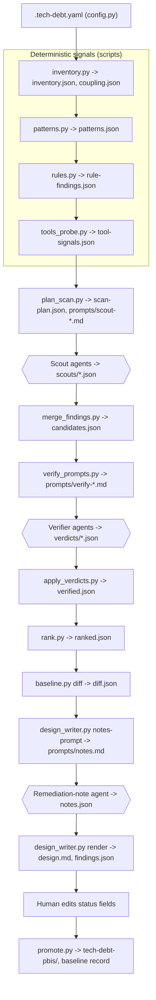

# tech-debt-scan v2 design

Provenance: derived from `docs/research/tech-debt-scan-v2/06-design-brainstorm.md` after the validation pass recorded in `07-validation-summary.md`; the taxonomy, gap analyses, judge's reference architecture and validation reports are under `docs/research/tech-debt-scan-v2/`. Every choice the brainstorm left open (its section 9) is settled here as a decision. Measured figures come from the validation reports.

Fixed constraints: Claude Code skill; SKILL.md orchestration with pinned commands, pinned output files and the exit-5 no-improvisation rule; pure Python 3.11+ with pyyaml as the only dependency, every script direct-path invocable as `python scripts/<name>.py`; read-only Agent subagents for all LLM work; language-agnostic by default, external tools only when already installed; human review of `design.md` before `promote.py`; no live LLM in tests; Windows-safe argv; LF-only rendered output; ruff, mypy strict, pytest and `skill_check.py` in CI.

## 0. Guardrails for planning and implementation

- **(a) Handoffs are rendered and assumptions bucketed.** Every artefact handoff (this spec, the implementation plan) is rendered in the brainstorming visual companion, with assumptions surfaced in three buckets: real concerns with decision and residual risk, verified safe with evidence, minor or accepted.
- **(b) Confidence per task.** Every plan task carries a confidence percentage; a task under 90 percent embeds its mitigation in the task text.
- **(c) Documentation ships with code.** `docs/architecture.md`, the repository `README.md` and `skills/tech-debt-scan/SKILL.md` are updated in the same PR as the code they describe. Phase 3 rewrites all three.
- **(d) Language-agnostic principle.** The only language-aware code is the inventory's extension map (which also supplies comment syntax) and the tool normalisers in `tools_probe.py`. Any per-language code path anywhere else is a defect.
- **(e) No live LLM in tests.** Tests feed canned JSON to scripts; the `live` pytest marker never runs in CI.
- **(f) Verify before commit.** When a task says "follows existing pattern X", the implementer reads X before writing.
- **(g) One branch and PR per phase.** Each phase is its own feature branch `feat/tech-debt-scan-v2-phase-<n>`, created before the first task; the PR opens in the phase's final gate task.

## 1. Goal, non-goals, success criteria

**Goal.** Replace a recall-only scan whose final list an LLM picks with a detect, verify, rank pipeline whose output is reproducible, evidence-checked and diffable across runs, widening coverage from the eight v1 categories to the taxonomy types the gap reports found absent or unverifiable.

**Success criteria.**

1. Every one of TD-01 to TD-35 has an explicit disposition, and every in-scope type has a family, a lead source and a verifier posture (section 2).
2. On the fixture corpus no planted decoy reaches tier A. Tier A precision under the opt-in live run is measured against a provisional bar of 0.80: v2.0 reports the number, v2.1 makes it a hard bar. The first row of `docs/evaluation-log.md` tests the bar.
3. `rank.py` produces a byte-identical `ranked.json` for a fixed `verified.json` and inventory. No LLM touches the final order.
4. Every reported finding cites a file, a line range and a verbatim quote that `merge_findings.py` found on disk; a finding whose quote is not found is diverted to open questions, never reported.
5. A second scan over the same repository classifies each finding NEW, UNCHANGED or RESOLVED and honours accepted-with-expiry decisions.
6. `design.md` carries the negative-space sections (considered and rejected, looks bad but fine, open questions, not assessed).
7. Deterministic stages complete in under two minutes on a 5,000-file repository without tools. Measured: stem graph 4.6 s and regex lead pass 3.6 s at 5,000 files; git pass under 1 s for 600 commits; blame on 50 files 4.4 s.

**Non-goals.** Autonomous fixing. A composite health score. Any tool that executes project code (coverage, mutation testing, test runs, builds). Installing tools. Issue-tracker, review-platform or registry lookups except through an installed tool. Class-level metrics that need a parser (LCOM, hierarchy depth, Feature Envy). Runtime-only aspects (flake confirmation, coverage numbers, model staleness, rollout state, deploy frequency). Money or hours estimates. Debate rounds between agents. SARIF export. The `data-ml` family, which is a follow-on after phase 5.

## 2. Scope: debt types and families

### 2.1 Disposition of the 35 types

| ID | Disposition | Family |
|---|---|---|
| TD-01 | IN | complex-units |
| TD-02 | IN | dependency-debt |
| TD-03 | IN | security |
| TD-04 | IN | test-gaps |
| TD-05 | IN | duplication |
| TD-06 | IN | migration |
| TD-07 | IN | architecture |
| TD-08 | IN | doc-drift |
| TD-09 | IN | dead-code |
| TD-10 | IN | architecture |
| TD-11 | IN | god-classes |
| TD-12 | IN, optional | test-quality |
| TD-13 | IN | error-masking |
| TD-14 | IN, script-led | pipeline-infra |
| TD-15 | IN as signal | (inventory) |
| TD-16 | IN, script-only | ownership |
| TD-17 | IN, folded | dead-code, migration |
| TD-18 | IN, optional | test-quality |
| TD-19 | IN, script-led | pipeline-infra |
| TD-20 | IN, limited | god-classes, dead-code |
| TD-21 | EXCLUDED | (trap for duplication) |
| TD-22 | IN | half-finished |
| TD-23 | IN, limited | ownership |
| TD-24 | DEFERRED | (god-classes later) |
| TD-25 | DEFERRED | data-ml |
| TD-26 | DEFERRED | data-ml |
| TD-27 | IN, limited | pipeline-infra |
| TD-28 | IN | half-finished |
| TD-29 | EXCLUDED | (signal only) |
| TD-30 | IN, folded | dead-code |
| TD-31 | DEFERRED | data-ml |
| TD-32 | IN, folded | half-finished |
| TD-33 | DEFERRED | (config-to-source ratio as a header number) |
| TD-34 | IN, one rule | half-finished |
| TD-35 | IN, one rule | pipeline-infra |

TD-15 (hotspots) is a corroborator and interest term, never a finding. TD-21 (magic literals) and TD-29 (lint suppressions) are recorded as signals and never scored. The artefact classes and domain gate for the deferred `data-ml` types land in v2 so the report can say "ML artefacts present, not assessed".

### 2.2 Taxonomy axes and debt types

Every finding carries three axes. `family` is the scout assignment axis (one prompt per family). `debt_type` is the reporting axis. `type_id` (TD-xx) is an optional third axis; each family block lists its allowed values and `validation.py` checks format and membership when present, the same tolerant pattern used for `debt_type` today.

`VALID_DEBT_TYPES` gains `security`, `infrastructure`, `knowledge-process` and `defect`. `data` and `ml-ai` are reserved for the data-ml follow-on and not added until a family emits them. `performance` is not added; the single no-timeout rule files under `requirement`.

### 2.3 Family table

| Family | Owns | Default | Detection mode | Leads from | Tool probe candidates | Tier cap without tool | Verifier questions |
|---|---|---|---|---|---|---|---|
| complex-units | TD-01 | on, quick | LLM scout, inventory leads | `deep_indent_lines`, `longest_indented_run`, `max_indent` per file | lizard; ruff (C901, PLR091x) | none; tier A on the general corroboration rule of 4.8 | Large but cohesive (table, state machine, generated)? Does the span show the branching claimed? Is the unit on a change path? |
| god-classes | TD-11, TD-20 (intimacy, chains) | on | LLM scout | `loc`, `fan_in_approx`, coupling pairs | lizard method counts | intimacy and chain findings tier B without a coupling pair | One reason to change? Do methods cluster over disjoint fields? Facade, DTO or fluent builder trap? |
| duplication | TD-05; TD-21 as trap | on | LLM scout, tool lead | coupling pairs, jscpd clones | jscpd, PMD CPD | tier B and excluded from quick-wins without tool hit or coupling pair | Copies change-coupled or tool-confirmed? Path class fixture, generated, vendored? Would a shared abstraction be simpler than the copies? |
| dead-code | TD-09, TD-30, TD-17 (zero callers), TD-20 (middle man) | on | LLM scout, tool lead, pattern lead | `fan_in_approx = 0` and `churn = 0` on ordinary modules only; commented-out code, legacy names, deprecation annotations, flag SDK calls | knip, vulture, ruff (F401) | tier C unless churn and fan-in are both zero on an ordinary module (then B) | Which dynamic-reference patterns were checked (reflection, string dispatch, routes, DI, serialisation)? Is the file an entry point, a script run by name, or a test file a runner discovers by convention? Public or plugin surface? Flag is permission or kill-switch? |
| error-masking | TD-13 | on, quick | LLM scout, pattern lead | error-masking pattern table | ruff (E722, BLE001, S110, S112), bandit | none; a pattern hit is deterministic corroboration | What failure is hidden and who learns of it? Process boundary, retry that re-raises, or cleanup block? Cause preserved on rethrow? |
| test-gaps | TD-04 | on, quick | LLM scout, script lead | empty `mapped_tests` in the hotspot band, `untested_change_share`, skip markers, `coverage_gate` | none | tier B for a reading-only claim; A when the mapping script agrees | Which test paths were searched? Is there an unconventionally named test? Does the mapped test assert behaviour? |
| test-quality | TD-12, TD-18 | optional (deep) | LLM scout, pattern lead | test-signal counts, `ci_retry_config`, `flaky_commits` | none | flakiness findings severity 3 max and tier B max without CI data | Table-driven or parametrised idiom? Fake timers or frozen clock? Does the assertion-free test guard a critical path? |
| half-finished | TD-22, TD-28, TD-32, TD-34 (one rule) | on, quick | LLM scout, SATD lead | SATD table with age and ticket flag; stub, defect, xfail patterns; no-timeout pattern | none | marker-only findings severity 3 max unless a concrete risk is named | Stub is an abstract contract? Ticket tracks it? Named risk still present in the code? |
| migration | TD-06, TD-17 (idiom drift, superseded config) | on | LLM scout, script lead | naming hints, `migration_commits`, dual-manifest rules, deprecation annotations with callers, coupling | none | tier B without churn evidence on both sides | Churn on old side, new side, both or neither? Deliberate multi-backend? Call-site ratio cited? |
| dependency-debt | TD-02 structural | on, quick | LLM scout on artefacts, tool facts | manifest, lockfile, runtime_version, governance artefacts | osv-scanner (first cut); pip-audit, npm outdated later | currency, EOL and vulnerability claims "not assessed" without a tool; structural facts tier B; tool facts tier A | Lockfile missing or elsewhere (monorepo)? Duplicate-purpose pair is a migration? Floating range inside a library? |
| doc-drift | TD-08 | on | LLM scout, script lead | `dangling_refs`, `stale_vs_code_days`, presence flags for README, CONTRIBUTING, ADRs, CHANGELOG versus tags | none | tier B until the live evaluation reports an F1 | Both the doc line and the contradicting code line cited? Example still runnable? Absence findings aggregated per module? |
| architecture | TD-07, TD-10; TD-15 as signal | on | LLM scout, graph lead | import-line cycles (capped leads), coupling pairs, directory aggregates, unstable edges, `boundary_tooling` | madge, dependency-cruiser, import-linter | reading-only cycles tier B; "wrong component" tier C; A only with tool or coupling corroboration | Language forbids package cycles (Go, .NET)? Co-change explained by a declared dependency or feature work? ADR or import contract states the layers? |
| security | TD-03 | on, quick | LLM scout pattern-level, tool facts | security pattern table, gitleaks and osv signals, SECURITY.md and CI scanning-job presence | gitleaks, osv-scanner (first cut); semgrep, bandit, trivy later | exploitability never claimed; pattern-level tier B; tool plus verifier tier A | Path class example, fixture or test, and secret entropy? User input reachable at the SQL or shell site? Suppression justified nearby? |
| pipeline-infra | TD-14, TD-19, TD-27, TD-35 | rules always; scout optional (deep) | `rules.py` deterministic; LLM scout for judgement symptoms | CI, container, IaC artefacts; tags and branches | actionlint, hadolint (first cut) | rule findings tier A, severity 2 to 3, one per file; scout findings tier B | Dev-only Dockerfile or compose path? Duplicated YAML generated from a template? Manual step documented as intentional? |
| ownership | TD-16, TD-23 | rules only, when git and 3+ human authors | `rules.py` deterministic, no scout | authors, `top_author_share`, blame line share on the hotspot band, CODEOWNERS, branches | none | tier A by construction, severity 3 max (4 for a top-5 hotspot island), excluded from quick-wins | none; wording is "no commits in six months", never "has left" |
| data-ml | TD-25, TD-26, TD-31 | deferred | LLM scout behind a domain gate | notebook, model_binary, sql artefacts; ML or LLM libraries in manifests | none | not applicable | not applicable |

Tool rule codes appear only in this table and in 4.5: they are the optional per-language precision layer, and the scan runs without them.

### 2.4 Family sets and the adaptive rule

Fourteen families carry a scout block in `categories.py`: the twelve default-on families plus test-quality and the pipeline-infra scout. `ownership` and the pipeline-infra rules have no scout and run through `rules.py` whenever their artefacts or git data exist. `data-ml` has no block until its follow-on.

- **Default set (12):** complex-units, god-classes, duplication, dead-code, error-masking, test-gaps, half-finished, migration, dependency-debt, doc-drift, architecture, security.
- **Quick set (6):** complex-units, error-masking, test-gaps, half-finished, dependency-debt, security.
- **Deep set (14):** the default set plus test-quality and the pipeline-infra scout.

**Adaptive rule.** A family in the default, quick or deep set is dispatched only when its leads block (4.6) is non-empty after path-class disables: at least one hotspot-band file, coupled pair, pattern lead, tool signal, SATD marker or artefact lead in the family's scope. Otherwise `scan-plan.json` lists it under `families_skipped` with reason `no leads`. An explicit list (`--families` or a list in `families.enabled`) is dispatched as named. When git is absent the hotspot band is empty, so families with no other lead source are skipped and the report says why.

## 3. Architecture

### 3.1 Pipeline



Hexagons are LLM agents; every other node is a script. The v1 synthesis agent does not exist in v2: scouts detect, a verifier checks, a script ranks, and one note agent writes remediation text for the top N only.

### 3.2 Script status

| Script | v2 status |
|---|---|
| `inventory.py` | changed: artefact and path classes, extended git pass, coupling, fan-in, cycles, test mapping, docs block (4.2) |
| `categories.py` | changed: family blocks with definition, questions, traps, allowed `type_id` values; shared prefix rewritten (4.6); in phase 2 the v1 symbols (`CATEGORY_PROMPTS`, `CATEGORIES`, `CORE_CATEGORIES`, `get_prompt`) stay beside the family blocks so SKILL.md v1 and `build_synthesis_prompt.py` keep working, and phase 3 deletes them |
| `validation.py` | changed: new debt types, `accepted` status, `validate_type_id`, `validate_tier` (4.13) |
| `design_parser.py` | changed: `OPTIONAL_KEYS` extended; a finding section also ends at an H1 (4.11) |
| `design_writer.py` | changed: `render` reads ranked, diff and notes inputs; new `notes-prompt` subcommand (4.11) |
| `bundle_writer.py`, `promote.py` | changed: new PBI fields, `accepted` status, baseline write-back with exit code 6 (4.12) |
| `skill_check.py` | unchanged; constrains every v2 script as stated in section 5 |
| `build_synthesis_prompt.py` | deleted in phase 3; `priority_score` moves to `rank.py`, scout-output validation to `merge_findings.py` |
| `config.py` | new: shared loader for `.tech-debt.yaml` (4.1) |
| `patterns.py` | new: SATD and per-family regex lead miner (4.3) |
| `rules.py` | new: deterministic finding generator for pipeline-infra and ownership (4.4) |
| `tools_probe.py`, `plan_scan.py`, `merge_findings.py`, `verify_prompts.py`, `apply_verdicts.py`, `rank.py`, `baseline.py`, `evaluate.py` | new (4.5 to 4.10, section 6) |

### 3.3 Conventions

**Workdir.** Every v2 script accepts `--workdir` (default `.tech-debt`) and reads and writes the pinned file names inside it. `inventory.py` keeps `--out` for compatibility. No file list ever appears on a command line; the longest expanded command (absolute script paths, a 75-character repository path, all fourteen family names) is 299 characters.

**Language-agnostic rule.** Every script-level rule in `inventory.py`, `patterns.py` and `rules.py` is a union-of-idioms table, one keyword or regex set covering many languages, never a per-language branch. The extension map is the only language-aware code and supplies the comment syntax a rule strips. Per-language precision comes only from the optional tools. Every pattern rule fires on at least two languages in the fixture corpus (section 6); the validation pass measured the regex rules on Python only.

**Failure posture.** Git and tool calls run with a 120-second timeout and a null result on failure; a missing optional signal never aborts a scan. A missing pinned output file after a numbered SKILL.md step is exit 5.

## 4. Components

### 4.1 `config.py` and `.tech-debt.yaml`

One loader, imported by every script, for `.tech-debt.yaml` at the repository root. Every key is optional; the defaults below apply when the file or key is absent. Committed state is two files: `.tech-debt.yaml` (config, root) and `.tech-debt/baseline.json` (scan state, inside the workdir, re-included by the gitignore triple of 4.10).

```yaml
schema_version: 1
ignore: []                                   # extra directory names or globs, added to DEFAULT_IGNORE
path_classes:                                # extend the built-in globs per class
  tests: []
  generated: []
  vendored: []
  docs: []
families:
  enabled: default                           # default | quick | deep | [explicit list]
  disabled: []
  per_path_class:
    tests: { disable: [duplication, complex-units, god-classes] }
    generated: { disable: all }
    vendored: { disable: all }
churn_months: 12
bot_authors: ["[bot]", Claude, dependabot, renovate, github-actions]   # author names dropped from authorship counts
hotspot_band: { fraction: 0.10, min: 5, max: 50 }
coupling: { min_shared: 3, min_ratio: 0.30, bulk_threshold: 50 }
fan_in:
  mode: auto                                 # auto | import-lines | anywhere
  min_stem_length: 4
  ambiguous:
    shared_stem: true
    package_files: [__init__, __main__, index, mod, lib]
    harness_files: [conftest, setup]
    stoplist: [utils, config, index, main, types, common, base, core, helpers, models]
scout_cap: 12
top: 5
chunking: { max_files: 1500, max_loc: 200000 }
verifier: { batch_size: 6, context_lines: 30, min_candidates: 30, top_multiple: 3, max_candidates: 72, always_families: [security], always_min_severity: 5 }
ranking:
  preset: balanced
  weights: { wH: 1.0, wC: 0.5, wF: 0.5 }
  tractability: { S: 1.0, M: 0.75, L: 0.5 }
  spread_cap: 0.5
tools: { allow: all, deny: [], network: true, timeout_s: 120 }
rules:
  ownership: { island_share: 0.8, island_max_authors: 2, island_min_churn: 2, inactive_days: 180, min_human_authors: 3, max_stale_branches: 10 }
  release: { stale_branch_days: 90, min_tags: 5, gap_multiple: 4 }
ci_enforces: []                              # families the repo's own CI already lints; findings are flagged, not dropped
baseline: .tech-debt/baseline.json
suppressions: []                             # [{fingerprint, reason, until}]
traps: []                                    # [{family, path_glob, note}]
```

`fan_in.mode: auto` uses import-line matching and falls back to anywhere mode for files whose language matched no import-like line in the repository (4.2). A command-line flag overrides its config key (`--churn-months`, `--preset`, `--top`, `--families`).

**Tests:** defaults load with no file; a partial file merges over defaults; an unknown top-level key is reported with its line and ignored; `families.enabled` accepts each of its four forms.

### 4.2 `inventory.py`

One walk over the repository and one pass over git history producing `inventory.json` and `coupling.json`. `files`, `total_files` and `languages` keep their v1 meaning (code plus markdown) so the v1 fixture counts hold; the new classes live under `artefacts`.

**Artefact classes**, a second walk over files the extension map skips:

| Class | Match |
|---|---|
| manifest | package.json, pyproject.toml, requirements*.txt, go.mod, Cargo.toml, Gemfile, *.csproj, pom.xml, build.gradle* |
| lockfile | package-lock.json, yarn.lock, pnpm-lock.yaml, poetry.lock, uv.lock, go.sum, Cargo.lock, Gemfile.lock, packages.lock.json |
| runtime_version | .python-version, .nvmrc, .tool-versions, .ruby-version, global.json, rust-toolchain* |
| ci | .github/workflows/*.yml, .gitlab-ci.yml, azure-pipelines.yml, .circleci/config.yml, Jenkinsfile |
| build | Makefile, justfile, Taskfile.yml, *.sh, *.ps1 |
| container | Dockerfile*, docker-compose*.yml, .devcontainer/** |
| iac | *.tf, *.tfvars, *.hcl, *.bicep, Chart.yaml, YAML containing `apiVersion:` and `kind:` |
| sql | *.sql, migrations/**, alembic/versions/**, db/migrate/**, *.prisma |
| notebook | *.ipynb (cell count and monotonic execution only) |
| model_binary | *.pkl, *.pt, *.h5, *.onnx, *.safetensors, *.joblib (size and LFS pointer only, never opened) |
| config | remaining *.yml, *.yaml, *.json, *.toml, *.ini, *.cfg, .env* |
| governance | CODEOWNERS, SECURITY.md, CONTRIBUTING.md, PULL_REQUEST_TEMPLATE*, dependabot.yml, renovate.json, docs/adr/** |

`DEFAULT_IGNORE` drops `build` and `bin` from its directory list and replaces them with a conditional rule: a directory named `bin` or `build` is ignored only when it holds no manifest itself and its parent is the repository root or holds a manifest (a build-output directory sits beside the manifest that produced it: CRA `build/`, setuptools `build/`, .NET `Project/bin/`, Gradle `module/build/`). A `bin` or `build` directory whose parent is an ordinary source directory (a Go `internal/build` package) is walked. The artefact walk excludes `.tech-debt.yaml` at the root (the workdir is already ignored by whole path part).

**Path classes** on every `files` entry: `tests` (tests/, __tests__/, test/, spec/, test_*, *_test.*, *.spec.*, *.test.*, *Tests.cs), `generated` (*.g.cs, *.generated.*, *_pb2.py, *.pb.go, *.min.js, *.designer.cs, /generated/), `vendored` (vendor/, third_party/, extern/), `docs` (*.md, *.rst, *.adoc, docs/), otherwise `source`. `path_classes` in config extends each list.

**One git pass**, replacing `_git_churn`:

```
git -C <root> -c core.quotePath=false log --since="<n> months ago" --name-only --relative --format=%x1e%H%x09%aN%x09%aE%x09%aI%x09%s -- .
```

Stdout is decoded as UTF-8 with replacement; the header line is split with `maxsplit=4` because subjects contain tabs. Each record gives hash, author name, author email, date, subject and file list. Authors are keyed by email; names matching `bot_authors` are dropped; `git.mailmap_present` records whether `.mailmap` exists, and when it does not the report states that authorship is by name, not by person. Churn and coupling are joined against the files present at HEAD, so a deleted file never becomes a lead.

Per file: `churn`, `last_touched`, `authors` (distinct humans), `top_author` (the email key of the author with the most commits, needed by the former-contributor rule), `top_author_share`, `bugfix_share` (subject matches `fix|bug|hotfix|regress`; recorded, not scored), `migration_commits` (`migrat|legacy|deprecat|port(ed|ing)|codemod|upgrade`), `flaky_commits` (`flak`), `untested_change_share` (share of commits touching the file with no `tests`-class file alongside). Repo-wide: authors with last-active dates, commit count, bulk commits excluded.

Two further fixed-argv commands give branches (`git for-each-ref` on `refs/heads` and `refs/remotes` with `%(symref)` in the format so `origin/HEAD` is skipped; merged state from one `git for-each-ref --format=%(refname) --merged=HEAD refs/heads refs/remotes` pass, every branch `merged: null` when that call fails) and tags (`git tag --sort=creatordate`). `git blame -w --line-porcelain <path>` runs only for hotspot-band files (cap 50) to derive `top_author_line_share`. Measured: 0.06 to 0.74 s for 5 to 604 commits; blame 4.4 s for 50 files.

**Change coupling.** Commits touching more than `bulk_threshold` (50) files are excluded. Pairs of `source`-class files are counted; a pair is emitted at `shared_commits >= 3` and `ratio >= 0.30` where `ratio = shared / mean(commits_a, commits_b)`; per-file `coupling_degree` is the count of emitted pairs. Measured: 49 pairs on ralph, 20 on better-memory, 0 on claude-skills.

**Approximate fan-in.** Each source file is tokenised once into an identifier set; stems (`min_stem_length` 4) are resolved through an inverted stem index, one pass per file against a stem-to-file map. Two modes:

- `import-lines`, the default: B references A only when A's stem appears in an import-like line of B. An import-like line matches `^\s*(import|from|using|use|require|include|#include|load|open|extern crate|require_relative|@import|@use)\b` or contains `require(`, `import(`, `from "` or `from '`. `package` is deliberately absent: in Go, Java, Kotlin, Scala and Perl it declares the file's own package and never references another file, and counting it made every Go file reference the sibling named after the package (found by the phase 1 corpus). A directory segment inside a relative import path can still match an unrelated stem; that imprecision is accepted and labelled approximate. A line ending in an open bracket, a trailing backslash or a comma is joined with the next as a continuation.
- `anywhere`, the whole-file token match, is the labelled lower-confidence fallback. Under `mode: auto` it applies to any file whose language matched no import-like line anywhere in the repository. Its edges are marked `fan_in_mode: anywhere` and contribute nothing to the F term.

**Ambiguity** is mechanical. A file is ambiguous, with `fan_in_approx` null, when its stem is shared by two or more files, when it is a package or index file (`package_files`), a test-harness file (`harness_files`), or in the ten-name `stoplist`. The three lists are one union across languages, extended only when the corpus gains a language family. The stoplist is never extended with domain vocabulary, and package files are never mapped to their directory name. Measured on three Python repositories against the true import graph: edge precision 0.90 to 0.98, recall 1.0, Spearman 0.985 to 1.0. Fan-in counts imports only; entry points, scripts run by name and runner-discovered test files have fan-in 0 without being dead, so dead-code corroboration by fan-in applies to ordinary modules only. The same edges give `fan_out_approx`, per-directory aggregates with instability, and `unstable_edges` (a directory under 0.3 depending on one over 0.7).

**Cycles.** Tarjan SCCs of size 2 to 5 from the import-line graph only, emitted as capped leads for the architecture scout, never as statistics or findings. `design.md` notes that recall on Python cycles is low because they route through package re-exports, which the ambiguity rule excludes.

**Hotspots.** `hotspots` keeps its v1 shape and key set; every file entry gains `hotspot_score`. New top-level `hotspot_band`: the top `fraction` (0.10) of `hotspot_score` among source-class files, at least `min` (5) and at most `max` (50) paths.

**Test mapping.** Candidate tests per source file by stem through one union glob table (`test_foo.*`, `foo_test.*`, `foo.test.*`, `foo.spec.*`, `foo_spec.*`, `FooTest.*`, `FooTests.*`) in the same directory or any tests-class tree, emitted as `mapped_tests`. Repo-level: `tests.test_to_source_ratio`, `tests.coverage_gate` (by filename or key: `fail_under`, `coverageThreshold`, `check-coverage`, `codecov.yml`), `tests.ci_retry_config`.

**Docs block:** `readme_present`, `readme_loc`, `contributing_present`, `adr_dir_present`, `changelog_present`, `changelog_last_commit`, `latest_tag`, `latest_tag_date`, `dangling_refs` (backtick or path-like tokens in docs naming no existing file or identifier stem), `stale_vs_code_days` per doc.

```json
inventory.json
{ "schema_version": 2, "root": "...", "total_files": 0, "total_loc": 0, "languages": [],
  "git_available": true, "churn_window_months": 12,
  "hotspots": [ {"path": "", "churn": 0, "complexity": 0, "loc": 0, "score": 0.0} ],
  "hotspot_band": ["..."],
  "files": [ { "path": "", "ext": "", "loc": 0, "mtime": 0.0, "complexity": 0, "max_indent": 0, "churn": 0,
               "language": "", "path_class": "source", "hotspot_score": 0.0,
               "deep_indent_lines": 0, "longest_indented_run": 0, "inline_disables": 0,
               "last_touched": null, "authors": 0, "top_author": null, "top_author_share": null, "top_author_line_share": null,
               "bugfix_share": 0.0, "migration_commits": 0, "flaky_commits": 0, "untested_change_share": null,
               "mapped_tests": [], "fan_in_approx": null, "fan_out_approx": null, "fan_in_mode": "import-lines", "coupling_degree": 0, "skipped_large": false } ],
  "artefacts": { "<class>": [ {"path": "", "path_class": "source", "loc": 0, "churn": 0, "last_touched": null, "size_bytes": 0, "skipped_large": false} ] },
  "skipped_large_files": 0,
  "docs": { ... }, "tests": { ... },
  "git": { "authors": [], "branches": [], "tags": [], "commits_in_window": 0, "bulk_commits_excluded": 0, "mailmap_present": false },
  "boundary_tooling": [], "lint_config": [], "signal_sources": { "git": "<timestamp>" } }

coupling.json
{ "schema_version": 2, "min_shared": 3, "min_ratio": 0.3, "bulk_threshold": 50, "fan_in_mode": "import-lines",
  "pairs": [ {"a": "", "b": "", "shared_commits": 0, "ratio": 0.0, "cross_directory": false} ],
  "degree": { "<path>": 0 },
  "cycles": [ {"members": [], "approximate": true, "source": "import-lines", "lead_only": true} ],
  "directories": [ {"path": "", "files": 0, "loc": 0, "churn": 0, "fan_in": 0, "fan_out": 0, "instability": 0.0} ],
  "unstable_edges": [ {"from": "", "to": "", "from_instability": 0.0, "to_instability": 0.0} ] }
```

`inline_disables` is emitted as 0 by `inventory.py` and filled in place by the lint group of `patterns.py`. Every artefact entry carries `path_class` (the same classifier as code files) so later stages can apply path-class disables to workflows, Dockerfiles and configs that live under a tests or fixtures tree. Files larger than 2 MB or with a NUL byte in their first 1 KB are never read: their entry keeps `loc` 0 and `complexity` 0 with `skipped_large: true`, and the top-level `skipped_large_files` counts them. Rule findings copy the artefact's `path_class` into `signals.path_class`.

**No git:** `churn` stays 0 and `hotspots` is empty; only the new history fields (`last_touched`, `authors`, `top_author_share`, `top_author_line_share`, `untested_change_share`) are null; `coupling.json` has empty lists; `design.md` says so.

**Tests:** the pinned hotspot key set and v1 fixture counts stay; artefact and path classification with config extension; the git pass over the synthetic history (churn, pairs, author keying by email, bot filtering, HEAD join, a non-ASCII path); branch and tag parsing with the `origin/HEAD` skip; fan-in precision on the corpus, the ambiguity rule and anywhere labelling; SCC leads; hotspot band bounds; test mapping across the seven conventions; docs block; the no-git shape.

### 4.3 `patterns.py`

One regex lead table keyed by family. Each row has `family`, `rule`, regex, path-class scope and a blame flag. Every regex is a union of idioms across languages; the extension map only says which comment markers to strip. A rule's scope is matched against the artefact class for an artefact and the path class for a code file, but every emitted lead and SATD entry carries the real `path_class` from 4.2, and an artefact classed `generated` or `vendored`, or marked `skipped_large`, is not scanned at all. Leads feed scouts and corroborate the merge; counts go to report statistics, never to a finding. Blame runs only for the `satd` group, on at most 200 files; `--no-blame` skips it. `commits_since` comes from one `git log --format=%H -- <path>` per blamed file (the position of the blamed commit in that list), never from one `rev-list` per marker. Redaction lives in one shared module, `redaction.py`, used by every script that writes a quote (`patterns.py` and `rules.py`).

| Group (family) | Rules | Scope |
|---|---|---|
| satd (half-finished) | 62-pattern marker list plus stubs (`NotImplementedError`, `NotImplementedException`, `not implemented`, `unimplemented!`, `panic("not implemented")`, `throw new Error("not implemented`, `TODO()`), defect markers (`known bug`, `known issue`, `kludge`, `workaround`), expected-failure and skip markers (`xfail`, `expectedFailure`, `@pytest.mark.skip`, `@Ignore`, `@Disabled`, `it.skip`, `test.skip`, `[Ignore]`, `t.Skip(`), ticket reference flag (`#\d+`, `[A-Z]{2,}-\d+`, issue URL) | every text file including build, CI and tests |
| error-masking | one rule over a union of catch idioms (`except X as e`, `except:`, `catch (X e)`, `catch (e)`, `catch e`, `catch {`, `rescue X => e`, `rescue => e`, `on X catch (e)`, Go's `if err != nil {`) with the caught-variable name captured from whichever idiom matched. A hit is a lead when the body is empty, `pass`, `return`, `return None` or `return null`, or when it is log-only and references neither the caught variable nor an exception-carrier token (`exc_info`, `.exception(`, `stack`, `stackTrace`, `err`, `ex`, `e)`). `extra.annotated: true` when the catch line carries a trailing comment or a suppression marker (`noqa`, `nolint`, `eslint-disable`, `pragma`). The catches-everything variants (`except:`, `except BaseException`, `catch (Throwable`, `catch (...)`, `catch {}`) are the higher-severity branch of the same rule. A second, signal-only rule records assertion-disabling switches as one union (`NDEBUG`, `-O` or `-OO` in a run command, `-da` or `enableassertions=false`, `assert: false` or `assertions: false` in config, `assert` calls commented out) so the scout can ask whether assertions still run | source, ci, config |
| dead-code | commented-out code: a run of three or more comment lines where, after stripping the markers the extension map names (`#`, `//`, `/* */`, `--`, `<!-- -->`), a majority of lines start with a statement keyword from the union set (`if`, `for`, `while`, `return`, `def`, `function`, `class`, `var`, `let`, `const`, `int`, `string`, `public`, `private`, `static`, `fn`, `func`, `import`, `using`, `switch`, `case`, `try`, `catch`) or match `identifier =` or `identifier(` or end with `;` or `{`, and the run's brackets balance; a language parser may confirm a hit only as an optional tool signal. Legacy names (`old`, `bak`, `v1`, `legacy` in path or symbol). In-repo deprecation annotations as one union (`@deprecated`, `[Obsolete]`, `@Deprecated`, `DeprecationWarning`, `#[deprecated]`, a `Deprecated:` doc comment, `@available(*, deprecated`) with approximate caller count. Flag SDK calls as one union (`variation(`, `boolVariation(`, `isEnabled(`, `IsEnabled(`, `is_active(`, `getFeatureFlag(`, `getBooleanValue(`, `FEATURE_`) | source |
| security | credential-shaped assignments (`password|secret|token|api_key\s*=\s*["'][^"']{8,}`), excluding values that begin `$`, `${`, `{{`, `<` or `%`, values matching `fake|dummy|example|placeholder|changeme|your_|xxx`, and the tests path class. String-built SQL as one union (a query call `execute(`, `query(`, `ExecuteSqlRaw(`, `Raw(` or `createStatement` whose argument is built with `+`, an f-string, a template literal, `String.format`, `$"` or `%` formatting). Dynamic evaluation and shell-out (`eval(`, `exec(`, `shell=True`, `shell: true`, `child_process.exec(`, `Runtime.exec(`, `Process.Start(`, `exec.Command(`, `system(`). TLS verification disabled (`verify=False`, `rejectUnauthorized: false`, `InsecureSkipVerify: true`, `ServerCertificateValidationCallback`, `VERIFY_NONE`, `--insecure`). Weak hashes (`md5(`, `sha1(`, `MD5.Create`, `getInstance("MD5")`, `createHash('md5')`, `Digest::MD5`). `Access-Control-Allow-Origin: *`. Suppression of a security rule (`nosec`, `eslint-disable` on a security rule, `nolint:gosec`, `pragma warning disable` on a CA rule). Matched credential values are redacted to their first four characters before writing | source, ci, config |
| test-quality | per test file, each signal one union: sleep calls (`sleep(`, `Thread.Sleep`, `setTimeout(`, `time.Sleep`), retry markers, wall-clock reads (`now()`, `Date.now`, `DateTime.Now`, `time.Now`, `Time.now`), unseeded random, try or catch in test bodies, assertion count per test function, numeric literals in assertions, conditional logic in test bodies | tests |
| requirement (half-finished) | HTTP call with no timeout, one union of client-call idioms each paired with its timeout argument: `requests.` and `httpx.` calls without `timeout=`, `fetch(` and `axios(` without `signal` or `timeout`, `HttpClient` without `Timeout`, `http.Get(`, `http.Post(` or `&http.Client{` without `Timeout`, `Net::HTTP` without `read_timeout`, `urlopen(` without `timeout`, `curl` without `--max-time` | source |
| observability (pipeline-infra) | stdout-write counts over one union (`print(`, `console.log(`, `System.out.println(`, `fmt.Println(`, `fmt.Printf(`, `puts `, `echo `, `Console.WriteLine(`, `printf(`) in non-test, non-CLI source when a logger library is also present | source |
| lint (signal only) | inline disables as one union (`noqa`, `eslint-disable`, `pragma warning disable`, `SuppressWarnings`, `nolint`, `rubocop:disable`, `#[allow(`, `nosec`) per file; written to `inventory.files[].inline_disables` | source |

```json
patterns.json
{ "schema_version": 2,
  "leads": { "<family>": [ {"rule": "", "file": "", "line": 0, "quote": "", "path_class": "", "extra": {}} ] },
  "satd": [ {"marker": "", "file": "", "line": 0, "quote": "", "ticket_ref": false, "age_days": null, "commits_since": null, "path_class": ""} ],
  "stats": { "markers_by_age_band": {}, "markers_without_ticket_share": 0.0, "leads_per_family": {} } }
```

Leads are capped at 40 per family in a prompt (hotspot-band first) and recorded in full in the file. Measured before amendment on four Python repositories: exception swallowing 7 of 15 strict, the credential rule 0 of 9, commented-out code 0 of 33; the amended forms above are what ship.

**Tests:** each rule has a positive case in at least two corpus languages and a decoy case; the exception-carrier exclusion; the placeholder and tests-class exclusions on the credential rule; the seeded true-positive credential is detected and redacted to four characters; SATD age and ticket flag over the synthetic history; `--no-blame`; the lint count written into the inventory; a grep-level test that the module contains no language-name conditional.

### 4.4 `rules.py`

Deterministic findings for the pipeline-infra and ownership families. Each is a single-line fact whose quote is verified by construction, so rule findings skip scouts and verifier and enter `merge_findings.py` as tier A candidates with `source: "rule"` and `rule_id`. One aggregated finding per file. Severity 2 to 3 for the ci, container, iac, manifest and release groups; 3 applies when a permissions or pinning gap sits on a workflow whose file or job name matches `release|publish|deploy`. Ownership severities are stated in the table.

| Rule group | Rules | Debt type |
|---|---|---|
| ci | per job: no `timeout-minutes`, no `permissions`, `continue-on-error: true`, `uses:` without a 40-hex SHA, `runs-on` ending `-latest`, no cache step, commented-out job blocks | build |
| container | `FROM` untagged or `latest`, unversioned `apt-get install`, `pip install`, `apk add`, `ADD` for local files, piped `RUN` without `pipefail`, no `USER`; dev-only paths (`docker-compose.dev.yml`, `.devcontainer/`) drop one severity | infrastructure |
| iac | Kubernetes `resources.limits` absent, `image:` with `latest`, `privileged: true` | infrastructure |
| manifest | no lockfile beside a manifest, two lockfile kinds for one ecosystem; `setup.py` beside `pyproject.toml` and `tslint` beside `eslint` are emitted as migration leads into the leads block, not findings | dependency |
| release | tag cadence when `min_tags` (5) or more tags exist and the maximum gap exceeds `gap_multiple` (4) times the median; `hotfix/*`, `release/*`, `prod`, `staging` branches unmerged for `stale_branch_days` (90); refs/heads only | build |
| ownership | knowledge island (`top_author_line_share >= island_share` 0.8 and `authors <= island_max_authors` 2 on a hotspot-band file; severity 3, or 4 on a top-5 hotspot); former-contributor hotspot (top author's last commit older than `inactive_days` 180); unowned hotspot (CODEOWNERS exists, no rule matches); no CODEOWNERS with `min_human_authors` (3) or more; more than `max_stale_branches` (10) unmerged branches over 90 days; no ADR directory and no PR template as one severity-1 note. The group is suppressed below three human authors. Phase 2 decision: an island also needs `churn >= island_min_churn` (2) in the window, so a one-author file nobody touches is not flagged (service-py ownership precision was 0.20 without the floor); CODEOWNERS is consulted only when its artefact entry is neither `skipped_large` nor under a disabled path class, and the unowned-hotspot check is skipped otherwise | knowledge-process |

Every threshold is overridable under `rules` in `.tech-debt.yaml`. Output `rule-findings.json` is an object `{ "schema_version": 2, "findings": [...], "leads": {"migration": [...]} }`: `findings` holds candidates in the 4.7 schema with `source: "rule"`, `tier: "A"` and `confirmed_by: ["rule:<rule_id>"]`; `leads` holds the manifest group's migration leads so `plan_scan.py` can add them to the migration leads block without a second cross-script write. Repository-level facts (release cadence, stale environment branches, missing CODEOWNERS) have no file: their single evidence item carries `file: null`, `line_start: null`, `line_end: null`, `quote: ""` and `quote_verified: true`, the same shape as manifest-level osv facts in 4.5. Rule date arithmetic takes an injectable `now` (default today) so fixture tests pin a date.

**Tests:** each rule with a positive fixture and a decoy (a dev-only compose file with `latest` drops one severity; a release workflow without `permissions` is severity 3, an ordinary one 2); ownership suppressed on a two-author history; the island severity bump on a top-5 hotspot; migration leads land in the leads block; threshold overrides from config.

### 4.5 `tools_probe.py`

Runs already-installed tools; never installs, never `npx`, never executes project code. Presence: `shutil.which` per tool, then `<root>/node_modules/.bin` for jscpd, knip and madge. Each present tool runs with JSON output under a per-tool timeout (`tools.timeout_s` 120, 300 for osv-scanner) and is marked `ran`, `absent`, `failed` (unparseable JSON, with the first 200 characters of stderr) or `skipped` (config deny list, no matching artefact, `--skip-all`, or `skipped: no local database` for offline osv-scanner). Exit status is read through a per-tool table; unparseable JSON is the failure signal.

| Tool | Clean exit | Findings exit | Failure signal |
|---|---|---|---|
| ruff | 0 | 1 (or 0 with `--exit-zero`) | unparseable JSON |
| gitleaks | 0 | 1 by default (`--exit-code` configurable) | unparseable JSON |
| osv-scanner | 0 | 1 | unparseable JSON |
| others | entered per tool when its normaliser and canned golden land | | unparseable JSON |

**First-cut tools (10):** osv-scanner (any lockfile; vulnerabilities for TD-02 and TD-03), gitleaks (secrets), ruff (Python: E722, BLE001, S110, S112 for error masking; C901, PLR091x for complex units; F401 for dead imports; UP035 for deprecated imports; its `filename` is absolute with backslashes even for relative input and is relativised and forward-slashed; it reads the repository's own ruff configuration unless run `--isolated`), vulture (Python dead code with per-kind confidence), lizard (per-function NLOC, CCN and parameter count), jscpd (clones), knip (JS and TS dead exports), madge (JS and TS cycles), hadolint (Dockerfiles), actionlint (workflows). Later cuts once a normaliser has goldens: dependency-cruiser, import-linter, pip-audit, npm outdated, semgrep, bandit, trivy, zizmor, checkov, kube-linter, `dotnet list package`, Go deadcode and govulncheck. Only ruff is installed on the development machine; every other normaliser is written against canned output, and the corpus goldens use canned tool output throughout.

```json
tool-signals.json
{ "schema_version": 2,
  "tools": { "<name>": {"status": "ran|absent|failed|skipped", "version": "", "duration_s": 0.0, "reason": ""} },
  "signals": [ {"tool": "", "family": "", "kind": "vuln|secret|clone|cycle|unused|deprecated|complexity|error-masking|dockerfile|workflow",
                "file": "", "line_start": 0, "line_end": 0, "message": "", "fact": true, "extra": {}} ] }
```

**Fact versus inference.** `fact: true` marks osv-scanner, gitleaks, hadolint and actionlint; vulture, knip, madge, jscpd, lizard and ruff are inference-class. Fact-class signals become candidates with `source: "tool"`: hadolint and actionlint merge with the same-file rule finding; osv findings are tier A without a verifier at manifest level (`line_start` null, evidence is the manifest or lockfile path, because osv-scanner's JSON carries no line numbers); gitleaks findings go to the verifier because placeholders and fixtures produce false positives. Inference-class signals are leads and corroboration only.

**Network.** osv-scanner sends package names, versions, ecosystems and file hashes to OSV.dev by default; the other first-cut tools are local-only. `tools.network: false` maps to `osv-scanner --offline` against a database pre-downloaded with `--download-offline-databases` (directory set by `OSV_SCANNER_LOCAL_DB_CACHE_DIRECTORY`); an absent database gives `skipped: no local database`. This is the documented private-repository path, and SKILL.md states the data sent before step 4.

**Absent tools:** the tier caps of 2.3 apply (duplication B, dead-code C, cycles B), currency claims are listed under "not assessed", and `design.md` frontmatter names every absent tool.

**Tests:** presence detection including `node_modules/.bin` and never `npx`; each normaliser from canned output; exit 1 with valid JSON is `ran`; unparseable JSON is `failed` with truncated stderr; deny list and missing artefact give `skipped`; `--skip-all` writes every tool `skipped`; ruff filename normalisation; the offline mapping and no-database skip; fact and inference classification.

### 4.6 `plan_scan.py` and the scout prompt contract

Reads the workdir and config, decides scope and chunking, renders every prompt to `prompts/scout-<family>[-<module>].md`, and writes `scan-plan.json`. SKILL.md dispatches exactly the entries in the plan. An absent `tool-signals.json` (phase 3) is treated as every tool `skipped`. In phase 2 every set form (`default`, `quick`, `deep`, an explicit list) is accepted, `chunked` is always false and the thresholds are recorded only; module chunking and the halved deep thresholds arrive in phase 4.

```json
scan-plan.json
{ "schema_version": 2, "set": "default|quick|deep|explicit", "top": 5, "chunked": false,
  "thresholds": { "max_files": 1500, "max_loc": 200000 },
  "entries": [ {"family": "", "module": null, "prompt": "prompts/scout-<family>.md", "output": "scouts/<family>.json", "leads": 0} ],
  "families_run": [], "families_skipped": [ {"family": "", "reason": "no leads|disabled|not in set"} ] }
```

**Scope per scout:** the hotspot band, every file that family's leads point at, then the remainder if budget allows. **Chunking:** when source files exceed `chunking.max_files` (1,500) or source LOC exceeds `chunking.max_loc` (200,000), both untuned defaults, the repository is split by top-level directory and a module scout runs only for families with leads or hotspot-band files in that module. The deep set halves both thresholds (750 files, 100,000 LOC). The adaptive rule of 2.4 decides which families are dispatched.

**Shared prefix** (from `categories.py`, rewritten): repository summary; read-only and do-not-invent rules; the evidence contract (file, `line_start`, `line_end`, verbatim quote of at most 6 lines); the per-scout cap (`scout_cap` 12) as a ceiling with "an empty list is a correct answer"; three channels `findings`, `open_questions`, `looks_bad_but_fine`; no fix proposals and no confidence field; never-assert rules (coverage, CVEs, EOL, library deprecation, flakiness, exploitability); the path-class note naming disabled families; the severity rubric, still headed "Severity rubric", with the hotspot amplifier clause removed. The word "hotspot" survives in the leads block, so every rendered prompt contains both "hotspot" and "Severity rubric".

**Family block:** definition, four to six literature-derived questions, traps, allowed `type_id` and `debt_type` values. **Leads block:** hotspot-band files with scores, coupled pairs touching scoped files, pattern leads and tool signals for the family (40 per family, hotspot-band first), artefact leads for dependency-debt and doc-drift, cycle leads for architecture, and for half-finished the SATD list.

```json
scouts/<family>[-<module>].json (one file per scout)
{ "family": "error-masking", "module": null,
  "findings": [ { "title": "<=80 chars", "family": "error-masking", "debt_type": "code", "type_id": "TD-13",
                  "severity": 4, "effort": "S",
                  "signals_cited": ["hotspot", "pattern:error-masking:empty-catch", "tool:ruff:<rule-code>"],
                  "evidence": [ {"file": "src/pay/refund.py", "line_start": 120, "line_end": 123, "quote": "verbatim"} ],
                  "note": "<=300 chars on what is wrong, no fix" } ],
  "open_questions": [ {"file": "", "line_start": 0, "question": ""} ],
  "looks_bad_but_fine": [ {"file": "", "line_start": 0, "why": ""} ],
  "not_assessed": ["coverage numbers"] }
```

**Prompt test constraints.** `test_categories.py` pins the fourteen-family set; the `import ` token ban narrows to `def `, `.py file`, `Python module`, `__init__`, `pip install`, so "unused imports" and "import cycles" are sayable; the schema-key assertions check `quote`, `line_start`, `line_end`, `type_id` and the absence of `suggested_fix` and `confidence`; every prompt contains "hotspot" and "Severity rubric".

**Tests:** plan over the corpus (entries, skipped families with reasons, explicit list bypassing the adaptive rule); the chunked plan at the default and halved thresholds; the 40-lead cap with hotspot-band ordering; absent `tool-signals.json`; rendered prompts contain prefix, family block and leads block.

### 4.7 `merge_findings.py`

Turns scout output, rule findings and fact-class tool signals into one verified, clustered, suppressed candidate list. Inputs: every `scouts/*.json` named in the plan, `rule-findings.json`, `tool-signals.json` (absent means no tool candidates), inventory, coupling, patterns and config. Steps, in order:

1. Validate each scout file; drop malformed items with a logged reason in `stats.dropped`.
2. Normalise paths to forward-slash, root-relative; drop evidence outside the root.
3. Verify every quote: read the file, collapse whitespace, search first at the cited range, then anywhere in the file (recording the real range); set `quote_verified`. A finding with no verified evidence goes to `open_questions` with reason `quote not found` and never reaches the verifier.
4. Fingerprint: `sha1(family + "|" + path + "|" + sha1(normalised quote))[:16]`, computed on the primary (first verified) evidence item; the inner hash is recorded as `quote_hash`.
5. Cluster: same family, same file, line ranges overlapping or within 10 lines. The cluster keeps the union of evidence, the maximum severity, the minimum effort, and `confirmed_by` listing every source (`scout:<id>`, `tool:<name>`, `rule:<id>`, `pattern:<rule>`, `satd`). A pattern lead of the same family, or a SATD marker of any family, within 10 lines counts as corroboration even when no second scout found it.
6. Attach the primary file's inventory signals (`hotspot_score`, `churn`, `coupling_degree`, `fan_in_approx`, `path_class`, `in_hotspot_band`).
7. Apply suppressions (fingerprint match, unexpired `until`) and path-class disables; count both in `stats`.
8. Redact security-family quotes (credential-shaped tokens masked to their first four characters) before writing.

```json
candidates.json
{ "schema_version": 2,
  "candidates": [ { "fingerprint": "", "quote_hash": "", "family": "", "debt_type": "", "type_id": null, "title": "",
                    "severity": 3, "effort": "M", "source": "scout|rule|tool", "rule_id": null, "note": "",
                    "evidence": [ {"file": "", "line_start": 0, "line_end": 0, "quote": "", "quote_verified": true} ],
                    "confirmed_by": [], "signals_cited": [],
                    "signals": { "hotspot_score": 0.0, "churn": 0, "coupling_degree": 0, "fan_in_approx": null, "path_class": "", "in_hotspot_band": false },
                    "tier": null } ],
  "open_questions": [ {"file": "", "line_start": 0, "question": "", "reason": null} ],
  "looks_bad_but_fine": [ {"file": "", "line_start": 0, "why": ""} ],
  "stats": { "<family>": { "raw": 0, "dropped": 0, "quote_failed": 0, "clustered": 0, "suppressed": 0, "disabled": 0, "dropped_reasons": [] } } }
```

Rule findings and osv facts carry `tier: "A"` already; every other candidate has `tier: null` until `apply_verdicts.py`. Rule findings are appended unchanged after the scout candidates and corroborate rather than merge. `missing_file` and `dropped_reasons` appear only when they apply.

**Tests:** one invented quote yields exactly one open question and no candidate; whitespace-only differences still verify; a moved quote records the real range; cluster union and `confirmed_by`; a pattern lead within 10 lines corroborates; suppression by fingerprint with expiry; path-class disable; redaction of the seeded credential; malformed scout item dropped and counted.

### 4.8 `verify_prompts.py`, the verifier contract and `apply_verdicts.py`

**Budget rule.** Compute a provisional priority with the 4.9 formula assuming tier B for every candidate. Select the top `max(top_multiple x N, min_candidates)` = `max(3N, 30)` by provisional priority, plus every candidate with severity at or above `always_min_severity` (5), plus every candidate in `always_families` (security), up to `max_candidates` (72), which is 12 batches of `batch_size` (6). With N = 5 that is 30 to 40 candidates, 5 to 7 batches. Candidates already tier A (rules, osv facts) are not sent. Everything unselected is `unverified` (tier C) and appears in the below-the-cut table with that label.

**`verify_prompts.py`** groups selected candidates by primary file and renders `prompts/verify-<nn>.md` in batches of 6, writing `verify-plan.json` (`batches: [{prompt, output, fingerprints}]`, `selected`, `unverified`). For each candidate it extracts the cited span with `context_lines` (30) of context on each side from disk, lists change-coupled files and approximate referrers, restates the deterministic signals and `confirmed_by`, and appends the family's verification questions (2.3) and the repository's traps (config `traps` plus baseline decisions with status `rejected`). The verifier prompt shares no text with the scout prompts beyond the read-only rule.

**Exploration allowance.** Before giving a verdict the verifier may open up to three further files it names, chosen from the listed referrers, change-coupled files or the callees of the cited span, and records them in `opened`. The research's 95.5 percent false-positive identification came from an agent free to explore while bounded prompting reached 36.4 percent; this verifier is expected to start between those figures, which is why the 0.80 bar is provisional at v2.0.

```json
verdicts/verify-<nn>.json
[ { "fingerprint": "", "verdict": "confirm|downgrade|reject|refer",
    "proof": "<=150 words citing line numbers", "severity": 3, "effort": "M",
    "trap_matched": null, "checked": ["reflection", "string-dispatch"], "opened": ["src/pay/api.py"] } ]
```

**`apply_verdicts.py`** joins verdicts to candidates by fingerprint (a verdict for an unknown fingerprint is logged and dropped; a selected candidate with no verdict is `unverified`) and assigns the earned tier:

- **A**: verifier confirmed, quote verified, and at least one independent corroboration in `confirmed_by` or signals (tool hit, second scout, rule, pattern lead, SATD marker, hotspot-band file or coupling pair). Rule findings and osv facts are A without a verifier.
- **B**: verifier confirmed and quote verified, no corroboration; also the ceiling for the tool-gated caps in 2.3.
- **C**: downgraded, referred, or unverified; listed for a human, excluded from the top N.
- **Rejected**: kept with the proof for "considered and rejected"; `trap_matched` rejections also feed "looks bad but is fine".

Family caps apply after the verdict, so a confirmed duplication finding without corroboration lands at B. The verifier's `severity` and `effort` replace the scout's when present. Output `verified.json`: the candidate list with `verdict`, `tier`, `proof`, `checked`, `opened`, `trap_matched` and `verified: true|false`.

**Tests:** budget selection over a synthetic candidate set (the 3N and 30 floors, severity-5 and security inclusions, the 72 cap, tier A excluded); batch grouping by file; context extraction at file boundaries; traps rendered from config and from rejected baseline entries; the tier table for every verdict and corroboration combination; family caps after verdict; unknown fingerprint dropped; missing verdict is unverified; verifier severity overrides scout severity.

### 4.9 `rank.py`

```
priority     = severity x interest x tier_weight x tractability
interest     = 1 + wH*H + wC*C + wF*F        (H, C, F in [0, 1])
H = hotspot_score / repo max;  C = coupling_degree / repo max;  F = fan_in_approx / repo max over the import-line graph (0 when null, ambiguous, or produced by anywhere mode)
tier_weight  = A 1.0, B 0.7, C 0.35 (C never enters the top N)
tractability = S 1.0, M 0.75, L 0.5
```

**Presets:** `balanced` (wH 1.0, wC 0.5, wF 0.5), `hotspot-first` (1.5, 0.5, 0.25), `architecture` (0.75, 1.0, 1.0), `quick-wins` (balanced weights; tractability S 1.0, M 0.5, L 0.2; duplication without corroboration and ownership findings excluded). **Spread cap:** no family holds more than `ceil(spread_cap x N)` = `ceil(N / 2)` of the top N; a displaced finding drops below the cut with `spread_capped: true`. **Tie-break:** fingerprint ascending. `wF` 0.5 depends on the import-line matching and the mechanical ambiguity rule of 4.2, under which the F term's mean absolute error was 0.001 on the sampled repositories; if either is removed, `wF` becomes 0. The hotspot amplifier lives here only; the scout-side "+1 for hotspot", the "3 + hotspot" rubric clause and the synthesis prompt's cold-code sentence are gone. `wH` stays at the balanced default, and the corpus checks that `hotspot_score` correlates with planted debt because the complexity half of the term has no external validation.

**Not scored on:** LOC, lint counts, duplicate copy counts, marker counts, code age, AI-authorship trailers, self-reported confidence, global coupling metrics, money or hours. Deterministic signals are precise when they fire and miss most reported debt, so they corroborate and never rank alone.

**Worked example, balanced preset, N = 3:**

| Finding | severity | H | C | F | interest | tier | effort | priority |
|---|---|---|---|---|---|---|---|---|
| X: empty catch around a write in a hotspot | 4 | 0.8 | 0.4 | 0.2 | 1 + 0.8 + 0.2 + 0.1 = 2.1 | A 1.0 | M 0.75 | 6.30 |
| Y: hard-coded key in a cold config file | 5 | 0 | 0 | 0 | 1.0 | B 0.7 | S 1.0 | 3.50 |
| Z: cycle between three top hotspots | 3 | 1.0 | 1.0 | 0.5 | 1 + 1 + 0.5 + 0.25 = 2.75 | A 1.0 | L 0.5 | 4.13 |

Order: X, Z, Y. Under `quick-wins` the same inputs give X 4.20 (M at 0.5), Y 3.50, Z 1.65, so the order becomes X, Y, Z.

```json
ranked.json
{ "schema_version": 2, "formula_version": 1, "preset": "balanced", "top": 5,
  "weights": {"wH": 1.0, "wC": 0.5, "wF": 0.5}, "tractability": {"S": 1.0, "M": 0.75, "L": 0.5},
  "top_n": [ "<fingerprint>" ],
  "findings": [ { "fingerprint": "", "rank": 1, "priority": 6.30,
                  "terms": {"severity": 4, "H": 0.8, "C": 0.4, "F": 0.2, "interest": 2.1, "tier_weight": 1.0, "tractability": 0.75},
                  "tier": "A", "in_top_n": true, "spread_capped": false } ] }
```

Findings are emitted in priority order, tier C and rejected included with `in_top_n: false`; the preset, weights, every term and `formula_version` are recorded so a reader can recompute any priority.

**Tests:** byte-identical output over two runs; the worked example reproduced for `balanced` and `quick-wins`; each preset's weights; the spread cap with `spread_capped` on the displaced finding; fingerprint tie-break; F is 0 for null, ambiguous and anywhere-mode fan-in; tier C never in the top N; `quick-wins` exclusions; the `hotspot_score` correlation check over the corpus.

### 4.10 `baseline.py`

`baseline.py diff` compares `ranked.json` against the committed baseline and writes `diff.json`; `baseline.py record` (called in-process by `promote.py`) writes decisions back. Both are subparsers; `--baseline` defaults to the config `baseline` key, `.tech-debt/baseline.json`.

```json
.tech-debt/baseline.json
{ "schema_version": 2, "last_scan": "2026-09-04", "preset": "balanced",
  "findings": { "<fingerprint>": {"family": "", "file": "", "line_start": 0, "quote_hash": "", "title": "", "tier": "A",
                                  "status": "pending|approved|rejected|accepted|promoted",
                                  "first_seen": "", "last_seen": "", "reason": null, "until": null, "bundle": null} } }
```

**Classification.** UNCHANGED when the fingerprint matches; UNCHANGED (moved) when the same family and file contain the normalised quote at another location; UNCHANGED (edited) when the same family and file have a candidate within 40 lines whose title shares at least half its tokens; RESOLVED when the quote no longer exists in the file, or the file is gone, and no edited match exists; NEW otherwise. `rejected` and unexpired `accepted` entries stay suppressed and are counted; an `accepted` entry past its `until` date returns as UNCHANGED with the note "acceptance expired". An absent baseline marks everything NEW.

```json
diff.json
{ "schema_version": 2, "baseline_found": true,
  "status": { "<fingerprint>": {"diff": "NEW|UNCHANGED|UNCHANGED (moved)|UNCHANGED (edited)|RESOLVED", "note": null, "matched": null} },
  "suppressed": [ {"fingerprint": "", "status": "rejected|accepted", "reason": ""} ],
  "counts": { "new": 0, "unchanged": 0, "moved": 0, "edited": 0, "resolved": 0, "suppressed": 0, "expired": 0 } }
```

**Gitignore triple.** The baseline lives inside the ignored workdir and is re-included by three lines in the repository `.gitignore`, in this order: `!.tech-debt/`, `.tech-debt/*`, `!.tech-debt/baseline.json`. The leading negation un-excludes the directory, after which the file negation works; the triple tracked the baseline and kept every other workdir file ignored for every variant tested (`.tech-debt/`, `.tech-debt`, `**/.tech-debt/`, a rule in `.git/info/exclude`, a global excludes file). `baseline.py record` checks `git check-ignore -q <baseline path>` and, when the path is ignored, appends the triple to `<root>/.gitignore` (creating it if absent) and reports the edit; without git it writes the baseline and skips the check.

**Tests:** transitions NEW, UNCHANGED, moved, edited, RESOLVED over the synthetic history; accepted expiry; rejected suppression and counts; absent baseline; record round-trips `reason` and `until`; the triple is appended once and never duplicated; `git check-ignore` confirms the baseline is tracked after the edit.

### 4.11 `design_writer.py`

Renders `design.md` and `findings.json` from `ranked.json`, `diff.json`, `notes.json`, `candidates.json`, `verified.json` and the inventory, and renders the remediation-note prompt. Subcommands `render` and `notes-prompt`; every `choices=` option lives on a subparser (section 5).

**Parser boundary change.** A finding is still an H2 with a yaml anchor, and every other section still uses an H1 heading, which never starts a finding. In v1 a finding section runs until the next H2, so every H1 after the last finding would be absorbed into its body and copied into its PBI. `design_parser.py` therefore also ends a finding section at an H1 (one condition), with a round-trip test that the last finding's body stops there. `OPTIONAL_KEYS` becomes `debt_type`, `effort`, `confidence`, `family`, `fingerprint`, `tier`, `priority`, `type_id`, `diff`, `reason`, `until`; `REQUIRED_KEYS` is unchanged. A `confidence` value on a v1 anchor is parsed and discarded.

**Frontmatter:** `schema_version: 2`, `scan_date`, `root`, `total_files`, `total_loc`, `languages`, `preset`, `families_run`, `families_skipped`, `tools_run`, `tools_absent`, `git_available`, `counts` (candidates, quote_failed, verified, tier_a, tier_b, tier_c, unverified, rejected, suppressed, new, resolved).

**Body, in order:**

1. `# Tech-debt scan <date>` header with the review instructions and the hotspot and coupling summary (top 5 hotspots, top 5 coupled pairs; omitted when git is absent).
2. `# Top N`, then one H2 per finding with the anchor `status`, `slug`, `fingerprint`, `tier`, `priority`, `family`, `category`, `debt_type`, `type_id`, `severity`, `effort`, `diff`; sections `### Proof` (verifier text), `### Evidence` (one line per item as `path:start-end` followed by the quote in a fenced block), `### Signals` (hotspot score, churn, coupling pairs, fan-in labelled approximate, `confirmed_by`), `### Remediation` and `### Acceptance criteria` (from the note agent). `category` is always emitted as the alias of `family`: it is a required parser key and `bundle_writer.py` reads it unconditionally.
3. `# Below the cut`: compact H2 sections for every remaining tier A and B finding (anchor plus Proof and Evidence only), so they are promotable, followed by a table of tier C and unverified candidates (slug, family, file, reason).
4. `# Considered and rejected`: title, file, verifier reason.
5. `# Looks bad but is fine`: merged from the scouts' channel and the verifier's `trap_matched` rejections.
6. `# Open questions for the maintainer`: scout open questions and quote-failed items.
7. `# Not assessed`: families not run, tools absent and the claims they gate, runtime-only aspects, and the by-design exclusions (magic literals, convention violations, class-level metrics).

An `accepted` anchor carries `reason:` and optional `until:` (ISO date). When `diff.json` is absent (phase 3), every finding renders `diff: NEW` and the `new` and `resolved` counts are omitted.

**`findings.json`** holds every candidate that reached `verified.json`, with `fingerprint`, `slug`, `title`, `family`, `debt_type`, `type_id`, `severity`, `effort`, `evidence`, `signals`, `confirmed_by`, `tier`, `verdict`, `proof`, `priority`, `terms`, `in_top_n`, `spread_capped` and `diff`. It is the machine-readable twin of `design.md` and the input to `evaluate.py`.

**Remediation notes.** The note agent runs once, after ranking, on the top N only. `notes-prompt` renders `prompts/notes.md` from `ranked.json` and `verified.json`; the agent returns `notes.json` as `[{fingerprint, remediation: "<=120 words", acceptance_criteria: [...]}]`; `render` checks every fingerprint is in the top N, ignores others, and writes "remediation note not available" for a missing entry rather than failing.

LF-only output with the parser self-check and atomic status edits through `mark_promoted` are retained.

**Tests:** golden `design.md` and `findings.json` per fixture; round trip including the H1 boundary; `category` equals `family` in every anchor; `accepted` anchor round-trips `reason` and `until`; missing note renders the placeholder; absent `diff.json`; git-absent header; the negative-space sections outside every finding body; `notes-prompt` golden. The seven existing parser tests derive their input from the v1 golden by substring replacement (`status: pending`, `slug: finding-1`, `category: god-modules`); that golden is kept as `tests/golden/design-v1.md` for those tests and doubles as the v1-compatibility parse case, while the v2 golden uses v2 values.

### 4.12 `promote.py` and `bundle_writer.py`

**Statuses:** `pending`, `approved`, `rejected` (false positive; becomes a trap for the verifier), `accepted` (deliberate deferral with `reason:` and optional `until:`), `promoted`. `promote.py` counts `accepted` separately from phase 1, the phase in which the status is added, so it never reports as pending.

**Flow.** Parse `design.md`; write a bundle per `approved` finding; `mark_promoted` flips those to `promoted`; then call `baseline.py record` in-process to write `promoted`, `rejected` and `accepted` decisions with reasons and expiry into the baseline. Write-back runs after `mark_promoted`, so the roll-forward guarantee is unchanged and a failed write-back leaves bundles and statuses intact.

**Exit codes:** 0 success; 2 parse or `mark_promoted` error; 4 bundle-write failure after at least one bundle was written (roll-forward); 6 baseline write-back failure after bundles and statuses succeeded. An existing bundle directory is counted as already promoted unless `--force`.

**PBI.** Frontmatter keeps the six keys ralph's queue parser requires (`id`, `type: feature`, `severity` as `critical|high|normal|low`, `attempts`, `created_at`, `updated_at` as ISO timestamps) plus `target_repo`, `status: inbox`, `depends_on`, `source_design` and `category`, exactly as v1 emits them, and gains `fingerprint`, `tier`, `type_id`, `family`, `debt_type`, `effort` when present. The body gains Proof, Evidence with quotes, Signals, Remediation and an Acceptance criteria checklist; `PLAN.md` lists the acceptance criteria as unchecked steps. Ralph ignores unknown keys and reads none of `category`, `debt_type` or the family names. Bundles stay `chore-<slug>-<date>/` with `PBI.md`, `PLAN.md` and `HISTORY.md`.

**Tests:** bundle golden with the new fields; a v1 design still promotes byte-identically to the v1 golden; `accepted` counted and written back with `reason` and `until`; write-back failure exits 6 with bundles intact; the six ralph keys present in the v1 form; roll-forward on a mid-run bundle failure still exits 4.

### 4.13 `validation.py`

- `VALID_STATUSES` gains `accepted`.
- `VALID_DEBT_TYPES` gains `security`, `infrastructure`, `knowledge-process`, `defect`.
- `validate_type_id` accepts `TD-01` to `TD-35` by format (`^TD-\d{2}$`) and membership; called only when the key is present.
- `validate_tier` accepts `A`, `B`, `C`; called only when the key is present.
- `validate_confidence` and `VALID_CONFIDENCES` are removed in phase 3 with `build_synthesis_prompt.py`, their only caller; the parser passes a v1 `confidence` value through and the writer discards it.

**Tests:** the existing reject cases (`""`, `Code`, `perf`, `tests` for debt type; the status reject list) stay; `accepted` accepted; each new debt type accepted; `type_id` format and range; tier membership.

## 5. SKILL.md v2

**Flags:** `/tech-debt-scan <repo> [--quick | --deep] [--preset balanced|hotspot-first|architecture|quick-wins] [--families a,b,c] [--top N] [--no-tools]`. `--quick` selects the quick set and `--top 3`; `--deep` selects the deep set and halves the chunking thresholds; `--families` overrides both and bypasses the adaptive rule; `--no-tools` runs step 4 with `--skip-all`.

**Conventions carried from v1:** commands run from `skills/tech-debt-scan/`; every script is `python scripts/<name>.py`; all intermediate files live under `.tech-debt/`; large inputs pass as file paths through `--workdir`, never inline; a missing pinned output file from a numbered step is exit 5; do not retry steps you were not told to retry, invent intermediate state, or skip steps.

**Scan steps.** Step numbers are fixed across phases: phase 3 ships the list without steps 4 and 11, which phases 4 and 5 insert without renumbering.

1. `python scripts/inventory.py <repo> --workdir .tech-debt` writes `inventory.json` and `coupling.json`. Add `--churn-months <n>` to change the window. When `git_available` is false, `churn` is 0, `hotspots` is empty and the history fields are null; say so in the report.
2. `python scripts/patterns.py <repo> --workdir .tech-debt` writes `patterns.json` and fills `inline_disables` in `inventory.json`.
3. `python scripts/rules.py <repo> --workdir .tech-debt` writes `rule-findings.json`.
4. Network notice, then the probe. Tell the user which installed tools will reach the network and what they send (osv-scanner: package names, versions, ecosystems and file hashes to OSV.dev; gitleaks and the rest: nothing) and how to stay offline (`tools.network: false` in `.tech-debt.yaml`, which runs `osv-scanner --offline` against a pre-downloaded database). Then `python scripts/tools_probe.py <repo> --workdir .tech-debt` writes `tool-signals.json`; with `--no-tools` the command is `python scripts/tools_probe.py <repo> --workdir .tech-debt --skip-all` and the file is still written with every tool `skipped`.
5. `python scripts/plan_scan.py --workdir .tech-debt --families <set> --top <n>` writes `scan-plan.json` and `prompts/scout-*.md`; `<set>` is `default`, `quick`, `deep` or a comma-separated list.
6. Dispatch one read-only Agent per plan entry with the prompt file's content; write each response verbatim to the output path the plan names. A missing output file after dispatch is exit 5; an empty findings list is not.
7. `python scripts/merge_findings.py --workdir .tech-debt` writes `candidates.json`.
8. `python scripts/verify_prompts.py --workdir .tech-debt --top <n>` writes `prompts/verify-*.md` and `verify-plan.json`; dispatch one read-only Agent per batch; write each response to the `verdicts/verify-<nn>.json` path the plan names.
9. `python scripts/apply_verdicts.py --workdir .tech-debt` writes `verified.json`.
10. `python scripts/rank.py --workdir .tech-debt --preset <p> --top <n>` writes `ranked.json`.
11. `python scripts/baseline.py diff --workdir .tech-debt --baseline .tech-debt/baseline.json` writes `diff.json`; an absent baseline marks everything NEW.
12. `python scripts/design_writer.py notes-prompt --workdir .tech-debt --top <n>` writes `prompts/notes.md`; dispatch one read-only Agent; write `notes.json`.
13. `python scripts/design_writer.py render --workdir .tech-debt --scan-date <date> --out .tech-debt/design.md` writes `design.md` and `findings.json`, self-checking through the parser; a non-zero exit is exit 5.
14. Report: the path, the counts from the frontmatter, tools absent, git absent, families skipped, and the instruction to set each `status:` to `approved`, `rejected` or `accepted` (with `reason:` and optional `until:`) and run `/tech-debt-promote`. Never promote on the user's behalf.

**Promote steps.**

1. Locate the edited `design.md` (default `.tech-debt/design.md`); missing is exit 5.
2. Optional: `python scripts/design_parser.py .tech-debt/design.md` prints the parsed findings as JSON and mutates nothing.
3. `python scripts/promote.py .tech-debt/design.md --out ./tech-debt-pbis --baseline .tech-debt/baseline.json` writes one bundle per `approved` finding, flips them to `promoted`, and records `promoted`, `rejected` and `accepted` decisions in the baseline, appending the gitignore triple when the baseline path is ignored. Add `--force` to overwrite an existing bundle directory.
4. Report the counts (emitted, already promoted, rejected, accepted, pending), the bundle location, any gitignore edit, and exit code 6 if the write-back failed. To queue a bundle, copy its `chore-<slug>-<date>/` directory into the ralph inbox and commit it as `chore(queue): add <id>`; the skill does not commit.

**`skill_check.py` constraints.** Every command above is a `python scripts/<name>.py` line, so the linter runs each script's `--help` and checks every flag. Two constraints keep that true, guarded by `test_real_skill_md_passes` at cut-over: any script with subcommands (`design_writer.py`, `baseline.py`) keeps every `choices=` option on a subparser, because the lint takes the first `{a,b}` group in the top-level help as the subcommand list and argparse prints optionals first; and flag names stay distinct within a script, because flag matching is substring-based (`--top` is satisfied by `--top5`).

**Token budget and caveats** state the section 7 table, the no-live-LLM rule, best-effort churn, the exit codes of `inventory.py` (2 on a bad path) and `promote.py` (0, 2, 4, 6), the single-user rule for promote, and the compatibility statement of section 8.

## 6. Testing and evaluation

**Fixture corpus.** `tests/fixtures/corpus/<name>/` with `files/` (the tree), `history.yaml` (an ordered list of commits, each with author, date, subject and the files it touches with their content at that point) and `planted.json`:

```json
{ "planted": [ {"id": "p1", "family": "error-masking", "type_id": "TD-13", "path": "src/pay/refund.py", "lines": [120, 124], "expect_tier": "A"} ],
  "decoys": [ {"id": "d1", "family": "duplication", "path": "tests/fixtures/seed.py", "why": "intentional fixture duplication"} ] }
```

`tests/helpers/make_history.py` replays `history.yaml` into a temporary directory with `git commit --author --date` at test time, so churn, coupling, blame age, authorship, branches and tags are exercised without committing a `.git` directory. mypy covers only `scripts/`, so the helper gets ruff but not mypy.

Three fixtures: `service-py` (Python: a hotspot, a coupled pair, a knowledge island, an empty catch, an untested module, a two-year-old FIXME, a Dockerfile without USER, a workflow without timeout, and a seeded true-positive credential in a non-test source file so the credential rule and the redaction path have a positive case), `web-ts` (TypeScript: a three-file cycle, a co-committed near-duplicate pair, a deprecated helper still called, a permanently-off flag) and `mixed-decoys` (written in one of C#, Go or Java: a 300-line lookup table, a manifest entry point with no caller, a `getattr`-style string dispatch, a fluent builder, a `main()` that catches, logs and exits non-zero, a documented kill-switch flag, a dev-only compose file with `latest`). **Multi-language requirement:** the three fixtures cover Python, TypeScript and a third language family, and every pattern rule has a positive case in at least two of them; no rule is validated on one language alone. The v1 fixtures stay for the inventory count tests.

**`evaluate.py`** scores `verified.json`, `ranked.json` or `findings.json` against `planted.json`: per-family precision, recall and decoy hits by tier, and whether any decoy sits in the top N. It runs in CI over canned goldens and in the live run over real output.

**Goldens** per fixture: scouts, verdicts, candidates, verified, ranked, diff, notes, `design.md`, `findings.json` and one bundle. Tool goldens are canned output throughout. Phase 2 authors targeted goldens: per fixture, scout files for the families its planted items and decoys exercise (about four to six each), and verdicts covering confirm, downgrade, reject, refer and one `trap_matched` rejection, so that every merge, tier and rank branch is exercised at least once across the three fixtures; the other families rely on the adaptive rule's `no leads` skip or an empty findings list.

The per-component test lists in section 4 are the test classes; one cross-cutting test additionally greps that no script outside the extension map and `tools_probe.py` branches on a language name.

**Existing tests.** Deleted: `test_build_synthesis_prompt.py`. Rewritten: `test_categories.py` (set, schema keys, token ban), `test_e2e.py` (scouts to promote over the corpus), `test_design_writer.py` and its golden (v2 layout), `test_bundle_writer.py` golden (new fields). Extended: `test_inventory.py` (classes, git pass, coupling, fan-in, mapping; the pinned hotspot key set and fixture counts stay), `test_validation.py` (new debt types, `accepted`, `type_id`, tier), `test_design_parser.py` (new optional keys, H1 boundary; input from `tests/golden/design-v1.md`), `test_promote.py` (baseline record, exit 6). `test_skill_check.py` is unchanged and its real-SKILL.md case guards the cut-over.

**Live policy.** `scripts/live_run.py <fixture>` (phase 2) replays a fixture, runs the signal scripts and `plan_scan.py`, dispatches every scout and verifier batch through `claude -p` (print mode, JSON output, read-only tools `Read`, `Grep`, `Glob`, user settings and MCP servers excluded with `--setting-sources project --strict-mcp-config --disable-slash-commands`, a per-call `--max-budget-usd`), then runs `merge_findings.py`, `verify_prompts.py`, `apply_verdicts.py`, `rank.py` and `evaluate.py`; `pytest -m live` wraps the same harness. Both are invoked manually by the maintainer, never in CI. The scout and verdict outputs of the first live run become the canned goldens, with two hand edits per fixture (one invented quote that pins the diversion path, one trap case). It appends a dated row (tier A precision, per-family precision and recall, decoy hits, token totals) to `docs/evaluation-log.md`. Release bars: zero decoys in tier A or the top N is hard from v2.0; tier A precision 0.80 is reported against at v2.0 and hard at v2.1; recall is reported without a bar in v2.0. The measured false-positive rate replaces the 50 to 63 percent scout prior quoted in the research.

## 7. Budget

Estimates, replaced by the live log after the first run.

| Scan | v1 | v2 quick | v2 default | v2 deep |
|---|---|---|---|---|
| Scout agents | 8 (4 quick) | 6 | 12 | 14, more with chunking |
| Verifier batches | 0 | 3 to 5 | 5 to 7 | 8 to 12 |
| Note agent | 1 synthesis | 1 | 1 | 1 |
| Output tokens | 80 to 110k | 35 to 50k | 60 to 85k | 90 to 130k |
| Input tokens | unbounded reads | 250 to 400k | 500 to 800k | 0.8 to 1.3M |
| Script time | seconds | under 2 min | under 2 min | under 3 min |
| Tool time | none | 0 to 10 min | 0 to 10 min | 0 to 10 min |

Output stays near v1 because scouts are lead-driven and capped and the synthesis prompt is gone. Input grows because scouts and verifiers read cited spans with context; the 40-lead cap, the adaptive rule and the verifier budget bound it. Per-tool timeouts bound tool time.

## 8. Compatibility and migration

**Still parses and promotes:** any v1 `design.md` (required anchor keys unchanged, new keys optional, `category` read as `family`, `confidence` parsed and discarded, `god-modules` as a category value still promotes). **Still produced:** `chore-<slug>-<date>/` bundles with the same three files and the ralph-required frontmatter in its v1 form.

**Breaks:** `top5.json`, `raw-findings.json` and `synthesis-prompt.txt` are no longer produced or consumed; `render --top5` and `--inventory` on the renderer are removed with no shim; `build_synthesis_prompt.py` and its test are deleted; the scout family `god-modules` becomes `god-classes` and `complex-units`; `confidence` is never rendered; SKILL.md's step list is replaced. Nothing outside this repository reads the removed files.

**Migration for an existing user:** nothing to do for `design.md` files already on disk; `.tech-debt.yaml` is optional; the baseline appears on the first promote, together with the gitignore triple.

## 9. Assumptions

Seven real concerns were raised. All seven have a decision. Four carry a residual risk that only the corpus or the first live run can retire (1, 2, 3, 7); three are closed by the decision and its tested evidence (4, 5, 6).

**Real concerns.**

1. **Verifier precision is unmeasured on this stack.** Decision: the 0.80 tier A bar is reported at v2.0 and hard at v2.1, and the verifier has the bounded exploration allowance of three files. Residual risk: the first live run lands below 0.80 and v2.1 needs prompt iteration on the corpus before the bar can be hard.
2. **Twelve default scouts may cost more than the user wants.** Decision: adaptive dispatch by leads, every skip recorded in the plan. Residual risk: the section 7 figures are estimates until the live log replaces them.
3. **Approximate fan-in is noisy.** Decision: import-line matching through one language-neutral regex, automatic anywhere fallback keyed on the repository, the mechanical ambiguity rule, ordinary-modules-only corroboration, cycles as capped leads, `wF` 0.5 in balanced. Residual risk: measured on Python only; the TypeScript and third-language fixtures measure the regex elsewhere, and `wF` drops to 0 if either amendment is removed.
4. **osv-scanner uses the network.** Decision: on by default, SKILL.md names the data sent before step 4, `tools.network: false` runs `osv-scanner --offline`. Closed: the other first-cut tools are local-only and the offline path is documented.
5. **Committed baseline location.** Decision: `.tech-debt/baseline.json` re-included by the gitignore triple; config stays at the root as `.tech-debt.yaml`. Closed: the triple tracked the baseline under every ignore-rule variant tested.
6. **Family renames reach ralph.** Decision: rename to god-classes with `category` always emitted as the alias of `family`. Closed: ralph reads only its six required keys and `target_repo`, and ignores unknown keys.
7. **Security findings can print secrets.** Decision: redaction in `patterns.py`, `merge_findings.py` and the scout evidence contract, keeping the first four characters, with placeholder filtering on the credential rule and a seeded true positive in the corpus. Residual risk: the redaction regex covers credential-shaped assignments only; a secret in another shape relies on gitleaks and the verifier's fixture question.

**Verified safe.**

- Hotspot entries keep their exact key set (`hotspot_band` and `hotspot_score` live elsewhere), `files` entries are checked for key presence only, and the v1 fixture counts hold with artefacts under `artefacts` and `build` and `bin` dropped from `DEFAULT_IGNORE`.
- The `validate_debt_type` reject cases do not collide with the four new values; the status reject list does not include `accepted`.
- `OPTIONAL_KEYS` pass-through and the bundle writer's optional rendering are the existing pattern for adding anchor keys; values are coerced with `str()`, so the write-back re-parses `priority` and `until`.
- H1 headings never start a finding; the section-end change is the only parser edit the negative-space sections need.
- `skill_check.py` resolves subcommands from the `{a,b}` choices string; probed against fake `notes-prompt` and `render` subparsers, the step 12 and 13 lines lint clean and a bogus flag is reported.
- LF-only output, the parser self-check, atomic status edits and roll-forward promotion are untouched; the write-back is appended after them.
- The git pass emits root-relative forward-slash paths matching `FileEntry.path`, one 0x1e record per commit, with a fixed-length argv, in 0.06 to 0.74 s for 5 to 604 commits; blame on 50 files costs 4.4 s against a 120-second timeout.
- The coupling thresholds yield pairs that match real import and interface relationships on the sampled repositories.
- Every section 5 command expanded with absolute paths and all fourteen family names is at most 299 characters.
- The gitignore triple keeps every other workdir file ignored under every ignore-rule variant tested.
- Minimum stem length 4: lengths 5 and 6 change precision by under 0.01 and remove eligible files.
- CI runs ruff, mypy strict, `skill_check.py` and pytest on 3.11 and 3.12; pyyaml is the only runtime dependency and every new script uses the standard library plus yaml.

**Minor or accepted.** Author identity is by name unless `.mailmap` exists; keying by email and `bot_authors` reduce but do not remove the double-identity problem, and the report says so. Blame is capped at 50 hotspot files and 200 pattern files. Tool JSON drift is reported as `failed`, never guessed; nine of the ten first-cut tools rest on canned output until a live run. Chunking thresholds and ranking weights are untuned defaults. The ten-line clustering window is a borrowed tolerance. The anywhere fan-in fallback was not measured. Python cycle recall from the import-line graph is low by construction. gitleaks is feature-complete with a named successor (Betterleaks), to be revisited when its normaliser lands. The 40-lead prompt cap may hide leads on very large repositories; the file keeps them all. The exploration allowance of three files is fixed, not configurable. `patterns.py` writes one field back into `inventory.json`, the only cross-script in-place edit in the pipeline.

## 10. Confidence per component

| Component | Confidence | Main risk | Mitigation |
|---|---|---|---|
| Inventory v2 git pass and coupling | 90% | performance on repositories with tens of thousands of commits (measured 0.74 s at 604) | window, bulk filter, single pass, 120 s timeout with null fallback |
| Artefact and path classes | 95% | misclassifying an unusual layout | config extends every glob list; class shown in the report |
| Approximate fan-in and SCC | 90% | duplicate-stem collisions; unmeasured anywhere mode | import-line matching, mechanical ambiguity rule, "approximate" label, cycles as leads only; measured precision 0.90 to 0.98 |
| `patterns.py` | 85% | regex false positives across languages; cross-language precision unmeasured (sample was Python only) | amended union-of-idioms rules; leads not findings; verifier questions per family; per-rule decoy tests, seeded true positives and a positive case in two languages per rule |
| `rules.py` | 90% | dev-only artefacts flagged | path-based severity drop; one finding per file; thresholds configurable |
| Tool probe | 85% | output format drift for the nine tools not installed here; network use | per-tool exit-code table, canned-output goldens, `failed` on unparseable JSON, network notice and offline path |
| Scout contract and family blocks | 85% | prompts too long once leads are attached | 40-lead cap, chunking, cap as ceiling, adaptive dispatch |
| Merge and quote verification | 95% | whitespace or encoding mismatch | whitespace-normalised search, whole-file fallback, diversion not rejection |
| Verifier and tiers | 60% | bounded context is nearer the 36.4 percent condition than the 95.5 percent one; the 0.80 bar is unsupported | bounded exploration allowance, corpus with decoys, per-family questions, traps from rejections, bar reported at v2.0 and hard at v2.1 |
| Ranking | 95% | untuned weights; the complexity half of the hotspot term is unvalidated | presets, every term recorded, determinism test, fixture check on `hotspot_score` |
| Baseline and diff | 85% | edited-neighbour heuristic misclassifies | three-step fallback, RESOLVED requires the quote to be gone, every transition tested on the synthetic history |
| Reporting | 85% | parser section-end change; document length on large repositories | one-condition parser change with a round-trip test, compact below-the-cut sections, tables for tier C |
| Promotion | 95% | none new | existing roll-forward, write-back appended with its own exit code |
| Fixture corpus and evaluation | 80% | corpus too small to measure recall | three fixtures first, evaluation log, recall reported without a bar |
| Token budget | 65% | estimates only | live log replaces them; quick set, adaptive dispatch and caps bound the worst case |

## 11. Delivery phases

Each phase is a feature branch `feat/tech-debt-scan-v2-phase-<n>` with its own PR, created at task start, and updates `docs/architecture.md`, `README.md` and SKILL.md wherever its code changes what they describe. All v1 tests stay green until phase 3 replaces them; ruff, mypy strict, `skill_check.py` and pytest gate every phase.

**Phase 1: signals** (`feat/tech-debt-scan-v2-phase-1`). Scope: `config.py`, inventory v2 with `coupling.json`, `patterns.py`, `rules.py`, `validation.py` extensions with `promote.py` taught to count `accepted`, `make_history.py`, the three-fixture corpus with `planted.json` and the seeded credential, `evaluate.py` tested against a hand-written `verified.json`. Gate: inventory, coupling, fan-in, pattern and rule tests over the synthetic history; the two-language rule per pattern; all v1 tests green. Afterwards the user can run the four signal scripts by hand and read `rule-findings.json` and the SATD statistics; `/tech-debt-scan` is unchanged.

**Phase 2: detect, verify, rank** (`feat/tech-debt-scan-v2-phase-2`). Scope: `categories.py` v2 with all fourteen family blocks, `plan_scan.py` with the adaptive rule (chunking wired in phase 4), `merge_findings.py`, `verify_prompts.py`, `apply_verdicts.py`, `rank.py`, goldens for scouts, candidates, verdicts, verified and ranked. Gate: quote-fabrication diversion, tier table, budget rule, spread cap, ranking determinism, the worked example, `evaluate.py` over the goldens. The v1 symbols of `categories.py` stay beside the v2 blocks and `test_categories.py` is rewritten to v2 with its v1 cases skipped (reason: retired in phase 3); `plan_scan.py` accepts all four set forms with `chunked` always false; the island churn floor, the CODEOWNERS guard and a test pinning that artefact-class and path-class names stay disjoint land here. The live harness `live_run.py`, `docs/evaluation-log.md` and its first row move into this phase from phase 5: the goldens come from the first live run, and the phase gate is a second live run over all three fixtures reporting tier A precision against the provisional 0.80 bar with zero decoys at tier A or in the top N. Afterwards the user can run the chain by hand or through the harness from `scan-plan.json` to `ranked.json`; `/tech-debt-scan` still runs v1.

**Phase 3: report and cut-over** (`feat/tech-debt-scan-v2-phase-3`). Scope: `design_writer.py` v2 (`render`, `notes-prompt`), `design_parser.py` keys and the H1 boundary, `bundle_writer.py` and `promote.py` with the new statuses, PBI fields and exit code 6 (write-back wired in phase 5), SKILL.md v2 without steps 4 and 11, deletion of `build_synthesis_prompt.py`, its test and `validate_confidence`, `tests/golden/design-v1.md`, and the rewrite of `docs/architecture.md`, `README.md` and SKILL.md. Gate: design round trip including the H1 boundary, e2e over the corpus from scouts to promote, `test_real_skill_md_passes`, a v1 design still promoting. Afterwards `/tech-debt-scan` and `/tech-debt-promote` are v2 without tools or baseline, with every tool-gated cap in force.

**Phase 4: tools and optional families** (`feat/tech-debt-scan-v2-phase-4`). Scope: `tools_probe.py` with the ten first-cut normalisers and canned goldens, tier caps lifted by tool presence, the deep set and `--deep`, module chunking, the network notice and step 4 in SKILL.md. Gate: per-tool normaliser tests; absent, failed and skipped paths; `--skip-all`; the chunked plan goldens at both thresholds; `test_real_skill_md_passes`. Afterwards a repository with tools installed earns tier A on duplication, dead code and cycles.

**Phase 5: baseline and evaluation** (`feat/tech-debt-scan-v2-phase-5`). Scope: `baseline.py` diff and record, the `diff` anchor key rendered from `diff.json`, promote write-back and the gitignore triple, `accepted` expiry, step 11 and the `--baseline` promote flag in SKILL.md, the note agent added to the live harness and a new row in `docs/evaluation-log.md`. Gate: baseline transition tests, promote write-back tests including exit 6, `test_real_skill_md_passes`, the live run reporting tier A precision against the provisional 0.80 bar with zero decoys at tier A or in the top N. Afterwards re-scans show NEW and RESOLVED, rejected findings stop recurring, and accepted findings return when their expiry passes.

The `data-ml` family is a separate follow-on after phase 5.
