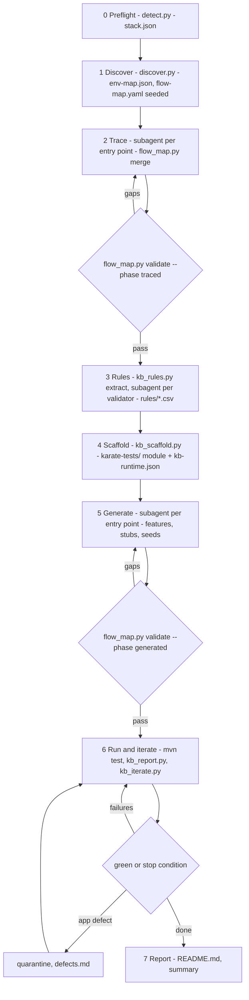
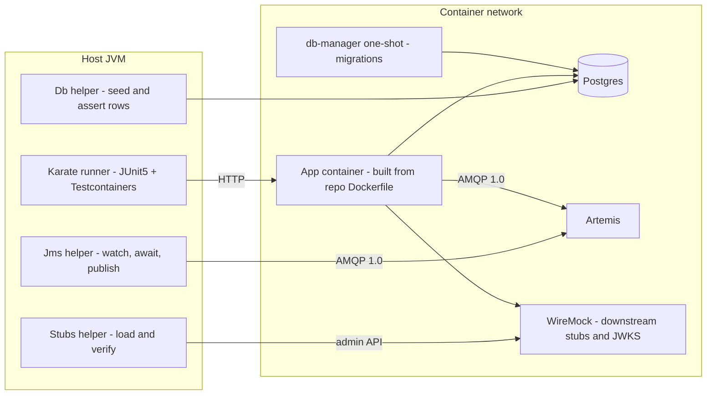

# karate-bootstrap — design

**Date:** 2026-09-05
**Status:** Approved 2026-09-05 (Plan 1 landed as PR #7; Plan 2 as PR #8). Harness amendment approved 2026-09-05. Skill-assembly amendment (5.2 to 5.4, 5.6, 5.7, 9, 11: `kb_prompt.py`, ledger bookkeeping commands, evals) 2026-09-06 for Plan 3.
**Repo:** `claude-skills`, skill path `skills/karate-bootstrap/`

## 1. Purpose

`karate-bootstrap` takes a service repository that has no Karate tests and leaves it with a first "ground truth" Karate suite that runs green under Testcontainers, locally and in an Azure DevOps (ADO) build, with minimal or no human intervention. It documents existing behaviour. It does not judge whether that behaviour is correct, except to quarantine and report clearly erroneous behaviour as suspected defects.

The skill will be run by Opus 4.8 and Sonnet 4.6, not by a Fable-class model. Every design choice below assumes the model is capable but must be kept on rails: scripts do bookkeeping and gating, the model does judgement inside narrow, well-specified tasks.

Target population: roughly 80 repositories at the user's workplace. Almost all are OpenShift ROSA services with a Dockerfile and an OpenShift deployment manifest already in the repo. Stacks are Spring Boot, Quarkus, .NET Core and Python. The database is Postgres. Messaging is ActiveMQ Artemis. Downstream HTTP calls are routed through YARP. Schema migrations are owned by a separate shared `db-manager` container image, not by the services.

## 2. Guardrails carried into this design

These come from the project's standards document and high-confidence reflections. They shape the implementation plan that follows this spec.

- **Confidence scoring on every plan task.** Any task below 90% confidence carries its mitigation inside the task body, not as an optional follow-up. Verify unfamiliar APIs (Karate, Testcontainers, WireMock admin API, Artemis image, Qpid JMS, ADO tasks) by reading docs or running a spike at plan-write time; the harness amendment was spike-backed (section 12).
- **Scripts own determinism, the model owns judgement.** Same principle as `tech-debt-scan` in this repo. Every phase has a pinned command and a pinned output file. Missing output means abort with a defined exit code. No improvisation between phases.
- **Feature branch at task start.** Already done: `feat/karate-testcontainers-skill` in a worktree under `.claude/worktrees/karate-testcontainers`.
- **Visualiser at every document handoff.** Spec and plan are rendered in the brainstorming visual companion, Bootstrap 5 light theme, mermaid for flows.
- **Cross-read prose and example blocks.** Where this spec shows example YAML, CSV or Karate, the prose and the example must agree. Reviewers should flag any mismatch.

## 3. Decisions made during brainstorming

| # | Decision |
|---|----------|
| Q1 | Per-repo `karate-tests/` Maven module. JUnit5 runner, Testcontainers Java. App under test is a black-box Docker image built from the repo's own Dockerfile. Same module shape regardless of app language. |
| Q2 | Downstream HTTP calls are stubbed in v1 with a stub container (WireMock since H3; originally MockServer). Outbound HTTP calls are treated as exit points and asserted with `Stubs.verify`. |
| Q3 | A persisted ledger, `karate-tests/flow-map.yaml`, is the only cross-phase memory. A script validates it. Tracing is done by one subagent per entry point. |
| Q4 | The fix loop may change anything under `karate-tests/`, never app source or the app Dockerfile. Suspected app defects are quarantined with `@known-defect` and documented with root cause in `karate-tests/defects.md`, in a format a future promote step can turn into ralph PBIs. |
| Q5 | Scenario depth: happy path plus every visible branch. Observed behaviour wins over code-derived expectation unless the observed behaviour is clearly erroneous. |
| Q6 | Validation rules are data, not scenarios. One `Scenario Outline` per endpoint reads `rules/<endpoint>.csv`. Declarative validators are extracted by script first; imperative branches by subagent. |
| Q7 | Fixture apps ship inside the skill and are used as end-to-end evals on the author's laptop with a container runtime and JDK 21. |
| Q8 | Everything runs in containers. Nothing external is reached. Target CI is ADO, which already runs a Testcontainers build on Docker. |
| C1 | One ADO job template, hosted agent with Docker. Aligned to the user's existing pipeline at work. |
| C2 | Schema comes from the shared `db-manager` image, run as a one-shot container before the app. Image reference from a flag or a central config file. |
| C3 | Postgres only in v1. The DB engine is a single seam in the harness so SQL Server can return later. |
| C4 | Weaker-model tracing is guarded by a reference-verification gate, an unresolved-hop loop and a depth cap. An optional `--double-trace` flag exists for very large Java repos, off by default. |
| C5 | Auth is normally switchable off. Detection order: off/mock switch, then configurable JWKS issuer served from the stub container (WireMock since H3), then `blocked` with a README note. |
| C6 | No Docker Desktop. Developers use podman or the docker CLI and have a local JDK and Maven. Primary run path is plain `mvn test`. The skill emits podman-oriented Testcontainers settings and README instructions. `mvnw` is kept for ADO reproducibility only. |
| H1 | (Harness brainstorm, 2026-09-05 evening) Repo-specific values live in `src/test/resources/kb-runtime.json`, written by the scaffold and read by `KbRuntime.java`. The Java harness is identical for every repo and is kept in the skill as a real Maven project that compiles in this repo's CI. |
| H2 | Testcontainers 1.21.4, not the 2.x line. Compiled in the spike. |
| H3 | The stub server is WireMock 3.13.2 (image `wiremock/wiremock:3.13.2-alpine`) as a plain `GenericContainer`, driven over its admin REST API with no client jar. Replaces MockServer everywhere in this spec. |
| H4 | The template module is verified on every PR by a `maven`-marked pytest (opt-in via `KB_MAVEN=1`) in a CI job with a JDK. |
| H5 | All messaging is AMQP 1.0. The harness uses `org.apache.qpid:qpid-jms-client` 1.17.0 (`javax.jms` over AMQP) against Artemis port 5672, the same protocol every app uses. |
| H6 | Java release level 17 (Karate 1.5 minimum); developers have 17 or 21; CI and ADO run 21. |
| H7 | Parallel execution by isolation-by-data (spec 5.6), 4 threads default, Karate's `@parallel=false` as the escape hatch. If Plan 4 shows it cannot be made reliable, fall back to `kb.threads=1` by default: a flag, not a redesign. |
| H8 | Four plans: 1 analysis core (landed as PR #7), 2 harness and loop, 3 skill assembly, 4 fixture apps and end-to-end evals. |

## 4. Architecture

### 4.1 Seven phases

Each phase has a pinned script command and a pinned output file. A phase cannot start until the previous phase's validator passes.



### 4.2 Runtime topology during a test run

Testcontainers Java owns every container. Nothing external is reached.



Start order: network, Postgres, Artemis (queues and addresses pre-created from the ledger), WireMock (health wait, then JWKS and discovery mappings when auth mode is `jwks`), db-manager (must exit 0), app (env from `kb-runtime.json`, wait on readiness). Containers start lazily from `karate-config.js`; `-Dkb.skipContainers=true` runs container-free features only, which is how the template's smoke feature and CI exercise the module without a runtime.

### 4.3 What the skill leaves in a target repo

```
karate-tests/
  pom.xml, mvnw, mvnw.cmd, .mvn/
  azure-pipelines.karate.yml         ADO job template
  karate-config.js
  flow-map.yaml                      ledger
  env-map.json                       config keys, roles, container values
  stack.json                         detected stack
  defects.md                         quarantined suspected app defects
  README.md                          how to run, counts, modes used, notes
                                     (rendered here; README.md.tmpl stays in the skill)
  rules/<endpoint>.csv
  seed/<feature>.sql
  seed/examples/<endpoint>.json      base request bodies
  stubs/<downstream>/*.json          WireMock mappings, suite-level, matched by request data
  src/test/java/kb/harness/
    KarateRunner.java KbRuntime.java Containers.java Db.java Jms.java Stubs.java Jwt.java
  src/test/resources/
    kb-runtime.json                  repo-specific values the harness reads (schema in 5.5)
    testcontainers.properties        podman-friendly defaults
    logback-test.xml
    common/reset.feature common/mutate.js
    features/<endpoint>.feature features/<subscription>.feature
  target/                            reports, app.log, db-manager.log (ignored)
```

Boundaries:

- The skill never edits app source, the app Dockerfile, or the repo's existing pipeline file.
- Every artefact lives under `karate-tests/`.
- The ledger is the only memory across phases. The main agent never holds the codebase in context.
- The run is autonomous. A human reads `README.md`, `defects.md` and `flow-map.yaml` at the end.

## 5. Phase details

### 5.1 Phase 0 — Preflight, `detect.py`

Command: `python scripts/detect.py <repo> --service-dir <sub> --out karate-tests/stack.json`

Checks: container runtime reachable (`docker` or `podman` CLI, and the Testcontainers-visible socket), `java -version` 17 or newer, `mvn -version`. Detects language, framework, ORM, messaging client, HTTP client library, validation library, auth library from build files:

- `pom.xml`, `build.gradle(.kts)` — Spring Boot or Quarkus, Hibernate/JPA, Spring Data, Panache, `artemis-jms-client`, `spring-jms`, SmallRye Reactive Messaging, Bean Validation, Spring Security, Quarkus OIDC.
- `*.csproj` — ASP.NET Core, EF Core, Npgsql, `Apache.NMS.ActiveMQ`, `Apache.NMS.AMQP`, `AMQPNetLite`, MassTransit (ActiveMQ transport), FluentValidation, data annotations, JWT bearer.
- `pyproject.toml`, `requirements*.txt` — FastAPI, Flask, Django, SQLAlchemy, psycopg, `python-qpid-proton`, `stomp.py`, Pydantic.

Output: `stack.json`. Exit 3 if no supported framework is found.

### 5.2 Phase 1 — Discover, `discover.py`

Command: `python scripts/discover.py <repo> --stack karate-tests/stack.json --out-env karate-tests/env-map.json --out-ledger karate-tests/flow-map.yaml`

Deterministic reads, in this order:

1. **Deployment manifests.** `deploymentserverless.yml` takes precedence when both exist, otherwise `deployment.yml`. Presence of `deploymentserverless.yml` sets `app.serverless: true`, and the container spec is read from the Knative `spec.template.spec.containers` path. Extracts `readinessProbe` path and port, container port, `env`, `envFrom` configMap and secret refs. Fallback: any Kubernetes `Deployment`, Helm values, Kustomize overlays.
2. **Dockerfile.** `EXPOSE`, `ENV` defaults, entrypoint.
3. **App config.** `application*.yml|properties`, `appsettings*.json`, `settings.py`, `.env.example`. Also `hibernate.cfg.xml` and `META-INF/persistence.xml`. Extracts config keys and their placeholder values.
4. **Routes.** Cheat-sheet regexes per stack produce entry-point candidates: HTTP method, path, handler file and line, and AMQ listener destinations. The model confirms the list in one pass and adds anything the regexes missed with `python scripts/flow_map.py add-entry --ledger karate-tests/flow-map.yaml --id <id> --kind http|amq-subscribe --handler <file:line> [--method M --path P | --destination D --type queue|topic]`, which seeds the same untraced entry shape `discover.py` writes.
5. **Migrations presence.** Recorded for information only. Schema strategy is `migration-container` by default (see 5.5). If the app also self-migrates on boot (`spring.jpa.hibernate.ddl-auto`, `quarkus.hibernate-orm.database.generation`, `hibernate.hbm2ddl.auto`, EF `Migrate()`), that is recorded as `app.migrations.also_on_boot: true`.

Config-key roles: `db`, `amq`, `downstream:<name>`, `auth`, `passthrough`. Role assignment is deterministic where the key name or placeholder scheme is unambiguous (`jdbc:postgresql://`, `amqp://`, `activemq:tcp://`, `Host=`), model-confirmed otherwise. Every key ends with a role.

Auth detection, in preference order:

1. **Off or mock switch.** A boolean or profile that removes the auth filter (`Auth__Enabled`, `quarkus.oidc.enabled`, a Spring profile guard on the security config, custom `AUTH_MODE=mock`). Ledger `app.auth.mode: disabled` with the key and value. 401/403 responses on entry points are marked `testable: false`.
2. **Configurable issuer or JWKS URL.** Ledger `app.auth.mode: jwks`, with the issuer and JWKS keys. Harness serves discovery and JWKS from WireMock under `/auth` and mints tokens.
3. **Neither.** Ledger `app.auth.mode: blocked`. README lists what a developer would need to change. Unauthenticated endpoints are still tested.

A switch found by name pattern alone is recorded with `confirmed: false`; the traced gate fails until the model confirms it (Plan 2 adds `flow_map.py set-auth`).

Readiness: from the manifest probe. Fallback `Wait.forListeningPort` on the container port, recorded as `app.readiness.source: fallback`. Serverless doubles the startup timeout.

Output: `env-map.json`, and `flow-map.yaml` seeded with `stack`, `app`, and one entry per entry point with `status.traced: false`.

### 5.3 Phase 2 — Trace, `flow_map.py`

Loop:

```
python scripts/flow_map.py next --phase traced --ledger karate-tests/flow-map.yaml        -> prints next untraced entry id + handler + cheat sheet path
python scripts/kb_prompt.py render --prompt trace --ledger karate-tests/flow-map.yaml --env karate-tests/env-map.json --entry <id> --repo <repo> --out karate-tests/.prompts/trace-<slug>.md
(dispatch a read-only trace subagent whose prompt is that file, by path; it returns JSON)
python scripts/flow_map.py merge <entry.json> --ledger karate-tests/flow-map.yaml         -> merges, prints unresolved count
python scripts/flow_map.py validate --phase traced --ledger karate-tests/flow-map.yaml --repo <repo> --env karate-tests/env-map.json    -> pass, or list of gaps
```

Trace subagent contract (`prompts/trace.md`):

- Input: one entry point (id, handler file and line), the stack cheat sheet, the env-map role list.
- Read-only. Follow every call from the handler until one of: DB write, AMQ publish, outbound HTTP, response return, or a third-party library boundary. Record each with file and line.
- Record `reads` (DB reads, inbound HTTP responses consumed) because they become seeds and stubs.
- Record `responses` with status and a short `when`, and whether the branch is validation (`rules: true`).
- Record `rules.sources` — files where validation lives.
- Depth cap 12 hops. Anything not followable (reflection, dynamic dispatch, generated code, cap reached) is returned in `unresolved` with file and line and reason.
- Output: JSON only, matching the ledger entry schema.

Unresolved hops are allowed in subagent output, not in the ledger. The main agent re-dispatches a narrower trace starting at that location: `kb_prompt.py render --prompt trace ... --focus <file:line>` renders the same prompt with a "start at" instruction, and the result is merged over the entry again. `validate --phase traced` fails while `unresolved` is non-empty.

`kb_prompt.py` (`render --prompt trace|rules|generate`) is the only way prompts reach a subagent: it fills a `string.Template` file under `prompts/` with the entry's ledger JSON, the cheat sheet path, the env-map role table and the file locations the subagent must use, and writes one prompt file the main agent passes by path. Every prompt file embeds an example output that the skill's tests feed back through the consuming script (`merge`, `kb_rules add`, `mark`) so the examples cannot drift from the schemas.

`flow_map.py verify-refs` runs inside the `traced` gate. For every `via: file:line` it opens the file and requires a write, publish, or HTTP marker token from the stack cheat sheet on that line or within three lines. Failing refs are listed and the entry is reset to untraced. This guards against invented exits.

`--double-trace` (off by default): each entry is traced twice by independent subagents and the ledger takes the union, with disagreements listed for a third narrow trace.

### 5.4 Phase 3 — Rules, `kb_rules.py`

```
python scripts/kb_rules.py extract <repo> --ledger karate-tests/flow-map.yaml --out-dir karate-tests
python scripts/kb_prompt.py render --prompt rules --ledger karate-tests/flow-map.yaml --entry <id> --source <source-file> --repo <repo> --tests-dir karate-tests --out karate-tests/.prompts/rules-<slug>-<n>.md
(dispatch one read-only rules subagent per unscanned rules source; it writes karate-tests/rules/<slug>.rows.csv)
python scripts/kb_rules.py add <entry-id> karate-tests/rules/<slug>.rows.csv --ledger karate-tests/flow-map.yaml --out-dir karate-tests
python scripts/kb_rules.py mark-scanned <entry-id> <source-file> --ledger karate-tests/flow-map.yaml
```

`--out-dir` is the `karate-tests` root; the script appends `rules/` itself.

`extract` handles declarative validators: Bean Validation and Hibernate Validator annotations, FluentValidation `RuleFor` chains, .NET data annotations, Pydantic `Field` constraints and validators. It emits candidate rows with `source`.

The subagent handles imperative branches (if/throw chains, service-layer checks, cross-field rules), confirms or drops candidates, and fills expected message text. It writes its confirmed rows to `rules/<slug>.rows.csv` (same header as the candidates file); the main agent appends them with `kb_rules.py add`. Nothing edits `rules/<slug>.csv` by hand.

CSV schema:

```
rule_id,field,mutation,value,expected_status,expected_code,expected_message_contains,source
R001,counterpartyId,missing,,400,VALIDATION,counterpartyId is required,src/Validators/DealValidator.cs:14
R002,volume,out_of_range,-1,400,VALIDATION,volume must be positive,src/Validators/DealValidator.cs:19
R003,deliveryDate,cross_field,before:tradeDate,400,VALIDATION,delivery before trade,src/Services/DealService.cs:70
```

Mutations: `missing`, `null`, `empty`, `too_long`, `too_short`, `invalid_format`, `out_of_range`, `invalid_enum`, `cross_field`. `mutate.js` in the scaffold implements each.

### 5.5 Phase 4 — Scaffold, `kb_scaffold.py`

Command: `python scripts/kb_scaffold.py <repo> --ledger karate-tests/flow-map.yaml --env karate-tests/env-map.json --out karate-tests [--service-dir <sub>] [--migrations-image <ref>] [--config ~/.karate-bootstrap/config.yaml] [--force]`

Copies `templates/karate-tests/`, a real Maven project that compiles in this repo, into the target repo and writes `src/test/resources/kb-runtime.json`, the only file carrying repo-specific values. Java sources are never templated. Generated content (`features/`, `rules/`, `stubs/`, `seed/`, `defects.md`, `README.md`) is never overwritten; harness files are overwritten only with `--force`; `kb-runtime.json` is always rewritten; nothing is deleted.

`kb-runtime.json` v1:

```json
{ "version": 1, "repo": "shipments", "stack": "spring",
  "app": { "repoRootRel": "..", "dockerfileRel": "Dockerfile", "port": 8080,
           "readinessPath": "/actuator/health/readiness", "serverless": true, "startupTimeoutSeconds": 120 },
  "env": [ { "name": "SPRING_DATASOURCE_URL", "role": "db", "value": "jdbc:postgresql://{{db.host}}:{{db.port}}/{{db.name}}" },
           { "name": "PRICING_BASE_URL", "role": "downstream:pricing", "value": "{{stubs.url}}/pricing" },
           { "name": "APP_SECURITY_ENABLED", "role": "auth", "value": "false" } ],
  "db": { "name": "shipments", "user": "app", "password": "app" },
  "migrations": { "strategy": "migration-container", "image": "registry/db-manager:1",
                  "env": { "PGHOST": "{{db.host}}", "PGDATABASE": "{{db.name}}", "PGUSER": "{{db.user}}", "PGPASSWORD": "{{db.password}}" } },
  "amq": { "user": "artemis", "password": "artemis", "queues": ["shipment.requested"], "topics": ["shipment.created"] },
  "downstreams": [ { "name": "pricing", "envVar": "PRICING_BASE_URL" } ],
  "auth": { "mode": "disabled", "key": "APP_SECURITY_ENABLED", "value": "false" } }
```

`env[].value` templates are produced by the scaffold from each key's role and original placeholder: db keys become the JDBC, Npgsql or `postgresql://` form the stack expects, or a single `{{db.user}}`-style token for user, password, host, port and name keys; amq keys become `amqp://{{amq.host}}:{{amq.amqpPort}}` or single tokens; `downstream:<name>` becomes `{{stubs.url}}/<name>`; the auth switch key becomes its confirmed value, and in `jwks` mode issuer keys become `{{auth.url}}` and JWKS keys `{{auth.url}}/.well-known/jwks.json`. `Containers.java` substitutes the tokens with network-alias values at start: `db:5432`, `artemis:5672`, `http://wiremock:8080`, `http://wiremock:8080/auth`. `db.name` comes from the central config entry, else a `Database=` or URL path found in a db placeholder, else a `ConnectionStrings__<Name>` key, else `app`. `auth.mode` is `disabled` (key, value), `jwks` (`issuerKeys`), `none` or `blocked`.

Schema strategy `migration-container`:

- Image reference resolution: `--migrations-image` flag, else `~/.karate-bootstrap/config.yaml` entry matching the DB name from env-map, else exit 4 with a README instruction. Nothing can pass without a schema.
- Central config shape:

```yaml
db_managers:
  deals:
    image: registry.example/db-manager-deals:latest
    env:
      DB_HOST_KEY: PGHOST
      DB_PORT_KEY: PGPORT
      DB_NAME_KEY: PGDATABASE
      DB_USER_KEY: PGUSER
      DB_PASSWORD_KEY: PGPASSWORD
    database: deals
    extra_env: {}
```

- `Containers.java` runs the db-manager as a one-shot container with `OneShotStartupCheckStrategy`, captures output to `target/db-manager.log`, and treats non-zero exit as an infra failure.

Pinned dependencies in `pom.xml`, every coordinate and image tag checked against Maven Central or Docker Hub on 2026-09-05 and compiled together in a spike on JDK 21:

| Concern | Artifact or image |
|---------|-------------------|
| Karate | `io.karatelabs:karate-junit5` 1.5.2 (needs Java 17) |
| Containers | `org.testcontainers:testcontainers-bom` 1.21.4 with `testcontainers`, `junit-jupiter`, `postgresql` |
| Postgres | `postgres:16-alpine` |
| Artemis | `GenericContainer("apache/activemq-artemis:2.44.0-alpine")`, no official module |
| Stubs | `GenericContainer("wiremock/wiremock:3.13.2-alpine")`, official module is alpha so not used; driven over `/__admin` with `java.net.http` |
| JDBC | `org.postgresql:postgresql` 42.7.13 |
| JMS over AMQP 1.0 | `org.apache.qpid:qpid-jms-client` 1.17.0 (`javax.jms`) |
| Auth | `com.nimbusds:nimbus-jose-jwt` 9.37.3 |
| JSON | `com.fasterxml.jackson.core:jackson-databind` 2.17.2 (reads `kb-runtime.json`) |
| Test engine | `org.junit.jupiter:junit-jupiter` 5.10.3, `maven-surefire-plugin` 3.2.5 including `**/*Test.java` and `**/KarateRunner.java` |
| Logging | `ch.qos.logback:logback-classic` 1.5.6 |
| Build | Maven wrapper 3.3.2 only-script (`only-mvnw`, `only-mvnw.cmd` from the `maven-wrapper-3.3.2` tag) pinned to Apache Maven 3.9.9; `maven.compiler.release` 17 |

Harness classes (package `kb.harness`):

- **`KbRuntime.java`.** Typed view over `kb-runtime.json`, loaded once per JVM.
- **`Containers.java`.** Singleton started lazily from `karate-config.js` unless `-Dkb.skipContainers=true`. Order: network, Postgres, Artemis, WireMock, db-manager, app. Artemis gets `EXTRA_ARGS` with `--queues` (anycast) and `--addresses` (multicast) built from the ledger's destinations. WireMock waits on `GET /__admin/health`; when `auth.mode` is `jwks`, `Jwt.publishJwks()` imports the discovery and JWKS mappings. App image from `ImageFromDockerfile` with the service root as context, or `-Dapp.image=<tag>`. Env values are `kb-runtime.json` templates with tokens substituted. Readiness from the ledger; port wait when none; serverless doubles the startup timeout. Every container's output is written to `target/<name>.log`. A failed start is remembered and rethrown by later scenarios instead of retried; a JVM shutdown hook stops the containers and closes the JMS connection when Ryuk is disabled.
- **`Db.java`.** `run(sqlPath)`, `row(table, whereMap)`, `awaitRow(table, whereMap, timeoutMs)`, `count(table, whereMap)`, `truncate(tables)`. Identifiers validated against `^[A-Za-z_][A-Za-z0-9_]*$`, values bound through `PreparedStatement`.
- **`Jms.java`.** `watch(destination)` subscribes once per destination before any request; `await(destination, timeoutMs)` and `await(destination, timeoutMs, matchMap)` return `{body, properties, messageId}`, the match form taking only the message whose body contains every key and value in `matchMap` while other messages stay in the inbox, in order, for other scenarios; `publish(destination, body, headers)` drives AMQ-subscribe entry points. Queue versus topic from the ledger.
- **`Stubs.java`.** `reset()` = `POST /__admin/reset`; `load(path)` = `POST /__admin/mappings/import` with a `{"mappings":[...]}` document; `verify(method, urlPath, times)` and `verify(method, urlPath, bodyContains, times)` = `POST /__admin/requests/count` with a request pattern (the four-argument form adds `"bodyPatterns":[{"contains":bodyContains}]`) compared to `times`; `unmatched()` writes `GET /__admin/requests/unmatched` and `/near-misses` to `target/stubs-unmatched.json` for the fix loop.
- **`Jwt.java`.** One RSA key per JVM. `token(claimsMap)` signs RS256 with `iss` = `http://wiremock:8080/auth`; `publishJwks()` imports mappings for `/auth/.well-known/openid-configuration` and `/auth/.well-known/jwks.json`.
- **`KarateRunner.java`.** JUnit 5, `Runner.path("classpath:features").tags("~@known-defect").outputCucumberJson(true).outputJunitXml(true).parallel(Integer.getInteger("kb.threads", 4))`. Under `-Dkb.skipContainers=true` the runner also requires the `@harness` tag, so only container-free features run; after a containerised run it writes `target/stubs-unmatched.json` via `Stubs.unmatched()`.
- **`karate-config.js`.** Defines `skipContainers`, `mutate` (from `common/mutate.js`) and, when containers run, `appBaseUrl`, `Db`, `Jms`, `Stubs`, `Jwt` via `Java.type`.
- **`features/harness-smoke.feature`.** Container-free self-test of `mutate`, `KbRuntime` and a CSV-driven outline; it is what the template's CI job and a developer's first `mvn test -Dkb.skipContainers=true` run.

Also rendered: `azure-pipelines.karate.yml`, `src/test/resources/testcontainers.properties`, `src/test/resources/logback-test.xml`, a `.gitignore` with `target/`, and an initial `defects.md`. `README.md` is written by `kb_report.py summary` (5.8), which reads `README.md.tmpl` from the skill; that template is never copied into the target repo.

The rendered `pom.xml` registers `rules/`, `stubs/` and `seed/` at the module root as additional test resources so `classpath:rules/...`, `classpath:stubs/...` and `classpath:seed/...` resolve (verified in the spike); the generated gate checks those directories at the module root and features under `src/test/resources/`.

`testcontainers.properties` and README cover podman: `DOCKER_HOST` for the rootless podman socket on Linux or the podman machine named pipe on Windows, `ryuk.container.privileged=true`, and `TESTCONTAINERS_RYUK_DISABLED=true` as the documented fallback.

### 5.6 Phase 5 — Generate

Loop, one subagent per entry point using `prompts/generate.md`:

```
python scripts/flow_map.py next --phase generated --ledger karate-tests/flow-map.yaml
python scripts/kb_prompt.py render --prompt generate --ledger karate-tests/flow-map.yaml --env karate-tests/env-map.json --entry <id> --repo <repo> --tests-dir karate-tests --out karate-tests/.prompts/generate-<slug>.md
(dispatch a generate subagent that may write only under karate-tests/: feature, stubs, seeds, example body; it returns JSON listing the files it wrote)
python scripts/flow_map.py mark --entry <id> --generated --feature features/<slug>.feature --stub stubs/<downstream>/<file>.json --seed seed/<slug>.sql --ledger karate-tests/flow-map.yaml
python scripts/flow_map.py validate --phase generated --ledger karate-tests/flow-map.yaml --repo <repo> --tests-dir karate-tests
```

**Isolation by data (decision H7).** Scenarios run in parallel against one app, one WireMock, one Postgres and one broker, so nothing a scenario does may depend on global resets:

- Stubs are suite-level: `stubs/<downstream>/*.json` WireMock mappings loaded once at start, discriminating by request data (path parameter, query, body) with `priority`. A failure path is driven by a reserved input the generator documents in the mapping, for example product code `ERR-500` answered with a 500 by a low-priority mapping. Every `urlPath` starts with `/<downstream>` because the app reaches each downstream as `{{stubs.url}}/<downstream>`.
- The database is additive: every scenario derives a unique value in its Background (`* def uid = java.util.UUID.randomUUID() + ''`), puts it in the request, and asserts rows by it. Seeds insert unique keys. `Db.truncate` is not used in parallel scenarios.
- Messages are matched by content: `Jms.await('deal.created', 5000, { dealId: response.id })`.
- Downstream calls are verified by scenario-unique data: `Stubs.verify('GET', '/pricing/rates/' + uid, 1)` when the outbound path carries it, else `Stubs.verify('POST', '/pricing/quotes', base.externalId, 1)` which adds a WireMock `bodyPatterns` `contains` clause to the count request. When neither the path nor the body carries scenario data, the scenario is `@parallel=false` and verifies the exact count.
- Anything that needs exclusive state (truncation, a static path that cannot carry a unique value, an outage simulation) carries Karate's built-in `@parallel=false` tag on the scenario or feature. The generated gate fails a scenario that calls `Stubs.reset`, `Db.truncate` or `Stubs.load` without that tag.
- Validation outlines never write, so they are parallel-safe by construction.
- Fallback: if Plan 4's end-to-end runs show flakiness this design cannot remove, `kb.threads` defaults to 1 and the rules above stay as good hygiene.

Feature shapes:

```gherkin
@smoke
Feature: POST /api/deals

Background:
  * def uid = java.util.UUID.randomUUID() + ''
  * call read('classpath:common/reset.feature') { watch: ['deal.created'] }
  * def base = read('classpath:seed/examples/post-api-deals.json')
  * set base.externalId = 'EXT-' + uid
  * header Authorization = 'Bearer ' + Jwt.token({ sub: 'test-user', roles: ['trader'] })

Scenario: creates a deal, writes deals and deal_audit, publishes deal.created
  Given url appBaseUrl
  And path '/api/deals'
  And request base
  When method post
  Then status 201
  And match response contains { id: '#uuid', status: 'PENDING' }
  * def row = Db.row('deals', { external_id: base.externalId })
  * match row.status == 'PENDING'
  * match Db.count('deal_audit', { deal_id: row.id }) == 1
  * def msg = Jms.await('deal.created', 5000, { dealId: response.id })
  * match msg.body.externalId == base.externalId
  * Stubs.verify('POST', '/pricing/quotes', base.externalId, 1)

@error
Scenario: unknown counterparty returns 404
  * set base.counterpartyId = 'CP-MISSING-' + uid
  Given url appBaseUrl
  And path '/api/deals'
  And request base
  When method post
  Then status 404

@error @parallel=false
Scenario: pricing outage returns 503
  * Stubs.load('classpath:stubs/pricing/outage.json')
  Given url appBaseUrl
  And path '/api/deals'
  And request base
  When method post
  Then status 503
  * Stubs.reset()
  * Stubs.load('classpath:stubs/pricing/default.json')

@rules
Scenario Outline: validation rule <rule_id> on <field>
  * def payload = mutate(base, '<field>', '<mutation>', '<value>')
  Given url appBaseUrl
  And path '/api/deals'
  And request payload
  When method post
  Then status <expected_status>
  And match response.code == '<expected_code>'
  And match response.message contains '<expected_message_contains>'

  Examples:
    | read('classpath:rules/post-api-deals.csv') |
```

The `Authorization` header line is emitted only when `auth.mode: jwks`. `common/reset.feature` accepts `{ watch: [destinations], seed: 'seed/x.sql', stubs: [paths], truncate: [tables] }` and applies them in the order watch, truncate, seed, stubs, so a truncate never wipes the rows the same call seeded; `seed` is additive and `stubs` and `truncate` are only legal under `@parallel=false`. AMQ-subscribe entry points use `Jms.publish` for the input and `Db.awaitRow` and `Jms.await` for the exits. Tags: `@smoke`, `@error`, `@rules`, `@amq`, `@known-defect`, `@parallel=false`.

`validate --phase generated` fails when: an entry has no feature file; an `http-out` exit has no stub file under `stubs/<downstream>/`; a `db-write` exit's table is not referenced by a `Db.` call in the feature; an `amq-publish` exit is not referenced by `Jms.`; an `http-out` exit is not referenced by `Stubs.verify`; a rules CSV row count differs from the ledger count; a rules source is not marked `scanned`; a scenario calls `Stubs.reset`, `Stubs.load` or `Db.truncate` without `@parallel=false`. These are grep-level checks by design.

### 5.7 Phase 6 — Run and iterate

```
mvn -B test                                          (or ./mvnw -B test; -Dkb.threads=1 for the sequential fallback)
python scripts/kb_report.py parse --reports karate-tests/target/karate-reports --out karate-tests/target/report.json
python scripts/flow_map.py record-run --ledger karate-tests/flow-map.yaml --report karate-tests/target/report.json
python scripts/kb_iterate.py next --report karate-tests/target/report.json --tests-dir karate-tests
python scripts/kb_iterate.py log --log karate-tests/.iterations.log --signature <sig> --hypothesis "..." --change "..." --classification <class>
mvn -B test -Dkarate.options="classpath:features/<one>.feature"
python scripts/kb_iterate.py check-stop --log karate-tests/.iterations.log --report karate-tests/target/report.json --max-iterations 15
```

`kb_report.py parse` reads Karate's cucumber JSON (`target/karate-reports/<packageQualifiedName>.json`, one per feature, `uri` already `features/<name>.feature`) into `{"passed", "skipped", "failed": [{"feature", "scenario", "tags", "step", "error"}]}`, the contract the green gate consumes.

Failure signature: feature, scenario with outline example suffixes collapsed, first failing step, error class (first error line with numbers, quoted strings and URLs normalised). Rules rows sharing a signature form one group.

Evidence bundle per group: the failing step and its match diff, the tail of `target/app.log`, WireMock's unmatched requests and near misses, written by the runner to `target/stubs-unmatched.json` after the run, DB error text, `target/db-manager.log` when the failure is at startup.

Classification, in this order:

1. **Infra.** Container did not start, wait timeout, connection refused, db-manager non-zero exit. Fix harness or env-map.
2. **Stub or seed missing.** 404 from WireMock (it appears in `stubs-unmatched.json` with a near miss), foreign key violation, empty read. Add the stub or seed.
3. **Expectation wrong, observed not erroneous.** Adopt observed behaviour and record it: `python scripts/flow_map.py override --ledger karate-tests/flow-map.yaml --entry <id> --scenario <name> --field <what> --old <expected> --new <observed> --reason "..."` appends to the entry's `observed_overrides`.
4. **Suspected app defect.** 5xx, stack trace in the response or log, behaviour that contradicts the app's own validation, data corruption. Tag the scenario `@known-defect`, write a `defects.md` entry with root cause.

Rules: one hypothesis and one change per iteration, logged before the change. Targeted rerun on the touched feature, then a full run before declaring green.

Stop conditions: iteration cap (default 15 full runs, `--max-iterations`), the same failure signature three iterations in a row, an infra failure not fixable from `karate-tests/`. On stop: write the status report, exit 6.

`flow_map.py record-run` sets `status.tested` on every entry that owns a feature and `status.passing` when none of its features appears in the report's `failed` list; it runs after every full `mvn test`. `flow_map.py validate --phase green` fails when any scenario failed in the last report, any `@known-defect` scenario lacks a `defects.md` anchor, or any entry has `passing: false` without a quarantine.

### 5.8 Phase 7 — Report

`python scripts/kb_report.py summary --ledger karate-tests/flow-map.yaml --defects karate-tests/defects.md --report karate-tests/target/report.json --template <skill>/templates/karate-tests/README.md.tmpl --out karate-tests/README.md`

README contents: how to run (`mvn test`, tag subsets, ADO), counts table (entry points, exits by kind, scenarios, rules rows, passing, quarantined), auth mode used, schema strategy and db-manager image used, wait strategy used, observed-overrides list, defects list, unresolved or fallback notes. The same table is printed to the terminal at exit.

## 6. Ledger schema — `flow-map.yaml`

```yaml
version: 1
repo: des-physicalservice
stack: { language: csharp, framework: aspnetcore, db: postgres, messaging: artemis-amqp,
         validation: fluentvalidation, auth: jwt-bearer }
app:
  dockerfile: Dockerfile
  port: 8080
  serverless: false
  readiness: { path: /health/ready, port: 8080, source: deployment.yml }
  migrations: { strategy: migration-container, image: registry.example/db-manager-deals:latest, source: config }
  auth: { mode: disabled, key: Auth__Enabled, value: "false" }
entry_points:
  - id: POST /api/deals
    kind: http
    method: POST
    path: /api/deals
    handler: src/Controllers/DealsController.cs:42
    auth: required
    request:
      content_type: application/json
      schema_ref: src/Models/DealRequest.cs
      example: seed/examples/post-api-deals.json
    responses:
      - { status: 201, when: happy }
      - { status: 400, when: validation, rules: true }
      - { status: 404, when: counterparty not found, via: src/Services/DealService.cs:88 }
      - { status: 401, when: auth, testable: false }
    reads:
      - { kind: db-read, table: counterparties, via: src/Repos/CounterpartyRepo.cs:21 }
      - { kind: http-in, host_key: Pricing__BaseUrl, method: GET, path: /prices/{product} }
    exits:
      - { kind: db-write, table: deals, op: insert, via: src/Repos/DealRepo.cs:30 }
      - { kind: db-write, table: deal_audit, op: insert, via: src/Repos/AuditRepo.cs:12 }
      - { kind: amq-publish, destination: deal.created, type: topic, via: src/Messaging/DealPublisher.cs:40 }
      - { kind: http-out, host_key: Pricing__BaseUrl, method: GET, path: /prices/{product}, via: src/Clients/PricingClient.cs:27 }
    rules:
      file: rules/post-api-deals.csv
      count: 143
      sources:
        - { file: src/Validators/DealValidator.cs, scanned: true }
        - { file: src/Services/DealService.cs, scanned: true }
    features: [ features/post-api-deals.feature ]
    stubs: [ stubs/pricing/default.json ]
    seeds: [ seed/post-api-deals.sql ]
    observed_overrides: []
    status: { traced: true, stubbed: true, tested: true, passing: true }
  - id: amq deal.requested
    kind: amq-subscribe
    destination: deal.requested
    type: queue
    handler: src/Messaging/DealRequestedListener.cs:18
    exits:
      - { kind: db-write, table: deals, op: update, via: src/Repos/DealRepo.cs:55 }
      - { kind: amq-publish, destination: deal.priced, type: queue, via: src/Messaging/DealPublisher.cs:52 }
    status: { traced: true, stubbed: true, tested: true, passing: false }
unresolved: []
```

`exits_none_reason` is allowed on an entry with no exits (pure read endpoints) and must be a non-empty string.

## 7. `defects.md` format

```markdown
## DEF-001: POST /api/deals returns 500 when counterparty is inactive
status: pending
slug: post-api-deals-500-inactive-counterparty
severity: high
category: app-defect
entry_point: POST /api/deals
scenario: features/post-api-deals.feature:48
evidence: |
  request: seed/examples/post-api-deals.json with counterpartyId CP-INACTIVE
  response: 500 {"error":"Object reference not set to an instance of an object"}
  app.log: NullReferenceException at DealService.Price(DealService.cs:91)
root_cause: src/Services/DealService.cs:91 dereferences pricing result without null check when counterparty.status != ACTIVE
suggested_fix: return 422 with code COUNTERPARTY_INACTIVE before pricing
```

Anchor keys `status`, `slug`, `severity`, `category` match `tech-debt-scan`'s `design.md`, so the existing promote path can be extended to turn approved defects into ralph PBI bundles. Promotion is out of scope for v1.

## 8. Stack cheat sheets — `reference/stack-*.md`

One file per stack, loaded only for the detected stack. Each contains: entry-point markers, DB write markers, AMQ publish and subscribe markers, outbound HTTP markers, config key conventions, readiness defaults, auth switch conventions, validation library patterns, and the marker tokens `verify-refs` accepts.

Non-exhaustive marker content:

- **Spring Boot.** `@RestController`, `@RequestMapping` family, `@JmsListener`, `JmsTemplate.convertAndSend`, Spring Data `save*`/`delete*`, `EntityManager.persist/merge/remove`, `@Modifying @Query`, `JdbcTemplate.update`, `RestTemplate`, `WebClient`, `@FeignClient`. Config `spring.datasource.*`, `spring.jpa.*`, `spring.artemis.*`. Actuator `/actuator/health`.
- **Quarkus.** JAX-RS `@Path` and method annotations, `@Incoming`/`@Outgoing`, `Emitter.send`, Panache `persist/delete`, `@Transactional` repositories, `@RestClient`. Config `quarkus.datasource.*`, `quarkus.hibernate-orm.*`, `mp.messaging.*`, `quarkus.oidc.*`. Health `/q/health/ready`.
- **ASP.NET Core.** `[ApiController]`, `[Http*]`, minimal API `Map*`, `DbContext.SaveChanges*`, `DbSet.Add/Update/Remove`, `[Table]`, `IConnectionFactory`, `CreateProducer`, `.Send(`, `IMessageConsumer.Listener`, MassTransit `IPublishEndpoint.Publish`, `IConsumer<T>`, `ReceiveEndpoint`, `HttpClient`, typed clients, YARP routes. Config `ConnectionStrings__*`, `activemq:tcp://`, `amqp://`, `failover:(...)`. Health `/health`.
- **Python.** FastAPI `@app.<method>`/`APIRouter`, Flask `@route`, Django `urls.py`, SQLAlchemy `session.add/commit/delete`, psycopg `execute` with INSERT/UPDATE/DELETE, `__tablename__`, qpid-proton `Container`/`send`, `stomp.Connection.send`, `httpx`/`requests`. Config via env or settings module. Health varies, fallback to port.

Hibernate specifics in the JVM sheets: `hibernate.cfg.xml`, `persistence.xml`, `@Entity`/`@Table` mapping for table resolution, `ddl-auto` values recorded as `also_on_boot`.

## 9. Skill packaging

```
skills/karate-bootstrap/
  SKILL.md
  scripts/
    detect.py discover.py flow_map.py kb_rules.py kb_scaffold.py kb_report.py kb_iterate.py kb_checkpoint.py kb_prompt.py kb_check_skill.py
    (every new script carries the kb_ prefix: both skills' test conftests share one sys.path and one mypy_path,
     and main already has rules.py, config.py, inventory.py, patterns.py, validation.py and others)
  templates/karate-tests/               a real Maven project; compiles and smoke-runs in this repo's CI
    pom.xml mvnw mvnw.cmd .mvn/wrapper/maven-wrapper.properties .gitignore
    azure-pipelines.karate.yml README.md.tmpl
    src/test/java/kb/harness/KbRuntime.java Containers.java Db.java Jms.java Stubs.java Jwt.java KarateRunner.java
    src/test/java/kb/harness/JwtTest.java              host-only unit tests
    src/test/resources/karate-config.js kb-runtime.json testcontainers.properties logback-test.xml
    src/test/resources/common/reset.feature common/mutate.js
    src/test/resources/features/harness-smoke.feature
  reference/
    stack-spring.md stack-quarkus.md stack-aspnetcore.md stack-python.md
    testcontainers-notes.md karate-notes.md failure-triage.md podman.md
  prompts/
    trace.md rules.md generate.md          string.Template files rendered by kb_prompt.py
  evals/
    trigger-eval.md                        description trigger eval: prompts that must and must not fire the skill
  fixtures/
    dotnet-deals/ fastapi-orders/ spring-shipments/
      app source, Dockerfile, deployment.yml, db-manager/ (Flyway image), expected-flow-map.yaml, planted-defect.md
  tests/
```

Written for Opus 4.8 and Sonnet 4.6:

- `SKILL.md` under 500 lines. Numbered steps, one pinned command each, one pinned output file each, an exit-code table.
- "No improvisation" rule as in `tech-debt-scan`: a missing expected output means abort with exit 5.
- Subagent prompts are files rendered by `kb_prompt.py render` with the entry-point context filled in. The main agent never composes subagent prompts freehand; it passes the rendered file's path to the Agent tool. Rendered prompts live under `karate-tests/.prompts/`, which the template's `.gitignore` excludes.
- Cheat sheets are loaded only for the detected stack.
- Only Python dependency is `pyyaml`. The Java harness is copied verbatim; repo-specific values go to `kb-runtime.json`, never into Java source. `README.md.tmpl` is the one `string.Template` file.

Git checkpoints are `kb_checkpoint.py begin` (branch behaviour below) and `kb_checkpoint.py commit --phase <n> --message "..."` (stages `karate-tests/` only).

Invocation:

```
/karate-bootstrap <repo-path> [--service-dir <sub>] [--migrations-image <ref>] [--app-image <tag>]
                  [--max-iterations 15] [--double-trace] [--no-commit]
```

Git behaviour: by default the skill commits after each phase gate passes, so a long run has checkpoints and the end state is a branch ready for a pull request. If the repo is on its default branch when the skill starts, the skill first creates and checks out `karate-bootstrap`. If the repo is already on another branch, such as a ralph-managed `ralph/<PBI-id>` branch, the skill commits on that branch and creates nothing. `--no-commit` writes files only and never runs git. The skill never pushes.

Expected usage: manual runs first to remove kinks, then bulk runs through ralph across the 80 repos. A run that stops on a stop condition still commits what it has, so a developer can pull the branch and finish it with Claude interactively.

Exit codes: 0 green, 3 unsupported stack, 4 no schema source, 5 missing expected output, 6 stopped by stop condition, 7 container runtime or JDK missing.

## 10. Local and CI execution

- **Local.** `cd karate-tests && mvn test` (JDK 17 or newer). `mvn test -Dkb.skipContainers=true` runs the harness smoke feature with no container runtime. `-Dkb.threads=1` is the sequential fallback. Podman users export `DOCKER_HOST` per `reference/podman.md` and the README section (`unix://${XDG_RUNTIME_DIR}/podman/podman.sock` for rootless Linux, the socket from `podman machine inspect` on Windows or macOS); the classpath `testcontainers.properties` sets `ryuk.container.privileged=true`, and `TESTCONTAINERS_RYUK_DISABLED=true` is the documented fallback.
- **This repo's CI.** A `karate-templates` job installs Temurin 21 and runs `KB_MAVEN=1 pytest -m maven`, which copies `templates/karate-tests` to a temp dir, compiles it and runs the smoke feature. The default `pytest` excludes the `maven` marker.
- **ADO.** `azure-pipelines.karate.yml` is a reusable job on a hosted agent with Docker: optional `Docker@2` build then `./mvnw -B test -Dapp.image=$(imageTag)`, `PublishTestResults@2` on `target/karate-reports/*.xml`, `PublishBuildArtifacts@1` on the HTML report. The template will be aligned to the user's existing Testcontainers pipeline at work.

## 11. Evals

- **Script tests.** pytest per script: ledger merge and validate against fixtures, `verify-refs` against planted good and bad refs, rules extraction against sample validators in all four stacks, report parsing against captured Karate output, scaffold output against a golden `kb-runtime.json` per fixture, the template module compiled and smoke-run under `KB_MAVEN=1 pytest -m maven`, iterate stop-condition logic.
- **Fixture runs.** The skill run end to end on each fixture app on the author's laptop. Pass criteria: exit 0, every entry in `expected-flow-map.yaml` present in the ledger, zero unresolved, `defects.md` contains the planted defect.
- **Trigger eval.** `evals/trigger-eval.md` lists prompts that must fire the skill ("add karate tests", "bootstrap integration tests", "testcontainers suite for this service") and prompts that must not (unit-test requests). A pytest checks the `SKILL.md` description carries each positive prompt's key terms and no unit-test claim; running the prompts against a live model is a documented manual step because this repo's tests never call an LLM.
- **Dry run.** `tests/test_kb_dry_run.py` runs every pinned SKILL.md command in order on `spring-mini` and `dotnet-mini` with canned subagent outputs and no containers, asserting each phase gate passes and the README renders; `kb_check_skill.py` lints every SKILL.md command against its script's `--help` in CI.

Fixtures: `dotnet-deals` (ASP.NET Core minimal API, EF Core, Npgsql, Apache.NMS.AMQP, one downstream call, FluentValidation, auth switch), `fastapi-orders` (FastAPI, SQLAlchemy, qpid-proton, one downstream call, Pydantic), `spring-shipments` (Spring Boot, JPA, spring-jms over Qpid JMS so the fixture speaks AMQP 1.0 like the real services, one downstream call, Bean Validation). Each has a `db-manager/` Flyway image and one planted 500.

## 12. Assumptions

### Real concerns and how they were resolved

| # | Concern | Resolution |
|---|---------|------------|
| C1 | Testcontainers on ADO agents | User already runs a Testcontainers build on Docker in ADO. One hosted template, aligned to it at work. |
| C2 | Schema without app-side migration | Shared `db-manager` image run as a one-shot container before the app. Image from flag or central config. Fixtures ship a small db-manager each. |
| C3 | SQL Server weight | Postgres only. Engine is a single harness seam. |
| C4 | Weaker-model tracing | `verify-refs` gate, unresolved loop, depth cap 12. `--double-trace` optional. Largest repos are Java; .NET repos are small. |
| C5 | Auth blocked | Auth is normally switchable off. Blocked stays a fallback message. |
| C6 | No Docker Desktop | Plain `mvn test` with local JDK and Maven. Podman settings and docs emitted. Docker-run wrapper dropped. |

### Harness amendment (2026-09-05 evening): concerns and how they were resolved

| # | Concern | Resolution |
|---|---------|------------|
| H-C1 | Parallel scenarios share one WireMock, one Postgres, one broker; per-scenario resets would make parallel runs flaky | Isolation by data (5.6) with `@parallel=false` as the escape hatch and a gate that enforces it; sequential `kb.threads=1` is the fallback if Plan 4 shows flakiness |
| H-C2 | Java release level | `release 17`; developers have 17 or 21; CI and ADO run 21 |
| H-C3 | Broker protocol: harness core versus apps on AMQP | All apps speak AMQP 1.0, so the harness does too via Qpid JMS; no conversion path to trust |

### Verified safe

- Spike (2026-09-05, JDK 21, only-script Maven wrapper 3.3.2 with Maven 3.9.9): the pinned pom compiles `KbRuntime`, `Containers`, `Db`, `Jms` (Qpid JMS, `javax.jms`), `Stubs` (WireMock admin API), `Jwt`, `KarateRunner` and a JUnit 5 test class; `mvn test -Dkb.skipContainers=true` runs 3 unit tests and 5 Karate scenarios green, including a dynamic outline reading `classpath:rules/sample.csv` from a `rules/` directory registered as a Maven test resource.
- Spike: Karate's cucumber JSON is `<packageQualifiedName>.json` with `uri` = `features/<name>.feature` (no prefix), `elements[].type`, `tags[].name`, `steps[].result.status`; JUnit XML names the suite by that path. `karate-summary-json.txt` carries `featureSummary[].relativePath` and counts.
- Fetched: WireMock image tags `3.13.2` and `3.13.2-alpine` exist; admin endpoints `POST /__admin/reset`, `POST /__admin/mappings/import`, `POST /__admin/requests/count`, `GET /__admin/requests/unmatched`, `GET /__admin/requests/unmatched/near-misses`, `GET /__admin/health` are in its OpenAPI document.
- Fetched: Artemis image env `ARTEMIS_USER`, `ARTEMIS_PASSWORD`, `ANONYMOUS_LOGIN`, `EXTRA_ARGS` appended to `artemis create`; `--queues` defaults to anycast, `--addresses` to multicast.
- Karate 1.5 documents the `@parallel=false` tag on features and scenarios.
- Karate supports `Examples: | read('file.csv') |` dynamic outlines.
- Testcontainers `ImageFromDockerfile` builds from an arbitrary Dockerfile with the repo root as context.
- `apache/activemq-artemis` is the official image, multi-protocol on 61616, AMQP on 5672; the harness uses 5672.
- `OneShotStartupCheckStrategy` supports run-to-completion containers (compiled in the spike).

### Minor, accepted (harness amendment)

- WireMock's official Testcontainers module is alpha; a plain `GenericContainer` with a health wait is used instead.
- `Db.run` splits seed SQL on `;` at end of line; seeds are inserts, not functions.
- `ImageFromDockerfile` sends the whole service root as build context; Testcontainers honours `.dockerignore`. Plan 4 measures build time.
- Testcontainers 2.x upgrade deferred; one seam in `pom.xml` and `Containers.java`.
- Nimbus 9.37.3 chosen over 10.x for the widest JDK compatibility; the API used is identical.

### Minor, accepted

- Karate 1.5 needs JDK 17 or newer. Templates compile at release 17; this repo's CI and ADO run 21.
- Monorepos are handled only through `--service-dir` in v1.
- Quarkus has a cheat sheet but no fixture app in v1.
- Defect promotion to ralph is a later step.
- The skill commits but never pushes. Pushing and opening the pull request belong to the caller, ralph or a developer.
- Podman on Windows requires WSL2. That is a one-time developer setup, documented, not automated.

## 13. Out of scope for v1

- Regeneration on code change.
- Knowledge-base or mem0 integration.
- Gap detection against business rules.
- Promotion of defects to PBIs.
- SQL Server, Kafka, RabbitMQ.
- Editing the repo's existing pipeline.
